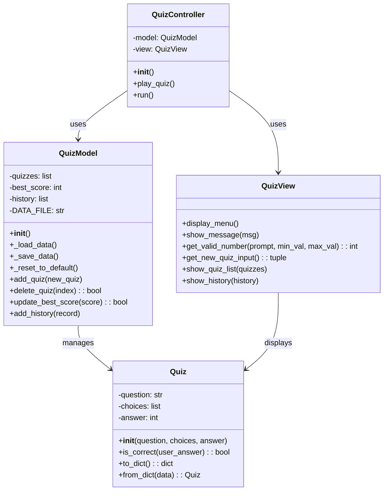
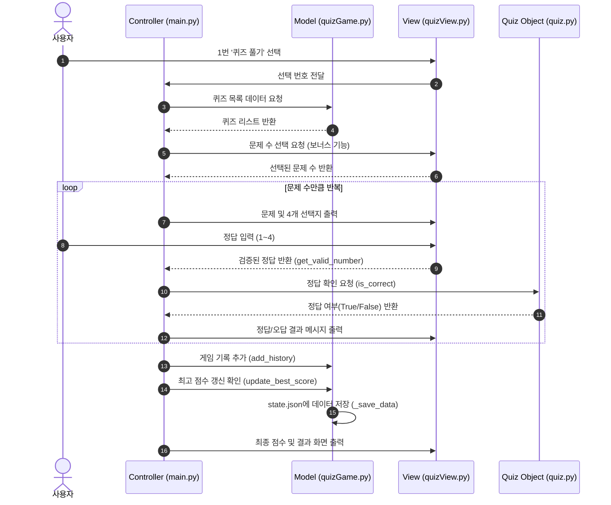

# 프로젝트 개요
## 프로젝트 소개
**Python과 Git을 함께 배우는 첫 발자국** - 터미널에서 동작하는 인터랙티브한 퀴즈 게임을 Python으로 구현한 프로젝트입니다.

### 주요 목표
#### Python 기초 문법 학습 및 실전 활용
* MVC(Model-View-Controller) 디자인 패턴 이해 

        MVC(Model-View-Controller) 패턴은 프로그램을 세 가지 역할로 나누어 관리하는 설계 방식입니다
    - Model (모델): 데이터와 저장을 담당합니다. quizGame.py와 quiz.py가 퀴즈 데이터를 관리하고 state.json에 저장하는 역할을 합니다
    - View (뷰): 사용자 인터페이스를 담당합니다. quizView.py가 메뉴를 화면에 출력하고 사용자의 입력을 받는 역할을 수행합니다
    - Controller (컨트롤러): 전체 흐름을 제어하며 모델과 뷰를 연결합니다. main.py가 사용자의 선택에 따라 필요한 기능을 실행하도록 명령하는 사령탑 역할을 합니다

- JSON 파일을 이용한 데이터 영속성 구현
- Git을 사용한 버전 관리 및 협업 기초 습득

---

## 기술 스택

| 항목 | 내용 |
|------|------|
| **언어** | Python 3.10+ |
| **패턴** | MVC (Model-View-Controller) |
| **데이터 저장** | JSON (UTF-8 인코딩) |
| **외부 라이브러리** | 없음 (표준 라이브러리만 사용) |
| **주요 모듈** | `json`, `os`, `random`, `datetime` |

---

## 프로젝트 구조

```
E1_2/
├── src/
│   ├── main.py           # 메인 컨트롤러 (게임 흐름 관리)
│   ├── quiz.py           # Quiz 데이터 모델
│   ├── quizGame.py       # QuizModel (데이터 저장/불러오기)
│   └── quizView.py       # QuizView (UI 및 입력 처리)
├── doc/
│   ├── mission.md        # 미션 요구사항
│   ├── project_intro.md  # 프로젝트 개요 (본 파일)
│   └── plan.md           # 개발 계획
├── README.md             # 프로젝트 설명서
└── state.json            # 데이터 저장 파일 (자동 생성)
```

# 퀴즈 주제와 선정 이유
# 실행 방법
# 기능 목록
# 파일 구조
# 데이터 파일 설명(`state.json` 경로/역할/스키마)

### Class Diagram


### Sequence Diagram


* **Git:** README 작성 후 최종 푸시한다.

### ⚙️ Git 저장소 복제 실습
* 이 단계는 `clone`과 `pull` 명령어를 자연스럽게 경험하기 위한 실습이다. 퀴즈 게임 개발이 완료된 후 아래 절차를 순서대로 수행한다.
* 미션 수행 저장소를 `clone`하여 별도의 로컬 디렉터리에 복제한다.
* 복제된 저장소에서 간단한 변경(예: README에 한 줄 추가)을 하고 `commit` → `push`한다.
* 기존 로컬 작업 디렉터리에서 `pull`로 변경사항을 가져온다.
* `pull` 받은 내용이 정상적으로 반영되었는지 확인한다.

---

## 5. 보너스 과제 (선택)
* **랜덤 출제:** 퀴즈 풀기 시 문제 순서를 랜덤하게 섞는다. (`random` 모듈 사용법 스스로 학습)
* **문제 수 선택:** 퀴즈 풀기 시 몇 문제를 풀지 선택할 수 있다.
* **힌트 기능:** `Quiz` 클래스에 힌트 속성을 추가한다. 풀이 중 힌트를 볼 수 있으며, 사용 시 점수 차감 로직을 구현한다.
* **퀴즈 삭제 기능:** 등록된 퀴즈를 삭제할 수 있다. 삭제 후 파일에 반영한다.
* **점수 기록 히스토리:** 최고 점수뿐 아니라 모든 게임 기록을 저장한다. 날짜/시간, 푼 문제 수, 점수를 기록한다.

---

## 6. 개발 환경
* Python 3.10 이상을 사용해야 한다.
* 외부 라이브러리 없이 기본 문법만 사용해야 한다. (표준 라이브러리 사용 가능)

---

## 7. 제약 사항

### 📌 데이터 저장 규칙
* 데이터 파일은 프로젝트 루트의 `state.json`을 기본으로 한다.
* 파일 인코딩은 UTF-8을 권장한다.

### 📌 코드 구조
* 모든 코드를 한 함수에 작성하지 않고, 기능별로 함수를 분리해야 한다.
* 최소 2개 이상의 클래스로 역할을 분리해야 한다.

### 📌 Git 워크플로우
* 최소 10개 이상의 의미 있는 커밋이 있어야 한다.
* 기능 단위 커밋(메뉴/Quiz/플레이/추가/저장/README 등) + 커밋 메시지에 변경 요약 포함
* 형식적인 커밋 메시지를 피하고, 아래처럼 작업 내용을 드러내는 형식을 권장한다.
    * `Feat: 퀴즈 출제 기능 구현`
    * `Fix: 점수 계산 오류 수정`
    * `Docs: README 실행 방법 추가`
    * `Refactor: QuizGame 책임 분리`
* Git 기초 명령어 7종(`init`, `add`, `commit`, `push`, `pull`, `checkout`, `clone`)을 각각 한 번 이상 사용해야 한다.

### 📌 제출물
* GitHub 저장소 URL
* 개발 환경 설정 스크린샷(예: VSCode, Python 버전, Git 설정)
* 프로그램 실행 결과 스크린샷(퀴즈 추가, 목록, 플레이, 점수)
* `git log --oneline --graph` 결과 스크린샷

---

## 8. 결과 예시
아래는 정답이 아니라 참고 예시다. 실제 문구와 디자인은 달라도 된다.

### 메뉴 화면(예시)
```text
========================================
        🎯 나만의 퀴즈 게임 🎯
========================================
1. 퀴즈 풀기
2. 퀴즈 추가
3. 퀴즈 목록
4. 점수 확인
5. 종료
========================================
선택:
```

### 퀴즈 풀기(예시)
```text
선택: 1

📝 퀴즈를 시작합니다! (총 5문제)

----------------------------------------
[문제 1]
마블 시네마틱 유니버스에서 타노스가 모은 인피니티 스톤의 개수는?

1. 4개
2. 5개
3. 6개
4. 7개

정답 입력: 3
✅ 정답입니다!

----------------------------------------
... (중략) ...

========================================
🏆 결과: 5문제 중 4문제 정답! (80점)
🎉 새로운 최고 점수입니다!
========================================
```

### 퀴즈 추가(예시)
```text
선택: 2

📌 새로운 퀴즈를 추가합니다.

문제를 입력하세요: 영화 '기생충'의 감독은?
선택지 1: 박찬욱
선택지 2: 봉준호
선택지 3: 김기덕
선택지 4: 이창동
정답 번호 (1-4): 2

✅ 퀴즈가 추가되었습니다!
```

### 퀴즈 목록(예시)
```text
선택: 3

📋 등록된 퀴즈 목록 (총 6개)

----------------------------------------
[1] 마블 시네마틱 유니버스에서 타노스가 모은 인피니티 스톤의 개수는?
[2] 영화 '인터스텔라'에서 주인공이 방문하지 않은 행성은?
...
----------------------------------------
```

### 점수 확인(예시)
```text
선택: 4

🏆 최고 점수: 80점 (5문제 중 4문제 정답)
```

### 잘못된 입력 처리(예시)
```text
선택: abc
⚠️ 잘못된 입력입니다. 1-5 사이의 숫자를 입력하세요.

선택: 9
⚠️ 잘못된 입력입니다. 1-5 사이의 숫자를 입력하세요.
```

### 프로그램 재시작 후 데이터 유지 확인(예시)
```text
========================================
        🎯 나만의 퀴즈 게임 🎯
========================================
📂 저장된 데이터를 불러왔습니다. (퀴즈 6개, 최고점수 80점)
========================================
1. 퀴즈 풀기
2. 퀴즈 추가
...
```

### state.json 예시 (데이터 형태 참고)
```json
{
    "quizzes": [
        {
            "question": "Python의 창시자는?",
            "choices": ["Guido", "Linus", "Bjarne", "James"],
            "answer": 1
        }
    ],
    "best_score": 3
}
```

### README 제출 체크리스트
* 프로젝트 개요
* 퀴즈 주제 선정 이유
* 실행 방법 (예: `python main.py`)
* 기능 목록(퀴즈 풀기/추가/목록/점수)
* 파일 구조
* 데이터 파일 설명(`state.json` 경로/역할/필드 구조)

### 실행 화면 스크린샷 구성 예시(학습자 캡처)
* `docs/screenshots/menu.png`
* `docs/screenshots/play.png`
* `docs/screenshots/add_quiz.png`
* `docs/screenshots/score.png`