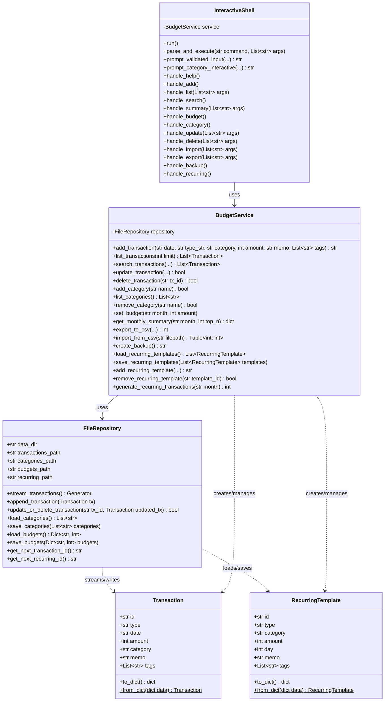
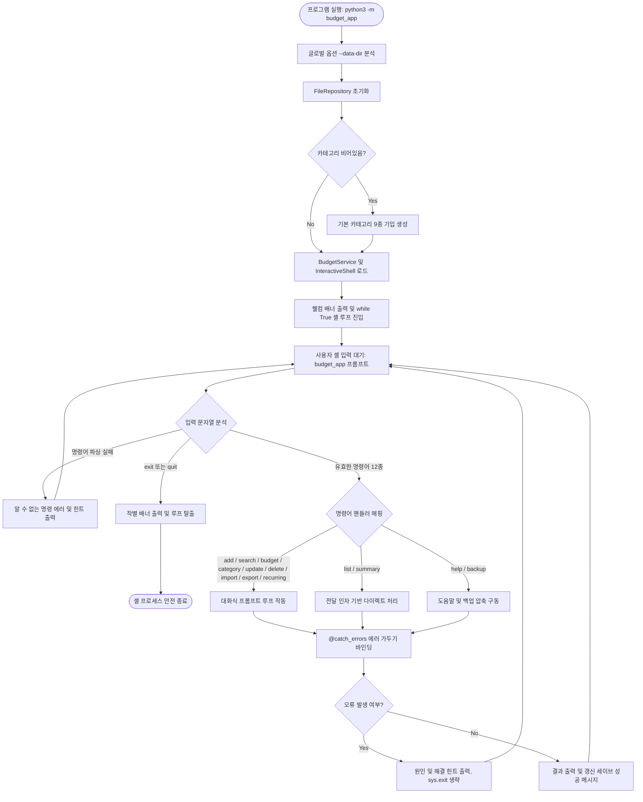

# 대화형 파일 기반 가계부 콘솔 프로그램 (Budget App)

본 프로젝트는 파이썬 표준 라이브러리만을 활용하여 구축된 **유지보수 가능하고 예외 상황에서도 데이터가 안전한 대화형 가계부 콘솔 프로그램**입니다.
터미널에서 한 번 구동하면 셸 인터페이스가 활성화되어 내부에서 다양한 명령어를 바로 간편하게 실행할 수 있습니다. 
제너레이터 스트리밍, 데코레이터 패턴, 타입 힌트, 모듈화 설계 및 파일 원자적 교체 기능이 포함되어 있습니다.

---

## 1. 실행 방법

패키지 경로 인식을 위해 가계부 루트 폴더(`/Users/mpeg46551/git/codyssey/b2_1`) 내에서 아래 명령을 통해 실행해 주십시오.

```bash
# 가계부 셸 시작
python3 -m budget_app

# 커스텀 데이터 경로 지정하여 가계부 셸 시작
python3 -m budget_app --data-dir ./my_custom_data
```

### 셸 진입 후 구동 예시
프로그램을 실행하면 가계부 전용 셸 프롬프트(`budget_app> `)가 표시되며 바로 명령을 내릴 수 있습니다:
```text
==================================================
   💰 대화형 파일 기반 가계부 (budget_app) v1.0 💰
   - 사용법 확인: help 입력
   - 프로그램 종료: exit 또는 quit 입력
==================================================
budget_app> help
```

---

## 2. 저장 파일 위치 및 형식

셸 구동 시 데이터 저장 디렉터리는 기본적으로 `./data` 폴더가 사용되며, 최초 기동 시 해당 폴더가 없는 경우 자동으로 생성됩니다. 

### 저장 파일 구조 (JSONL 형식)
데이터 저장 안전성과 제너레이터 스트리밍 성능 극대화를 위해 개행 구분 JSON 형식인 **JSONL (JSON Lines)** 형식을 채택했습니다. 
- **거래 내역**: `data_dir/transactions.jsonl`
- **카테고리 목록**: `data_dir/categories.jsonl` (최초 실행 시 기본 카테고리가 자동 생성됩니다)
- **월별 예산**: `data_dir/budgets.jsonl`
- **반복 내역 템플릿**: `data_dir/recurring.jsonl`

---

## 3. CSV 가져오기/내보내기 (Import/Export) 스키마

`import` 및 `export` 명령 수행 시 고정된 CSV 스키마 규칙을 준수합니다. (UTF-8 인코딩, 첫 번째 행 헤더 포함)

| 열 이름 (Column) | 필수 여부 (Required) | 형식 및 설명 (Format) |
| :--- | :---: | :--- |
| **date** | Y | `YYYY-MM-DD` 형식 (날짜) |
| **type** | Y | `income` (수입) 또는 `expense` (지출) |
| **category** | Y | 가계부에 등록된 카테고리 중 하나 |
| **amount** | Y | 양수 정수 |
| **memo** | N | 문자열 (메모) |
| **tags** | N | 쉼표(`,`)로 구분된 태그 문자열 |

---

## 4. 가계부 셸 명령어 및 대화형 동작 방식

### 1) 도움말 출력 (help)
사용 가능한 명령어 전체 정보와 한글 설명을 포맷팅 테이블로 출력합니다.
```text
budget_app> help
[ 사용 가능한 명령어 목록 ]
--------------------------------------------------------------------------------
명령어       | 인자 형태       | 한글 기능 설명
--------------------------------------------------------------------------------
help         | 없음            | 도움말 및 명령어 안내를 출력합니다.
...
```

### 2) 거래 내역 추가 (add)
순차적인 질문식 프롬프트를 통해 내역을 입력받으며, 유효성 검사 오류 시 오류 사유와 힌트를 출력하고 재요청합니다. 존재하지 않는 카테고리 입력 시 즉각 신규 추가 분기로 안내합니다.
```text
budget_app> add
[새 거래 추가를 시작합니다]
- 날짜 (YYYY-MM-DD) [2026-06-01]: 2024-01-15
- 타입 (income/expense): expense
- 카테고리: food
- 금액 (양수): 15000
- 메모 (선택, 없으면 엔터): 점심 식사
- 태그 (쉼표 구분, 없으면 엔터): 외식
[저장 완료] id=TX-000001
```

### 3) 거래 내역 목록 조회 (list)
최근 가계부 내역을 최신순으로 정렬 표 형식으로 출력합니다. limit 값을 선택적 인자로 설정할 수 있습니다.
```text
budget_app> list 2
id        | date       | type    | category | amount | memo  | tags
TX-000002 | 2024-01-16 | income  | salary   | 300000 | 월급  | monthly
TX-000001 | 2024-01-15 | expense | food     | 15000  | 점심  | 외식
```

### 4) 조건별 상세 검색 (search)
시작일, 종료일, 타입, 카테고리, 메모 검색 키워드, 태그 필터를 단계별 대화식 인터페이스를 통해 입력받아 복합 검색을 수행합니다. (지정하지 않는 조건은 엔터를 쳐서 건너뜁니다)
```text
budget_app> search
[필터링 검색을 설정합니다. 건너뛰려면 엔터를 입력해 주세요]
- 검색 시작일 (YYYY-MM-DD): 2024-01-01
- 검색 종료일 (YYYY-MM-DD): 
- 타입 필터 (income/expense): expense
- 카테고리 필터: 
- 메모 검색어: 점심
- 태그 필터: 
```

### 5) 월별 요약 및 예산 체크 (summary)
지정한 월(생략 시 대화형 입력 또는 현재 달 적용)의 총수입, 총지출, 잔액과 함께 지출 상위 TOP 3 카테고리를 백분율 정보와 함께 도식화합니다. 예산이 지정된 월에는 소비율(%) 및 예산 초과 시 강력한 경고 메시지가 연계 출력됩니다.
```text
budget_app> summary 2024-01
==================================================
   📊 2024-01 재정 요약 리포트
==================================================
- 총 수입: 3,000,000원
- 총 지출: 15,000원
- 잔액: 2,985,000원
- 책정 예산: 100,000원 (사용률: 15.0%)

[ 지출 TOP 3 카테고리 ]
1) food : 15,000원 (100.0%)
==================================================
```

### 6) 카테고리 관리 (category)
목록 조회, 카테고리 추가, 기존 카테고리 삭제 관리 서브 메뉴를 제공합니다. 사용 중인 카테고리는 삭제가 안전하게 차단됩니다.
```text
budget_app> category
[카테고리 설정 관리]
1. 등록된 카테고리 목록 조회
2. 신규 카테고리 추가
3. 기존 카테고리 삭제
메뉴 선택 (1/2/3/엔터(취소)): 1
```

### 7) 거래 수정 (update) 및 삭제 (delete)
- `update [ID]`: 각 항목의 기존 값을 디폴트`[...]`로 보여주며, 변경 사항만 덮어써 수정합니다.
- `delete [ID]`: 정말 삭제할 것인지 묻는 2중 확인 컨펌 후 데이터를 안전히 삭제합니다.

### 8) 일괄 연동 및 기타 기능
- `import`: 외부 CSV 파일을 가계부 규격으로 파싱 후 데이터 오류 라인은 스킵 처리하여 가정보를 안내합니다.
- `export`: 대상 월 또는 기간 범위를 선택식으로 지정받아 고정 규격 CSV로 추출 저장합니다.
- `backup` (보너스 과제 1): 전체 가계부 파일을 단일 타임스탬프 zip 파일로 압축 생성합니다.
- `recurring` (보너스 과제 2): 매달 반복 지출/수입 템플릿(REC-XXXXXX)을 등록하고, 특정 월에 일괄 자동 생성합니다. (중복 방지 내장)

---

## 5. 설계 및 기술적 특징 분석

### 5.1 계층 구조 설계 (Layered Architecture) 및 책임 분리
- **모델 (`models.py`)**: `dataclass`를 사용하여 `Transaction` 및 `RecurringTemplate`의 순수 스키마 정의.
- **저장소 (`repository.py`)**: 파일 시스템 CRUD 캡슐화 및 원자적 파일 교체 전략 수행.
- **서비스 (`service.py`)**: 핵심 계산 로직, CSV 로더, 중복 감지, 백업 집계 등 독립된 비즈니스 룰 전담.
- **CLI (`cli.py`, `__main__.py`)**: 대화형 셸 주 루프 가동, 예외 복원 셸 컨텍스트 제어, 한글 보정 정렬 출력.

### 5.2 제너레이터(Generator) 기반 파일 스트리밍 처리
대용량 파일에서 메모리 잠식을 피하기 위해 `yield`를 사용해 파일 라인을 실시간으로 한 줄씩만 로드합니다. `list` 및 `search` 결과 정렬 시에도 파일 내 전체 데이터를 메모리에 올리지 않고 **최대 `limit` 크기로 크기가 제한된 정렬 삽입 버퍼**를 활용하여 $O(\text{limit})$의 매우 제한적인 메모리 자원으로 실시간 조회 정렬을 이행합니다.

### 5.3 데코레이터(Decorator)를 통한 관심사 분리 및 에러 복원
로깅(`@log_action`), 경과 시간 측정(`@measure_time`) 및 에러 감지 `@catch_errors`가 분리되어 핵심 기능과 느슨하게 결합되어 있습니다. 특히 셸 구동 내부의 데코레이터는 사용자 에러 시 원인과 힌트를 출력하고 프로세스를 비정상 종료시키는 대신, 가계부 셸 루프 상태로 정상 복귀하도록 설계되어 안전성을 보장합니다.

### 5.4 파일 저장 원자성(Atomicity) 보장
거래 정보의 수정, 삭제, 예산 갱신 등 모든 물리 파일 디스크 갱신 과정에서 원본 파일을 직접 스트림 쓰기하지 않습니다. `tempfile`로 데이터를 임시 안전 영역에 기입한 후, 완벽히 완료된 상태에서 커널의 `os.replace` 연산으로 파일 교체를 완료하므로 예기치 않은 시스템 단절 시에도 데이터 유실이나 손상을 완벽히 방어합니다.

---

## 6. 구조 및 설계 다이어그램 (Architecture Diagrams)

### 6.1 클래스 다이어그램 (Class Diagram)


### 6.2 셸 명령어 실행 루프 흐름도 (Interactive Loop Flowchart)


---

## 7. 대화형 자동완성 및 입력 편의 기능 (Autocomplete & Interactive Input Features)

사용자의 키보드 입력 수를 최소화하고 빠른 이용을 돕기 위해 터미널 친화적 입력 시스템을 전격 탑재하였습니다:

### 1) 메인 셸 프롬프트 (`budget_app> `)
- **화살표 좌/우 키 (`Left` / `Right`)**: 사용 가능한 가계부 명령어 15가지를 키보드 입력 없이 차례대로 순환 선택할 수 있습니다. (예: `help` ➔ `add` ➔ `list` ➔ `search` ...) 이미 작성된 인자가 있는 경우에도 인자 내용은 유지하고 명령어 이름 부분만 변경됩니다.
- **화살표 위/아래 키 (`Up` / `Down`)**: 터미널 본연의 역사(History) 탐색 기능을 제공하여, 이전에 작성했던 명령어 기록을 조회 및 불러올 수 있습니다.
- **탭 키 (`Tab`)**: 입력 중인 글자 접두사와 가장 잘 맞는 명령어를 자동완성합니다.

### 2) 데이터 항목 대화형 입력 프롬프트
- **디폴트 값 자동 채우기 및 덮어쓰기 (Prefill & Overwrite)**:
  - 프롬프트 진입 시 각 항목의 추천 기본값(예: 오늘 날짜, 타입 기본값인 `expense`, 카테고리 기본값인 `food` 등)이 입력창에 미리 작성되어 출력됩니다.
  - 별도의 타이핑 없이 바로 `Enter`를 누르면 이 기본값으로 확정되어 입력됩니다.
  - 사용자가 첫 글자를 타이핑하거나 `Backspace`를 누르는 즉시 미리 채워진 기본값 텍스트가 지워지고 새로운 문자 입력 모드로 부드럽게 전환됩니다.
  - 백스페이스로 문자를 전부 지운 후 빈칸 상태에서 `Enter`를 쳐도 유효한 기본값(Default)이 자동으로 선택되어 등록됩니다.
- **화살표 키 후보군 즉시 순환**:
  - `Up`, `Down`, `Left`, `Right` 방향키를 사용하면 표시되는 가로 후보군(`food /transport /rent...`)을 양방향으로 즉시 탐색 및 선택 변경할 수 있습니다.
- **중복 출력 배제**:
  - 오늘 날짜 등 단일 기본값만 존재하는 경우에는 괄호 쌍이나 힌트가 중복 노출되지 않도록 깔끔하게 정돈된 싱글 텍스트 프롬프트를 유지합니다. (예: `- 날짜 (YYYY-MM-DD): 2026-06-01`)
