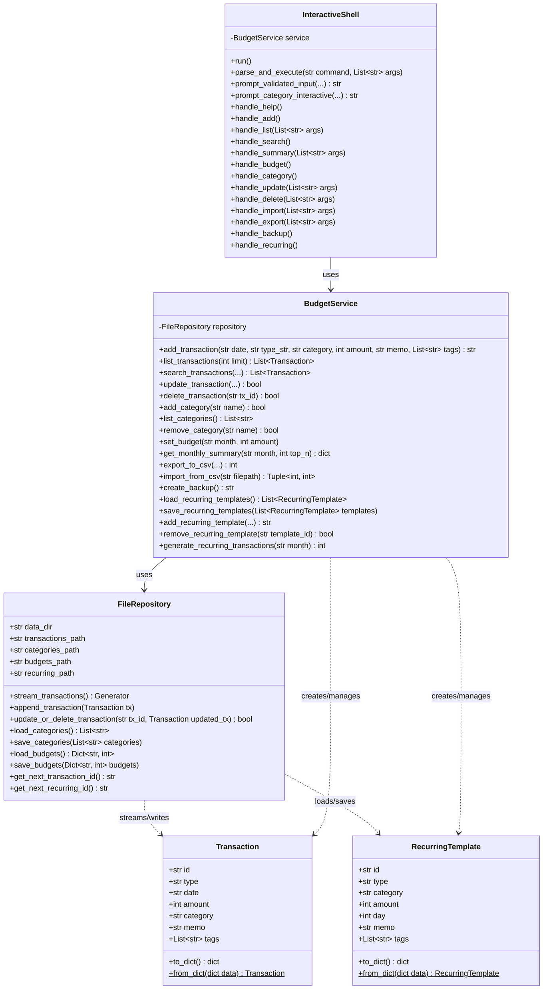
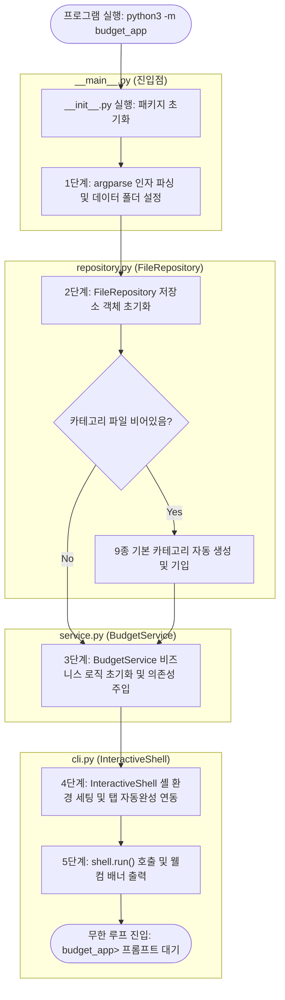
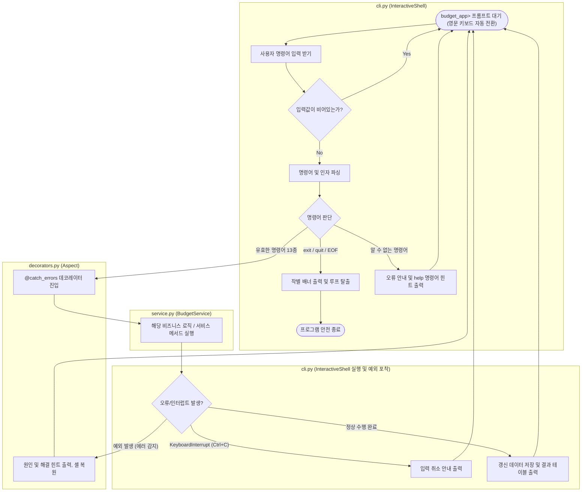
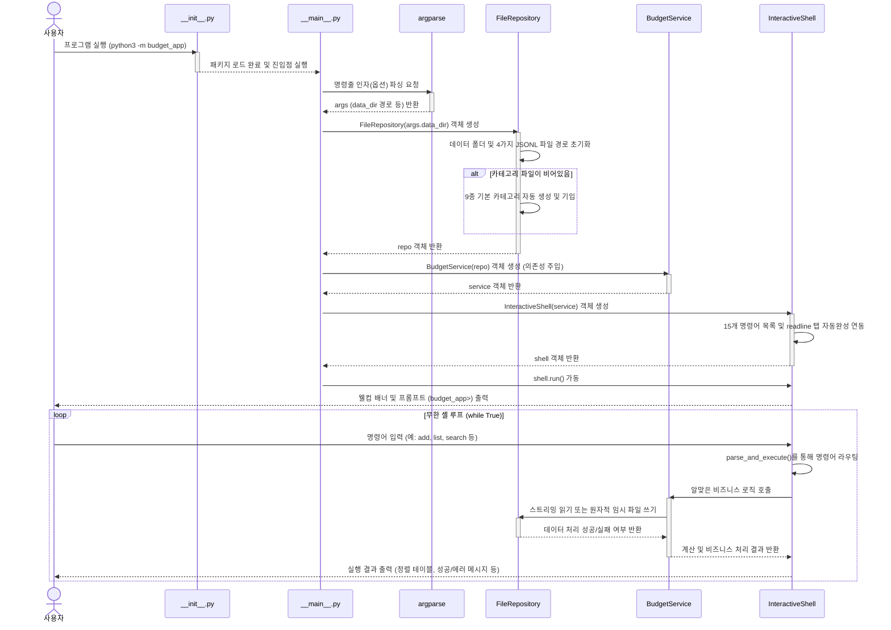
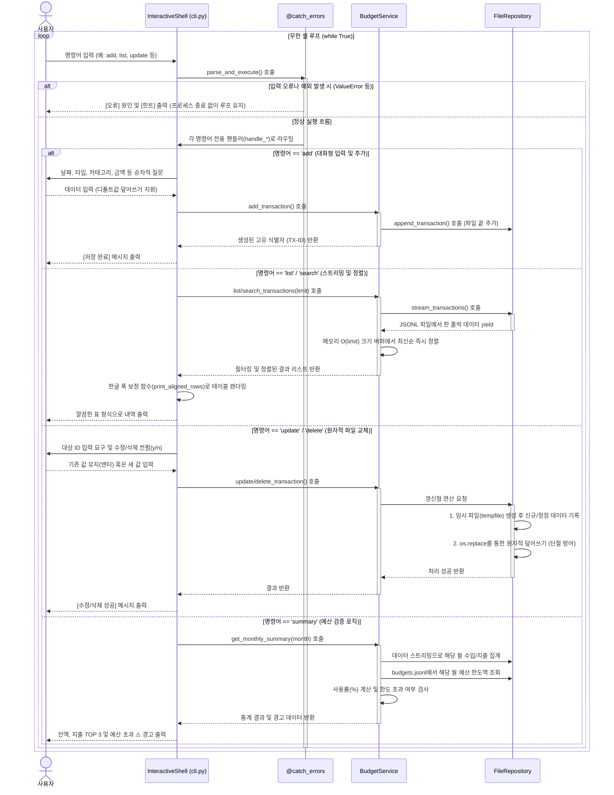

# 대화형 파일 기반 가계부 콘솔 프로그램 (Budget App)

본 프로젝트는 파이썬 표준 라이브러리만을 활용하여 구축된 **유지보수 가능하고 예외 상황에서도 데이터가 안전한 대화형 가계부 콘솔 프로그램**입니다.
터미널에서 한 번 구동하면 셸 인터페이스가 활성화되어 내부에서 다양한 명령어를 바로 간편하게 실행할 수 있습니다. 
제너레이터 스트리밍, 데코레이터 패턴, 타입 힌트, 모듈화 설계 및 파일 원자적 교체 기능이 포함되어 있습니다.

---

## 1. 실행 방법

패키지 경로 인식을 위해 가계부 루트 폴더(`/Users/mpeg46551/git/codyssey/b2_1`) 내에서 아래 명령을 통해 실행해 주십시오.

```bash
# 가계부 셸 시작
python3 -m budget_app

# 커스텀 데이터 경로 지정하여 가계부 셸 시작
python3 -m budget_app --data-dir ./my_custom_data
```

### 💡 패키지 실행 시 동작 흐름 및 초기화 시점
`python3 -m budget_app` 명령어로 패키지를 실행할 때, 파이썬 인터프리터가 패키지를 로드하고 진입점을 찾아 실행하는 순서는 다음과 같습니다:
1. **패키지 초기화 (`__init__.py` 실행)**: 파이썬 인터프리터가 `budget_app` 패키지를 로드하는 과정에서 `budget_app/__init__.py` 파일이 가장 먼저 실행되어 패키지 수준의 임포트 및 초기화를 수행합니다.
2. **진입점 실행 (`__main__.py` 실행)**: 패키지 로드 및 초기화가 완료된 후, `-m` 옵션의 타겟인 `budget_app/__main__.py` 파일이 메인 스크립트(`__name__ == "__main__"`)로써 실행됩니다. 이 진입점에서 최종적으로 의존성이 조립되고 가계부 셸 프로그램이 시작됩니다.

### 셸 진입 후 구동 예시
프로그램을 실행하면 가계부 전용 셸 프롬프트(`budget_app> `)가 표시되며 바로 명령을 내릴 수 있습니다:
```text
==================================================
   💰 대화형 파일 기반 가계부 (budget_app) v1.0 💰
   - 사용법 확인: help 입력
   - 프로그램 종료: exit 또는 quit 입력
==================================================
budget_app> help
```

---

## 2. 저장 파일 위치 및 형식

셸 구동 시 데이터 저장 디렉터리는 기본적으로 `./data` 폴더가 사용되며, 최초 기동 시 해당 폴더가 없는 경우 자동으로 생성됩니다. 

### 저장 파일 구조 (JSONL 형식)
데이터 저장 안전성과 제너레이터 스트리밍 성능 극대화를 위해 개행 구분 JSON 형식인 **JSONL (JSON Lines)** 형식을 채택했습니다. 
- **거래 내역**: `data_dir/transactions.jsonl`
- **카테고리 목록**: `data_dir/categories.jsonl` (최초 실행 시 기본 카테고리가 자동 생성됩니다)
- **월별 예산**: `data_dir/budgets.jsonl`
- **반복 내역 템플릿**: `data_dir/recurring.jsonl`

---

## 3. CSV 가져오기/내보내기 (Import/Export) 스키마

`import` 및 `export` 명령 수행 시 고정된 CSV 스키마 규칙을 준수합니다. (UTF-8 인코딩, 첫 번째 행 헤더 포함)

| 열 이름 (Column) | 필수 여부 (Required) | 형식 및 설명 (Format) |
| :--- | :---: | :--- |
| **date** | Y | `YYYY-MM-DD` 형식 (날짜) |
| **type** | Y | `income` (수입) 또는 `expense` (지출) |
| **category** | Y | 가계부에 등록된 카테고리 중 하나 |
| **amount** | Y | 양수 정수 |
| **memo** | N | 문자열 (메모) |
| **tags** | N | 쉼표(`,`)로 구분된 태그 문자열 |

---

## 4. 가계부 셸 명령어 및 대화형 동작 방식

### 1) 도움말 출력 (help)
사용 가능한 명령어 전체 정보와 한글 설명을 포맷팅 테이블로 출력합니다.
```text
budget_app> help
[ 사용 가능한 명령어 목록 ]
--------------------------------------------------------------------------------
명령어       | 인자 형태       | 한글 기능 설명
--------------------------------------------------------------------------------
help         | 없음            | 도움말 및 명령어 안내를 출력합니다.
...
```

### 2) 거래 내역 추가 (add)
순차적인 질문식 프롬프트를 통해 내역을 입력받으며, 유효성 검사 오류 시 오류 사유와 힌트를 출력하고 재요청합니다. 존재하지 않는 카테고리 입력 시 즉각 신규 추가 분기로 안내합니다.
```text
budget_app> add
[새 거래 추가를 시작합니다]
- 날짜 (YYYY-MM-DD) [2026-06-01]: 2024-01-15
- 타입 (income/expense): expense
- 카테고리: food
- 금액 (양수): 15000
- 메모 (선택, 없으면 엔터): 점심 식사
- 태그 (쉼표 구분, 없으면 엔터): 외식
[저장 완료] id=TX-000001
```

### 3) 거래 내역 목록 조회 (list)
최근 가계부 내역을 최신순으로 정렬 표 형식으로 출력합니다. limit 값을 선택적 인자로 설정할 수 있습니다.
```text
budget_app> list 2
id        | date       | type    | category | amount | memo  | tags
TX-000002 | 2024-01-16 | income  | salary   | 300000 | 월급  | monthly
TX-000001 | 2024-01-15 | expense | food     | 15000  | 점심  | 외식
```

### 4) 조건별 상세 검색 (search)
시작일, 종료일, 타입, 카테고리, 메모 검색 키워드, 태그 필터를 단계별 대화식 인터페이스를 통해 입력받아 복합 검색을 수행합니다. (지정하지 않는 조건은 엔터를 쳐서 건너뜁니다)
```text
budget_app> search
[필터링 검색을 설정합니다. 건너뛰려면 엔터를 입력해 주세요]
- 검색 시작일 (YYYY-MM-DD): 2024-01-01
- 검색 종료일 (YYYY-MM-DD): 
- 타입 필터 (income/expense): expense
- 카테고리 필터: 
- 메모 검색어: 점심
- 태그 필터: 
```

### 5) 월별 요약 및 예산 체크 (summary)
지정한 월(생략 시 대화형 입력 또는 현재 달 적용)의 총수입, 총지출, 잔액과 함께 지출 상위 TOP 3 카테고리를 백분율 정보와 함께 도식화합니다. 예산이 지정된 월에는 소비율(%) 및 예산 초과 시 강력한 경고 메시지가 연계 출력됩니다.
```text
budget_app> summary 2024-01
==================================================
   📊 2024-01 재정 요약 리포트
==================================================
- 총 수입: 3,000,000원
- 총 지출: 15,000원
- 잔액: 2,985,000원
- 책정 예산: 100,000원 (사용률: 15.0%)

[ 지출 TOP 3 카테고리 ]
1) food : 15,000원 (100.0%)
==================================================
```

### 6) 카테고리 관리 (category)
목록 조회, 카테고리 추가, 기존 카테고리 삭제 관리 서브 메뉴를 제공합니다. 사용 중인 카테고리는 삭제가 안전하게 차단됩니다.
```text
budget_app> category
[카테고리 설정 관리]
1. 등록된 카테고리 목록 조회
2. 신규 카테고리 추가
3. 기존 카테고리 삭제
메뉴 선택 (1/2/3/엔터(취소)): 1
```

### 7) 거래 수정 (update) 및 삭제 (delete)
- `update [ID]`: 각 항목의 기존 값을 디폴트`[...]`로 보여주며, 변경 사항만 덮어써 수정합니다.
- `delete [ID]`: 정말 삭제할 것인지 묻는 2중 확인 컨펌 후 데이터를 안전히 삭제합니다.

### 8) 일괄 연동 및 기타 기능
- `import`: 외부 CSV 파일을 가계부 규격으로 파싱 후 데이터 오류 라인은 스킵 처리하여 가정보를 안내합니다.
- `export`: 대상 월 또는 기간 범위를 선택식으로 지정받아 고정 규격 CSV로 추출 저장합니다.
- `backup` (보너스 과제 1): 전체 가계부 파일을 단일 타임스탬프 zip 파일로 압축 생성합니다.
- `recurring` (보너스 과제 2): 매달 반복 지출/수입 템플릿(REC-XXXXXX)을 등록하고, 특정 월에 일괄 자동 생성합니다. (중복 방지 내장)

---

## 5. 설계 및 기술적 특징 분석

### 5.1 계층 구조 설계 (Layered Architecture) 및 책임 분리

- **[models.py](budget_app/models.py)**
  - **[Transaction](budget_app/models.py)** : 개별 수입/지출 내역의 데이터 구조(`dataclass`) 및 딕셔너리 직렬화/역직렬화 처리
  - **[RecurringTemplate](budget_app/models.py)** : 고정/반복 거래 설정 데이터 구조(`dataclass`) 정의
- **[repository.py](budget_app/repository.py)**
  - **[FileRepository](budget_app/repository.py)** :
*"이 `repository.py` 파일은 가계부 데이터를 4개의 파일로 나누어 영구 저장하며, **정전이 돼도 데이터가 안 날아가게(원자적 교체) 방어**하고, **100만 건의 데이터가 쌓여도 컴퓨터가 느려지지 않게(제너레이터 스트리밍) 만들어진 아주 튼튼한 데이터베이스 관리자**입니다!"* 
   #### 로컬 파일 시스템 CRUD 제어, 데이터 스트리밍 및 원자적(Atomic) 파일 교체 전략 수행
    - budget_app/repository.py - 데이터 영속성 계층 (Data Access & Storage Layer)
    본 모듈은 가계부 프로그램(budget_app)에서 사용하는 JSONL(JSON Lines) 형식의 파일 데이터
    (거래 내역, 카테고리 목록, 예산 한도, 반복 거래 템플릿)의 직접적인 파일 CRUD 처리를 전담합니다.

    [주요 설계적 강점 및 구현 내용]
    1. 원자적 파일 교체 (Atomic File Replacement): 
    - 데이터 수정/삭제 또는 카테고리/예산 저장 시, 원본에 스트림 쓰기를 하다가 비정상 종료 시
        발생할 수 있는 파일 오염을 방지하기 위해 임시 파일(tempfile)을 생성하여 쓰고, 
        안전하게 기록이 끝나면 os.replace() 연산으로 원자적 치환(Atomic Swap)을 구현했습니다.
    2. 제너레이터 스트리밍 (Generator Streaming):
    - 거래 내역과 같이 규모가 지속적으로 증대할 수 있는 데이터 조회 시, 파일 전체를 메모리에
        동시에 올리지 않고 yield 제너레이터를 통하여 실시간 한 줄씩 순차적으로 스트리밍하여
        메모리 사용량을 제한된 자원 O(1) 수준으로 유지합니다.
    질문해주신 문구는 앞서 우리가 함께 살펴보았던 **`FileRepository` 클래스(창고 관리자)의 핵심 역할과 설계 철학**을 요약한 개발 설명서입니다. 


    #### 1. 데이터 영속성 계층 (Data Access & Storage Layer)이란?
    프로그램을 껐다 켜도 데이터가 날아가지 않고 영구적으로 보존되는 것을 '영속성(Persistence)'이라고 부릅니다. 
    * 이 모듈은 가계부의 핵심 로직(서비스 계층)과 분리되어, **오직 파일 시스템(하드디스크)에 접근해 데이터를 읽고 쓰는(CRUD: 생성/조회/수정/삭제) 작업만을 전담하는 '데이터 창고' 역할**을 한다는 뜻입니다.
    * 거래 내역(`transactions.jsonl`), 카테고리(`categories.jsonl`), 예산(`budgets.jsonl`), 반복 거래(`recurring.jsonl`) 등 4가지 필수 데이터를 안전하게 보관하는 책임을 집니다.

    #### 2. 원자적 파일 교체 (Atomic File Replacement)의 의미
    이 부분은 이전 대화에서 다뤘던 **'데이터 손상 완벽 방어'** 기술을 설명하는 부분입니다.
    * **문제 상황:** 원본 데이터 파일에 직접 새로운 내용을 덮어쓰고 있는데, 갑자기 정전이 되거나 컴퓨터가 멈추면 파일이 반쪽만 기록되어 데이터가 완전히 오염(증발)될 위험이 있습니다.
    * **해결책 (원자적 쓰기):** 이를 막기 위해 원본을 바로 건드리지 않고, 안전한 **임시 파일(`tempfile`)**을 몰래 하나 만듭니다. 이 임시 파일에 변경된 내용을 100% 완벽하게 기록을 끝마친 뒤에야, 운영체제(OS)의 **`os.replace()` 기능을 호출해 원본 파일과 단번에 바꿔치기(Atomic Swap)** 합니다. 
    * 이렇게 하면 중간에 에러가 나더라도 임시 파일만 날아갈 뿐, 원본 가계부 데이터는 안전하게 보호됩니다.

    #### 3. 제너레이터 스트리밍 (Generator Streaming)의 의미
    가계부를 몇 년 동안 써서 거래 내역이 10만 건, 100만 건으로 늘어났을 때를 대비한 **'메모리(RAM) 최적화'** 기술입니다.
    * **문제 상황:** 파일 전체를 한 번에 메모리로 불러오면(`readlines()` 등 사용), 데이터가 커질수록 컴퓨터 메모리가 터져버리거나 프로그램이 엄청나게 느려집니다.
    * **해결책 (제너레이터):** 파이썬의 **`yield`**라는 문법을 사용해 파일을 한 번에 다 읽지 않고, **실시간으로 딱 '한 줄(하나의 거래 내역)'씩만 읽어와서 처리하고 메모리에서 지워버리는 스트리밍 방식**을 사용합니다.
    * **결과:** 이 덕분에 데이터가 아무리 커져도 프로그램이 차지하는 메모리는 **$O(1)$(또는 정렬 시 $O(limit)$ 수준)로 아주 작고 일정하게 유지**되어 언제나 빠르고 가볍게 동작할 수 있습니다.

---
- **[service.py](budget_app/service.py)**
  - **[BudgetService](budget_app/service.py)** : 필터링/정렬 버퍼 연산, 소비율 집계, CSV 변환(Import/Export), 백업 압축, 반복 거래 일괄 생성 등 비즈니스 로직 전담
- **[cli.py](budget_app/cli.py)**
  - **[InteractiveShell](budget_app/cli.py)** : 셸 명령어 분석 및 대화식 입력 프롬프트 제어, 자동완성 제공, 한글 정렬 기반 결과 테이블 시각화
- **[__main__.py](budget_app/__main__.py)**
  - entry point : 글로벌 명령어 라인 옵션 분석 및 데이터 계층부터 UI 계층까지의 의존성(Repository ➔ Service ➔ Shell) 주입 및 앱 실행
- **[__init__.py](budget_app/__init__.py)**
  - package initialization : `python3 -m budget_app` 실행 시 패키지 로드 과정에서 `__main__.py` 진입 전에 가장 먼저 실행되어 패키지 초기화를 담당
- **[decorators.py](budget_app/decorators.py)**
  - decorator : 동작 로깅(`@log_action`), 소요 시간 정밀 기록(`@measure_time`), 에러 가두기 및 자동 복구(`@catch_errors`) 구현


### 5.2 제너레이터(Generator) 기반 파일 스트리밍 처리
대용량 파일에서 메모리 잠식을 피하기 위해 `yield`를 사용해 파일 라인을 실시간으로 한 줄씩만 로드합니다. `list` 및 `search` 결과 정렬 시에도 파일 내 전체 데이터를 메모리에 올리지 않고 **최대 `limit` 크기로 크기가 제한된 정렬 삽입 버퍼**를 활용하여 $O(\text{limit})$의 매우 제한적인 메모리 자원으로 실시간 조회 정렬을 이행합니다.

### 5.3 데코레이터(Decorator)를 통한 관심사 분리 및 에러 복원
로깅(`@log_action`), 경과 시간 측정(`@measure_time`) 및 에러 감지 `@catch_errors`가 분리되어 핵심 기능과 느슨하게 결합되어 있습니다. 특히 셸 구동 내부의 데코레이터는 사용자 에러 시 원인과 힌트를 출력하고 프로세스를 비정상 종료시키는 대신, 가계부 셸 루프 상태로 정상 복귀하도록 설계되어 안전성을 보장합니다.

### 5.4 파일 저장 원자성(Atomicity) 보장
거래 정보의 수정, 삭제, 예산 갱신 등 모든 물리 파일 디스크 갱신 과정에서 원본 파일을 직접 스트림 쓰기하지 않습니다. `tempfile`로 데이터를 임시 안전 영역에 기입한 후, 완벽히 완료된 상태에서 커널의 `os.replace` 연산으로 파일 교체를 완료하므로 예기치 않은 시스템 단절 시에도 데이터 유실이나 손상을 완벽히 방어합니다.

### 5.5 핵심 구현 코드 조각 (Core Code Snippets)

#### **1) 제너레이터 기반 파일 스트리밍**
* **용도**: 대용량 거래 데이터 조회 시 파일 전체를 읽어 배열화하지 않고, 개행 구분 단위로 한 줄씩 실시간 로드 및 yield하여 메모리 효율을 극대화합니다.
* **소스 코드**: [repository.py:L53-L72](file:///Users/mpeg46551/codyssey/b2_1/budget_app/repository.py#L53-L72)
```python
def stream_transactions(self) -> Generator[Transaction, None, None]:
    # 1. 파일이 미생성 상태이면 빈 제너레이터 즉시 리턴
    if not os.path.exists(self.transactions_path):
        return
    # 2. open()을 통해 한 행씩(텍스트 개행 구분) 스트리밍 처리
    with open(self.transactions_path, "r", encoding="utf-8") as f:
        for line in f: # readlines() 대신 yield를 통한 O(1) 수준 버퍼 유지
            line = line.strip()
            if not line:
                continue
            try:
                data = json.loads(line)
                yield Transaction.from_dict(data) # 역직렬화된 Transaction 객체 실시간 반환
            except (json.JSONDecodeError, KeyError):
                continue # 손상 데이터 라인은 무시하고 패스
```

#### **2) 원자적 파일 교체 (Atomic Write)**
* **용도**: 쓰기 중 정전/강제 종료 등 데이터 손상 우려를 완벽 예방하기 위해, 임시 파일 작성 완료 후 원본과 원자적으로 치환합니다.
* **소스 코드**: [repository.py:L84-L127](file:///Users/mpeg46551/codyssey/b2_1/budget_app/repository.py#L84-L127)
```python
def update_or_delete_transaction(self, tx_id: str, updated_tx: Optional[Transaction]) -> bool:
    found = False
    # 1. 임시 고유 파일 경로 생성 (tempfile.mkstemp)
    temp_fd, temp_path = tempfile.mkstemp(dir=self.data_dir, prefix="transactions_tmp_", suffix=".jsonl")
    try:
        with os.fdopen(temp_fd, "w", encoding="utf-8") as out_f:
            if os.path.exists(self.transactions_path):
                with open(self.transactions_path, "r", encoding="utf-8") as in_f:
                    for line in in_f:
                        line = line.strip()
                        if not line: continue
                        data = json.loads(line)
                        if data.get("id") == tx_id: # 수정 대상 발견
                            found = True
                            if updated_tx is not None: # 수정 기입 (None이면 삭제)
                                out_f.write(json.dumps(updated_tx.to_dict(), ensure_ascii=False) + "\n")
                        else:
                            out_f.write(line + "\n") # 타 객체는 원문 그대로 임시 파일 복사
        if found:
            # 2. 변경 완료가 확정되면 OS 원자적 치환 연산 단행
            os.replace(temp_path, self.transactions_path)
        else:
            os.remove(temp_path) # 수정 대상 없을 시 임시 파일 파기
    except Exception as e:
        if os.path.exists(temp_path):
            os.remove(temp_path) # 실패 복구 시 찌꺼기 파일 클린업
        raise e
    return found
```

#### **3) $O(\text{limit})$ 정렬 삽입 버퍼**
* **용도**: 10만 건 이상의 조회 시 병목을 우회하기 위해, limit 크기로 버퍼를 제한하고 새 데이터를 적시 정렬 삽입 및 초과 시 pop() 처리합니다.
* **소스 코드**: [service.py:L70-L96](file:///Users/mpeg46551/codyssey/b2_1/budget_app/service.py#L70-L96)
```python
def list_transactions(self, limit: int) -> List[Transaction]:
    top_txs: List[Transaction] = [] # 정렬 순서대로 최대 limit 만큼 보관할 버퍼
    for tx in self.repository.stream_transactions():
        inserted = False
        for i, existing in enumerate(top_txs):
            # 1. 날짜 내림차순(최신순), 날짜 같으면 ID 역순 정렬 기준 삽입 위치 스캔
            if tx.date > existing.date or (tx.date == existing.date and tx.id > existing.id):
                top_txs.insert(i, tx) # 정밀 정렬 위치에 데이터 추가
                inserted = True
                break
        if not inserted:
            top_txs.append(tx)
        
        # 2. 버퍼 크기가 limit을 상회하면 가장 낡은 끝자리 요소 소거
        # -> 메모리 점유율을 O(limit)로 영구 한정하여 대량 데이터 병목 방지
        if len(top_txs) > limit:
            top_txs.pop()
            
    return top_txs
```

#### **4) 횡단 관심사 예외 격리 데코레이터**
* **용도**: 비즈니스 처리 시 에러 폭발로 터미널 세션이 다운되지 않도록 오류 원인/힌트를 출력하고 프롬프트를 복구합니다.
* **소스 코드**: [decorators.py:L20-L47](file:///Users/mpeg46551/codyssey/b2_1/budget_app/decorators.py#L20-L47)
```python
def catch_errors(func: Callable[..., Any]) -> Callable[..., Any]:
    @functools.wraps(func)
    def wrapper(*args, **kwargs):
        try:
            return func(*args, **kwargs) # 핵심 핸들러 수행
        except ValueError as e: # 사용자 입력 데이터 에러
            print(f"[오류] {e}", file=sys.stderr)
            print("[힌트] 입력 형식을 확인하고 유효한 값을 입력해 주세요.", file=sys.stderr)
        except FileNotFoundError as e: # 파일 손실 에러
            print(f"[오류] 파일을 찾을 수 없습니다: {e}", file=sys.stderr)
        except Exception as e: # 기타 예외 복원
            print(f"[오류] 실행 중 예외가 발생했습니다: {e}", file=sys.stderr)
    return wrapper
```

#### **5) macOS 한영 입력 소스 영어 자동 강제 전환**
* **용도**: 한글 타이핑 상태에서 가계부 셸에 명령어 입력 시 발생하는 불필요한 에러를 영문 자동 전환으로 원천 방어합니다.
* **소스 코드**: [cli.py:L38-L83](file:///Users/mpeg46551/codyssey/b2_1/budget_app/cli.py#L38-L83)
```python
def switch_to_english():
    try:
        # 1. macOS 시스템 Carbon 프레임워크 라이브러리 동적 로드
        cf_path = ctypes.util.find_library('CoreFoundation')
        cf = ctypes.cdll.LoadLibrary(cf_path)
        carbon_path = ctypes.util.find_library('Carbon')
        carbon = ctypes.cdll.LoadLibrary(carbon_path)
        
        # 2. 미국 영어 식별 지시용 "en" CFString 변환
        utf8_str = cf.CFStringCreateWithCString(None, b"en", 0x08000100)
        
        # 3. TIS API로 영어 입력 소스 가져오기 및 선택
        source = carbon.TISCopyInputSourceForLanguage(utf8_str)
        cf.CFRelease(utf8_str)
        if not source:
            return False
            
        status = carbon.TISSelectInputSource(source) # 입력 소스 미국 영어(US) 전환
        cf.CFRelease(source)
        return status == 0
    except Exception:
        return False
```

#### **6) CJK 2바이트 가폭 인지 및 표 정렬**
* **용도**: 동아시아 한글의 2바이트 출력 크기를 계산해 터미널 테이블 출력이 삐뚤어지지 않게 완벽 정렬합니다.
* **소스 코드**: [cli.py:L295-L313](file:///Users/mpeg46551/codyssey/b2_1/budget_app/cli.py#L295-L313)
```python
def visual_len(s: str) -> int:
    width = 0
    for char in s:
        # 유니코드 문자의 동아시아 정렬 폭 속성이 W(Wide), F(Full), A(Ambiguous)인 경우 2칸으로 연산
        if unicodedata.east_asian_width(char) in ('W', 'F', 'A'):
            width += 2
        else:
            width += 1
    return width
```

---

## 6. 구조 및 설계 다이어그램 (Architecture Diagrams)

### 6.1 클래스 다이어그램 (Class Diagram)



### 6.2 가계부 앱 초기 실행부터 프롬프트 대기까지의 5단계 흐름



### 6.3 셸 무한 루프 및 명령어 실행 흐름도 (Command Execution Loop Flowchart)




### 6.4 초기화 및 기본 실행 시퀀스 다이어그램 (Initialization & Execution Sequence Diagram)

### 6.5 상세 명령어 실행 시퀀스 다이어그램 (Detailed Command Execution Sequence Diagram)


----
## 7. 대화형 자동완성 및 입력 편의 기능 (Autocomplete & Interactive Input Features)

사용자의 키보드 입력 수를 최소화하고 빠른 이용을 돕기 위해 터미널 친화적 입력 시스템을 전격 탑재하였습니다:

### 1) 메인 셸 프롬프트 (`budget_app> `)
- **화살표 좌/우 키 (`Left` / `Right`)**: 사용 가능한 가계부 명령어 15가지를 키보드 입력 없이 차례대로 순환 선택할 수 있습니다. (예: `help` ➔ `add` ➔ `list` ➔ `search` ...) 이미 작성된 인자가 있는 경우에도 인자 내용은 유지하고 명령어 이름 부분만 변경됩니다.
- **화살표 위/아래 키 (`Up` / `Down`)**: 터미널 본연의 역사(History) 탐색 기능을 제공하여, 이전에 작성했던 명령어 기록을 조회 및 불러올 수 있습니다.
- **탭 키 (`Tab`)**: 입력 중인 글자 접두사와 가장 잘 맞는 명령어를 자동완성합니다.

### 2) 데이터 항목 대화형 입력 프롬프트
- **디폴트 값 자동 채우기 및 덮어쓰기 (Prefill & Overwrite)**:
  - 프롬프트 진입 시 각 항목의 추천 기본값(예: 오늘 날짜, 타입 기본값인 `expense`, 카테고리 기본값인 `food` 등)이 입력창에 미리 작성되어 출력됩니다.
  - 별도의 타이핑 없이 바로 `Enter`를 누르면 이 기본값으로 확정되어 입력됩니다.
  - 사용자가 첫 글자를 타이핑하거나 `Backspace`를 누르는 즉시 미리 채워진 기본값 텍스트가 지워지고 새로운 문자 입력 모드로 부드럽게 전환됩니다.
  - 백스페이스로 문자를 전부 지운 후 빈칸 상태에서 `Enter`를 쳐도 유효한 기본값(Default)이 자동으로 선택되어 등록됩니다.
- **화살표 키 후보군 즉시 순환**:
  - `Up`, `Down`, `Left`, `Right` 방향키를 사용하면 표시되는 가로 후보군(`food /transport /rent...`)을 양방향으로 즉시 탐색 및 선택 변경할 수 있습니다.
- **중복 출력 배제**:
  - 오늘 날짜 등 단일 기본값만 존재하는 경우에는 괄호 쌍이나 힌트가 중복 노출되지 않도록 깔끔하게 정돈된 싱글 텍스트 프롬프트를 유지합니다. (예: `- 날짜 (YYYY-MM-DD): 2026-06-01`)
