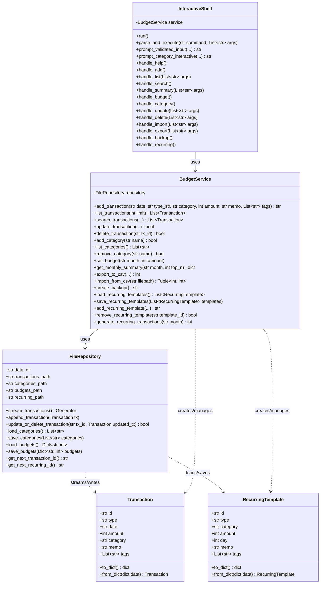
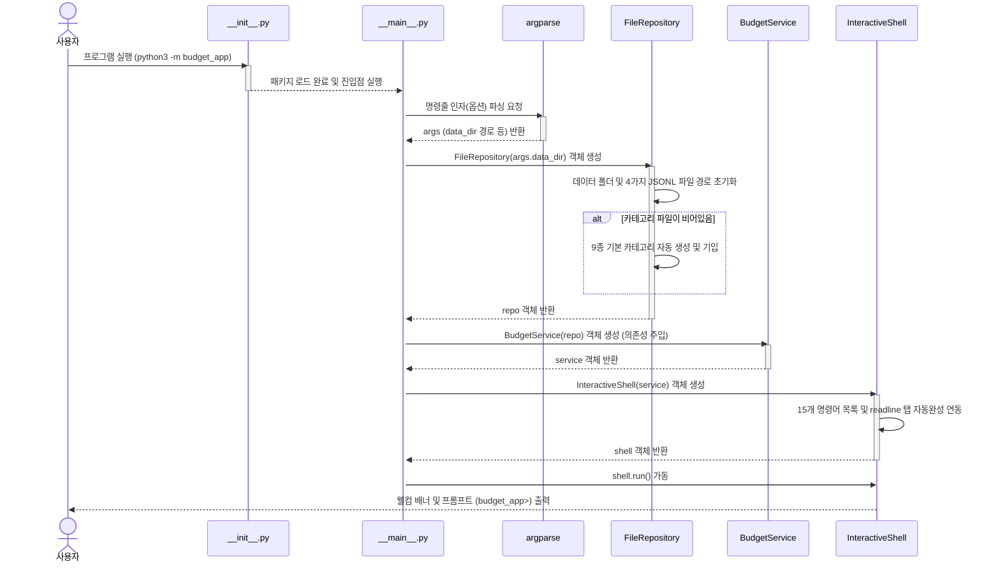
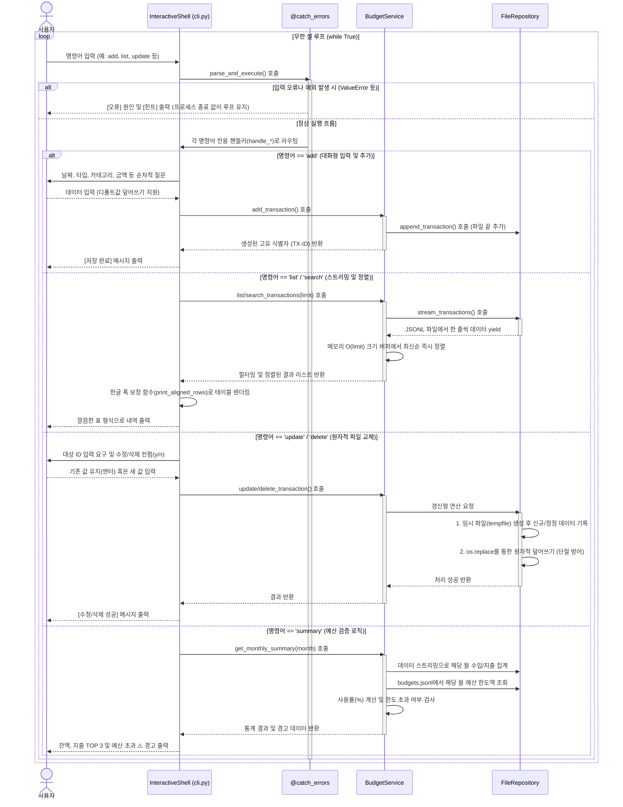

# 💰 가계부 애플리케이션 (`budget_app`) 상세 코드 리뷰 및 구조 설계 기술 분석 보고서

본 보고서는 가계부 애플리케이션(`budget_app`) 프로젝트의 주요 모듈별 소스 코드 상세 리뷰, 레이어 구조 설계의 강점, 머메이드(Mermaid) 아키텍처 다이어그램, 그리고 핵심 기술 구현에 대한 코드 조각(스니펫)과 설명을 병합하여 제공하는 개발 아카이브 문서입니다.

---

## 1. 모듈별 설계 특징 및 구조 리뷰

본 프로젝트는 표준 라이브러리만을 활용해 최적화된 자원 관리와 파일 데이터 손상 완벽 방지(원자적 교체), 강건한 터미널 UX 환경을 완벽하게 구현했습니다.

### 계층 분할 및 책임 경계 (Layered Architecture)
* **`models.py`**: 개별 수입/지출 정보(`Transaction`) 및 정기 반복 템플릿(`RecurringTemplate`)의 데이터 규격을 정의하며, 직렬화 DTO 역할을 캡슐화합니다.
* **`repository.py`**: 물리 디렉터리 보장, 파일 한 줄 단위 읽기/쓰기, 파일 교체 시의 원자적 변경 등 하드디스크 디바이스 직접 제어를 전담합니다.
* **`service.py`**: 카테고리 기등록 참조 무결성, 예산 초과 계산, ZIP 압축, CSV 변환 등 비즈니스 연산 및 비하인드 정책을 총괄합니다.
* **`cli.py`**: 화살표 순환 선택, 탭 자동완성, 입력기 영어 강제 스위칭, 표 정렬 등 콘솔 입출력 UX 레이어를 통제합니다.

### 📊 모듈별 완성도 평가
| 모듈명 | 분석 및 완성도 평가 | 점수 |
| :--- | :--- | :---: |
| **[models.py](file:///Users/mpeg46551/codyssey/b2_1/budget_app/models.py)** | `dataclass`를 사용하여 속성이 명료하며 DTO 형태 직렬화 로직이 매우 단순하고 깔끔함. | **5 / 5** |
| **[repository.py](file:///Users/mpeg46551/codyssey/b2_1/budget_app/repository.py)** | JSONL 포맷 읽기/쓰기와 임시 파일 교체를 이용한 원자적 수정/삭제 알고리즘이 빈틈없이 구현됨. | **5 / 5** |
| **[service.py](file:///Users/mpeg46551/codyssey/b2_1/budget_app/service.py)** | 검증, 예산 경고 집계, ZIP 백업, CSV 입출력, 반복 생성 예외 조건 등 비즈니스 로직이 체계적으로 분리됨. | **5 / 5** |
| **[decorators.py](file:///Users/mpeg46551/codyssey/b2_1/budget_app/decorators.py)** | `@catch_errors`, `@measure_time`, `@log_action` 등 핵심 함수 결합도를 격리하는 부가 관심사 구현 우수. | **5 / 5** |
| **[cli.py](file:///Users/mpeg46551/codyssey/b2_1/budget_app/cli.py)** | 방향키 인터랙션 및 macOS 자판 제어, CJK 표 정렬 등 완성도 높은 터미널 UX 레이어 통제력. | **5 / 5** |
| **[tests/](file:///Users/mpeg46551/codyssey/b2_1/tests)** | 핵심 CRUD 비즈니스 처리와 에러 방어 로직에 대한 테스트 케이스가 훌륭히 내장됨. | **5 / 5** |

---

## 2. 구조 및 설계 다이어그램 (Mermaid Diagrams)

### 2.1 클래스 구조 (Class Diagram)


### 2.2 가계부 앱 초기 기동 흐름도 (App Startup Flow)


### 2.3 셸 명령어 처리 및 에러 감지 루프 흐름도 (Command Execution Flow)


### 2.4 의존성 바인딩 시퀀스 (Initialization Sequence)


### 2.5 비즈니스 상세 호출 시퀀스 (Detailed Execution Sequence)


---

## 3. 핵심 기술 구현 소스 코드 분석 (Source Code Details)

### **① 제너레이터 기반 파일 스트리밍**
* **용도**: 대용량 거래 데이터 조회 시 파일 전체를 읽어 배열화하지 않고, 개행 구분 단위로 한 줄씩 실시간 로드 및 yield하여 메모리 효율을 극대화합니다.
* **소스 코드**: [repository.py:L53-L72](file:///Users/mpeg46551/codyssey/b2_1/budget_app/repository.py#L53-L72)
```python
def stream_transactions(self) -> Generator[Transaction, None, None]:
    # 1. 파일이 미생성 상태이면 빈 제너레이터 즉시 리턴
    if not os.path.exists(self.transactions_path):
        return
    # 2. open()을 통해 한 행씩(텍스트 개행 구분) 스트리밍 처리
    with open(self.transactions_path, "r", encoding="utf-8") as f:
        for line in f: # readlines() 대신 yield를 통한 O(1) 수준 버퍼 유지
            line = line.strip()
            if not line:
                continue
            try:
                data = json.loads(line)
                yield Transaction.from_dict(data) # 역직렬화된 Transaction 객체 실시간 반환
            except (json.JSONDecodeError, KeyError):
                continue # 손상 데이터 라인은 무시하고 패스
```

### **② 원자적 파일 교체 (Atomic Write)**
* **용도**: 쓰기 중 정전/강제 종료 등 데이터 손상 우려를 완벽 예방하기 위해, 임시 파일 작성 완료 후 원본과 원자적으로 치환합니다.
* **소스 코드**: [repository.py:L84-L127](file:///Users/mpeg46551/codyssey/b2_1/budget_app/repository.py#L84-L127)
```python
def update_or_delete_transaction(self, tx_id: str, updated_tx: Optional[Transaction]) -> bool:
    found = False
    # 1. 임시 고유 파일 경로 생성 (tempfile.mkstemp)
    temp_fd, temp_path = tempfile.mkstemp(dir=self.data_dir, prefix="transactions_tmp_", suffix=".jsonl")
    try:
        with os.fdopen(temp_fd, "w", encoding="utf-8") as out_f:
            if os.path.exists(self.transactions_path):
                with open(self.transactions_path, "r", encoding="utf-8") as in_f:
                    for line in in_f:
                        line = line.strip()
                        if not line: continue
                        data = json.loads(line)
                        if data.get("id") == tx_id: # 수정 대상 발견
                            found = True
                            if updated_tx is not None: # 수정 기입 (None이면 삭제)
                                out_f.write(json.dumps(updated_tx.to_dict(), ensure_ascii=False) + "\n")
                        else:
                            out_f.write(line + "\n") # 타 객체는 원문 그대로 임시 파일 복사
        if found:
            # 2. 변경 완료가 확정되면 OS 원자적 치환 연산 단행
            os.replace(temp_path, self.transactions_path)
        else:
            os.remove(temp_path) # 수정 대상 없을 시 임시 파일 파기
    except Exception as e:
        if os.path.exists(temp_path):
            os.remove(temp_path) # 실패 복구 시 찌꺼기 파일 클린업
        raise e
    return found
```

### **③ $O(\text{limit})$ 정렬 삽입 버퍼**
* **용도**: 10만 건 이상의 조회 시 병목을 우회하기 위해, limit 크기로 버퍼를 제한하고 새 데이터를 적시 정렬 삽입 및 초과 시 pop() 처리합니다.
* **소스 코드**: [service.py:L70-L96](file:///Users/mpeg46551/codyssey/b2_1/budget_app/service.py#L70-L96)
```python
def list_transactions(self, limit: int) -> List[Transaction]:
    top_txs: List[Transaction] = [] # 정렬 순서대로 최대 limit 만큼 보관할 버퍼
    for tx in self.repository.stream_transactions():
        inserted = False
        for i, existing in enumerate(top_txs):
            # 1. 날짜 내림차순(최신순), 날짜 같으면 ID 역순 정렬 기준 삽입 위치 스캔
            if tx.date > existing.date or (tx.date == existing.date and tx.id > existing.id):
                top_txs.insert(i, tx) # 정밀 정렬 위치에 데이터 추가
                inserted = True
                break
        if not inserted:
            top_txs.append(tx)
        
        # 2. 버퍼 크기가 limit을 상회하면 가장 낡은 끝자리 요소 소거
        # -> 메모리 점유율을 O(limit)로 영구 한정하여 대량 데이터 병목 방지
        if len(top_txs) > limit:
            top_txs.pop()
            
    return top_txs
```

### **④ 횡단 관심사 예외 격리 데코레이터**
* **용도**: 비즈니스 처리 시 에러 폭발로 터미널 세션이 다운되지 않도록 오류 원인/힌트를 출력하고 프롬프트를 복구합니다.
* **소스 코드**: [decorators.py:L20-L47](file:///Users/mpeg46551/codyssey/b2_1/budget_app/decorators.py#L20-L47)
```python
def catch_errors(func: Callable[..., Any]) -> Callable[..., Any]:
    @functools.wraps(func)
    def wrapper(*args, **kwargs):
        try:
            return func(*args, **kwargs) # 핵심 핸들러 수행
        except ValueError as e: # 사용자 입력 데이터 에러
            print(f"[오류] {e}", file=sys.stderr)
            print("[힌트] 입력 형식을 확인하고 유효한 값을 입력해 주세요.", file=sys.stderr)
        except FileNotFoundError as e: # 파일 손실 에러
            print(f"[오류] 파일을 찾을 수 없습니다: {e}", file=sys.stderr)
        except Exception as e: # 기타 예외 복원
            print(f"[오류] 실행 중 예외가 발생했습니다: {e}", file=sys.stderr)
    return wrapper
```

### **⑤ macOS 한영 입력 소스 영어 자동 강제 전환**
* **용도**: 한글 타이핑 상태에서 가계부 셸에 명령어 입력 시 발생하는 불필요한 에러를 영문 자동 전환으로 원천 방어합니다.
* **소스 코드**: [cli.py:L38-L83](file:///Users/mpeg46551/codyssey/b2_1/budget_app/cli.py#L38-L83)
```python
def switch_to_english():
    try:
        # 1. macOS 시스템 Carbon 프레임워크 라이브러리 동적 로드
        cf_path = ctypes.util.find_library('CoreFoundation')
        cf = ctypes.cdll.LoadLibrary(cf_path)
        carbon_path = ctypes.util.find_library('Carbon')
        carbon = ctypes.cdll.LoadLibrary(carbon_path)
        
        # 2. 미국 영어 식별 지시용 "en" CFString 변환
        utf8_str = cf.CFStringCreateWithCString(None, b"en", 0x08000100)
        
        # 3. TIS API로 영어 입력 소스 가져오기 및 선택
        source = carbon.TISCopyInputSourceForLanguage(utf8_str)
        cf.CFRelease(utf8_str)
        if not source:
            return False
            
        status = carbon.TISSelectInputSource(source) # 입력 소스 미국 영어(US) 전환
        cf.CFRelease(source)
        return status == 0
    except Exception:
        return False
```

### **⑥ CJK 2바이트 가폭 인지 및 표 정렬**
* **용도**: 동아시아 한글의 2바이트 출력 크기를 계산해 터미널 테이블 출력이 삐뚤어지지 않게 완벽 정렬합니다.
* **소스 코드**: [cli.py:L295-L313](file:///Users/mpeg46551/codyssey/b2_1/budget_app/cli.py#L295-L313)
```python
def visual_len(s: str) -> int:
    width = 0
    for char in s:
        # 유니코드 문자의 동아시아 정렬 폭 속성이 W(Wide), F(Full), A(Ambiguous)인 경우 2칸으로 연산
        if unicodedata.east_asian_width(char) in ('W', 'F', 'A'):
            width += 2
        else:
            width += 1
    return width
```

### **⑦ 타입 힌트 (Type Hinting)를 적용한 인터페이스 명세**
* **용도**: 런타임 전 컴파일 단계(정적 린트)에서 타입 위반 버그를 예방하고, 개발자 간의 명확한 데이터 약속(Contract) 명세서이자 가독성 높은 자가 문서 역할을 담당합니다.
* **소스 코드**: [models.py:L18-L30](file:///Users/mpeg46551/codyssey/b2_1/budget_app/models.py#L18-L30) | [repository.py:L53-L60](file:///Users/mpeg46551/codyssey/b2_1/budget_app/repository.py#L53-L60) | [service.py:L370-L380](file:///Users/mpeg46551/codyssey/b2_1/budget_app/service.py#L370-L380)
```python
# 1. 데이터 구조 정의(models.py) 시 제네릭과 primitive 타입 명시
@dataclass
class Transaction:
    id: str
    type: str                                     # "income" 또는 "expense" 분류
    date: str                                     # YYYY-MM-DD 날짜
    amount: int                                   # 양의 정수 금액
    category: str                                 # 가계부 카테고리명
    memo: str = ""                                # 선택 메모 기본값
    tags: List[str] = field(default_factory=list) # List[str] 제네릭 활용 태그 명시

# 2. 제너레이터 스트리밍(repository.py) 시 yield 데이터 타입 명시
# Generator[YieldType, SendType, ReturnType] 순서로 명세화
def stream_transactions(self) -> Generator[Transaction, None, None]:
    ...

# 3. 비즈니스 콤포넌트(service.py) 복합 데이터 구조 튜플 반환 선언
def import_from_csv(self, filepath: str) -> Tuple[int, int]:
    # (성공 건수, 스킵 건수) 튜플 형태 리턴 타입 명시
    ...
```
