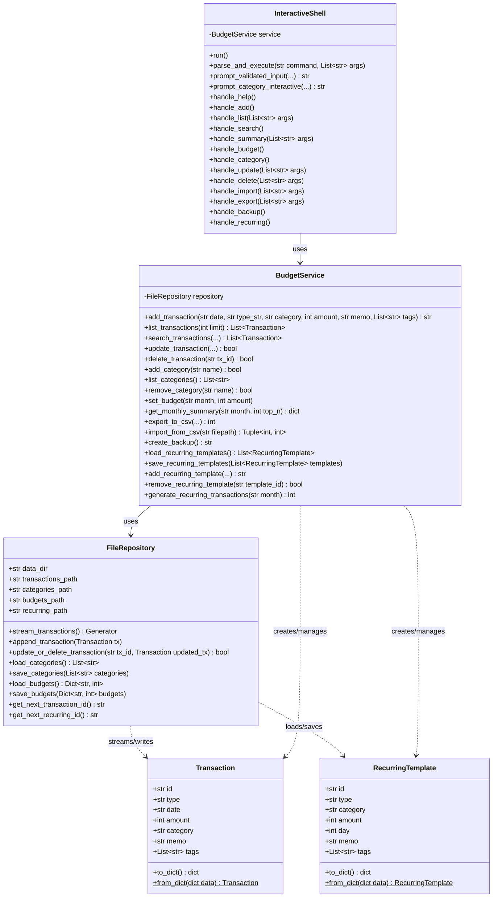
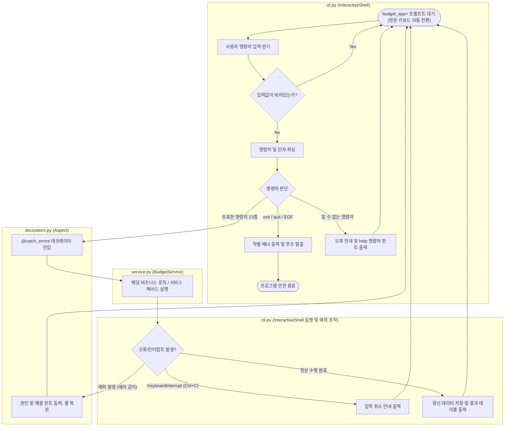
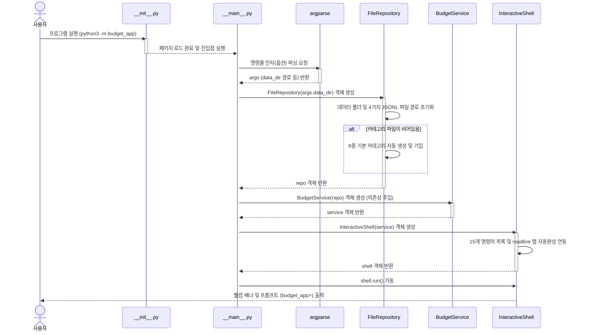
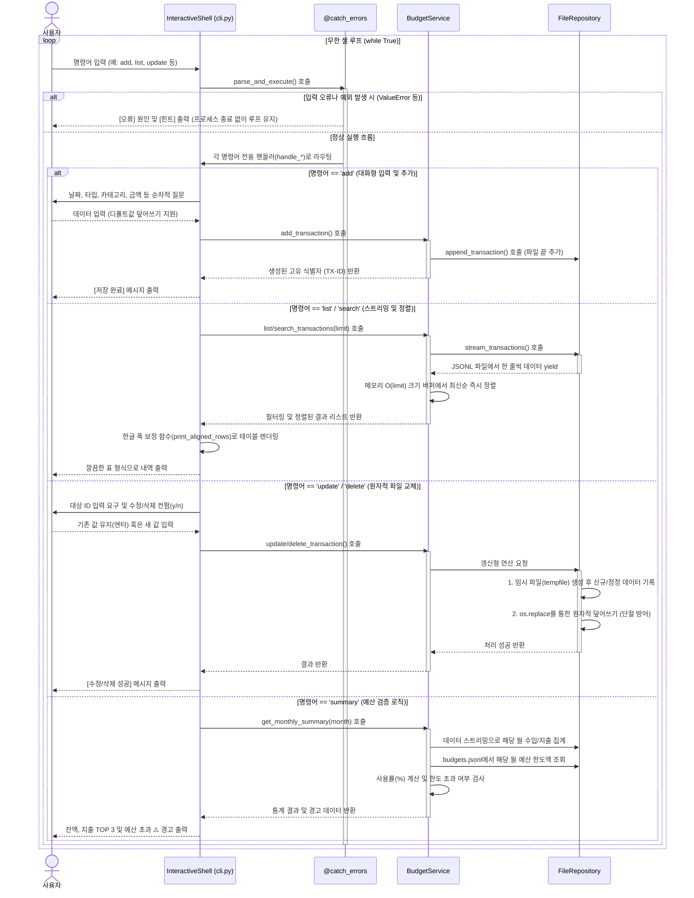

# 💰 가계부 애플리케이션 (`budget_app`) 상세 코드 리뷰 및 구조 설계 기술 분석 보고서

본 보고서는 가계부 애플리케이션(`budget_app`) 프로젝트의 주요 모듈별 소스 코드 상세 리뷰, 레이어 구조 설계의 강점, 머메이드(Mermaid) 아키텍처 다이어그램, 그리고 핵심 기술 구현에 대한 코드 조각(스니펫)과 설명을 병합하여 제공하는 개발 아카이브 문서입니다.

---

## 1. 모듈별 설계 특징 및 구조 리뷰

본 프로젝트는 표준 라이브러리만을 활용해 최적화된 자원 관리와 파일 데이터 손상 완벽 방지(원자적 교체), 강건한 터미널 UX 환경을 완벽하게 구현했습니다.

### 계층 분할 및 책임 경계 (Layered Architecture)
본 프로젝트는 관심사 분리(SoC)를 실현하기 위해 역할을 네 가지 계층으로 분할하고, 각 계층의 종속성이 하위 방향(UI -> Service -> Repository -> Models)으로만 흐르도록 구조화하여 유지보수성을 극대화했습니다.

### 📂 상세 클래스별 책임 및 디자인 패턴 분석 (Detailed Class Roles)

#### 1. [models.py](file:///Users/mpeg46551/codyssey/b2_1/budget_app/models.py) (데이터 모델 및 DTO 계층)

##### 💡 `models.py`는 무엇이며 왜 핵심 기반인가?
`models.py` 파일은 어플리케이션 전체에서 유통되는 **데이터의 형식(DNA)과 명세서**를 작성해둔 가장 밑단의 기초 공사 영역입니다. 

소프트웨어가 데이터를 처리(추가/조회/수정/삭제)하고 파일에 저장하기 위해선, **"거래(Transaction) 데이터는 도대체 어떤 구조로 생겼고, 어떤 제약조건과 데이터 형식을 가지고 있는가?"**에 대한 질문에 먼저 명확히 답할 수 있어야 합니다. 이 정의가 흔들리거나 누락되면 시스템 전체가 오작동합니다.

`models.py`는 바로 이 핵심 규약을 제공하며, 다음과 같은 세 가지 핵심 임무를 수행합니다:

1. **데이터 스키마의 정형화 (Data Standardization)**:
   * 만약 프로그램 전반에서 데이터를 규격 없는 딕셔너리(`{"date": "2026-06-28", "amount": 10000}`) 형태로만 다룬다면 개발자의 실수(예: `date`를 `dt`로 오타를 내거나 `amount` 값을 누락하는 경우)를 런타임 전에 감지하기가 매우 어렵습니다.
   * `models.py`는 명확히 정해진 데이터 속성과 파이썬 타입 힌트를 지정함으로써, 모든 레이어(UI ➡️ Service ➡️ Repository)가 오직 신뢰할 수 있는 단일 모양의 객체만 사용하도록 강제합니다.
2. **DTO (Data Transfer Object) 역할 및 직렬화/역직렬화 계약**:
   * **물리 저장소(JSONL 파일)**는 오직 플랫한 문자열 데이터(`"{"id":"TX-000001",..."}"`)만을 읽고 쓸 수 있습니다.
   * 반면, **파이썬 비즈니스 로직**은 구조화된 멤버 속성 접근 방식(`tx.amount` 등)과 객체 지향 문법을 필요로 합니다.
   * 이 상반된 두 환경을 이어주는 양방향 통역사(직렬화 `to_dict()` 및 역직렬화 `from_dict()`)가 바로 이 파일 내의 클래스 메서드들입니다.
3. **가계부 어플리케이션의 핵심 도메인 개념 모델 정의**:
   * 영수증 한 장의 상세 스펙을 뜻하는 **`Transaction`** 객체와 고정 지출 템플릿을 뜻하는 **`RecurringTemplate`** 객체를 명문화하여 비즈니스 레이어 간 커뮤니케이션의 근간으로 삼습니다.

---

이 파일에는 가계부 비즈니스 도메인의 본질적인 데이터 구조(스키마)와 입출력 변환 계약이 명시되어 있습니다. 파이썬의 표준 `dataclass`를 채택하여 보일러플레이트(생성자 `__init__`, 객체 표현 `__repr__`, 동등성 비교 `__eq__` 등) 코드를 라이브러리 차원에서 자동 완성함으로써 가독성과 유지보수 편의를 챙겼습니다.

* **`Transaction` 클래스 (가계부 거래 원장 도메인 모델)**:
  - **역할 및 책임**: 단일 수입 또는 지출 항목의 필드 명세와 데이터 상태를 모델링하며, 파일 보존용 직렬화 및 역직렬화의 DTO 역할을 동시 수행합니다.
  - **멤버 변수 및 엄격 조건 제약**:
    * `id: str`: 고유 식별자 키입니다. 시스템 내부 채번 시 `TX-` 접두사와 함께 6자리 패딩 숫자 형태(`TX-XXXXXX`)로 고유화하여 수정/삭제 타겟팅 키로 활용합니다.
    * `type: str`: 거래의 재정적 분류를 규정하며, 비즈니스 룰상 `"income"` (수입) 또는 `"expense"` (지출)의 2가지 문자열만 허용합니다.
    * `date: str`: 거래 발생 시각 정보입니다. YYYY-MM-DD 형식에 대응하는 10자 고정 길이 문자열로 정규화되어 정렬 및 월별 조회 필터의 기본 키로 쓰입니다.
    * `amount: int`: 거래 액수입니다. 0보다 큰 양의 정수 단위로만 구성하여 음수 수치 혼입 오류를 완벽 억제합니다.
    * `category: str`: 해당 거래의 성격 분류 카테고리 명칭입니다. 마스터 파일인 `categories.jsonl`에 정식 등록된 범주명과 정확히 매치되도록 하여 참조 무결성을 충족합니다.
    * `memo: str = ""`: 선택적 설명 문구입니다. 기본값으로 빈 문자열 `""`을 장착해 키 누락 오류를 막습니다.
    * `tags: List[str] = field(default_factory=list)`: 거래 식별 꼬리표 목록입니다. 파이썬 클래스의 공통 참조 공유 버그를 원천 차단하기 위해 `default_factory=list` 팩토리를 탑재해 개별 인스턴스마다 독립된 빈 리스트 `[]` 메모리가 확보되도록 정밀 통제합니다.
  - **핵심 메서드 메커니즘**:
    * `to_dict(self) -> dict`: 물리 디바이스 파일에 기록하기 위해 현재 데이터 클래스 필드 속성을 파이썬 원시 타입인 딕셔너리 포맷으로 인코딩하여 출력합니다.
    * `from_dict(cls, data: dict) -> Transaction`: 파일 읽기 제너레이터로부터 공급받은 원시 딕셔너리(`data`) 정보를 도메인 객체로 격상시키는 클래스 메서드입니다. 기존 버전이나 수동 편집 등의 이유로 `memo`나 `tags` 등 비필수 키 속성이 유실되어 파일에 보관 중이더라도, `data.get("memo", "")` 및 `data.get("tags", [])`와 같이 디폴트 밸류 폴백 코드를 유연히 얹어 런타임 역직렬화 Key Error를 방어합니다.

* **`RecurringTemplate` 클래스 (정기 고정 거래 자동화 템플릿 모델)**:
  - **역할 및 책임**: 매월 특정 주기에 공통 발생하도록 예약 설정하는 월세, 공과금, 월급 등의 원본 템플릿 구조를 규정합니다.
  - **멤버 변수 및 엄격 조건 제약**:
    * `id: str`: 고유 식별자 키입니다. `REC-` 접두사 구조의 고유 6자리 포맷(`REC-XXXXXX`)으로 발급됩니다.
    * `type: str`: 거래 속성으로 `"income"` 혹은 `"expense"`만 입력 가능합니다.
    * `category: str`: 발생시킬 타겟 카테고리명.
    * `amount: int`: 정기 자동 이체/기입액.
    * `day: int`: 매달 자동 발생을 트리거할 일자 정보입니다. `1`일부터 `31`일 사이의 물리 정수 범위만 허용합니다. 만약 2월이나 윤달, 30일 마감 월 같이 해당 일자가 달력상 실존하지 않는 달인 경우, 비즈니스 계산 시 당월의 마지막 날짜(`min(day, last_day)`)로 지능적으로 보정 처리하기 위한 기본 정보로 사용됩니다.
    * `memo: str = ""`: 자동 생성 시 기입할 설명 문구.
    * `tags: List[str] = field(default_factory=list)`: 자동 생성 시 심을 태그들입니다.
  - **핵심 메서드 메커니즘**:
    * `to_dict(self) -> dict`: 템플릿 직렬화용 `dict` 변환.
    * `from_dict(cls, data: dict) -> RecurringTemplate`: 파일 속 템플릿 JSON 딕셔너리 정보로부터 `RecurringTemplate` 객체 인스턴스를 무결하게 역직렬화 빌드합니다. 복원 시 필수 속성 키가 누락되었을 시에 대한 기본값 보정 매커니즘을 동일하게 장착합니다.

#### 2. [repository.py](file:///Users/mpeg46551/codyssey/b2_1/budget_app/repository.py) (물리 데이터 영속성 계층)
이 파일은 물리 디렉터리 보장, 파일 한 줄 단위 읽기/쓰기, 파일 교체 시의 원자적 변경 등 하드디스크 디바이스 직접 제어를 전담하며 데이터 정합성을 철저히 지키는 물리 I/O 계층입니다.
* **`FileRepository` 클래스**:
  - **역할**: `data/` 디렉터리 내에 물리적으로 독립 구성된 4대 핵심 JSONL 파일 데이터베이스(`transactions.jsonl`, `categories.jsonl`, `budgets.jsonl`, `recurring.jsonl`)의 수명 주기를 제어하고 입출력을 대행합니다.
  - **주요 멤버 변수**: `data_dir`(저장 디렉터리 경로), `transactions_path`, `categories_path`, `budgets_path`, `recurring_path` 등 데이터 파일 경로들.
  - **핵심 메서드**:
    - `stream_transactions(self) -> Generator[Transaction, None, None]`: 대용량 파일 읽기 시 메모리 고갈을 영구 차단하기 위해 `yield`를 사용하는 **제너레이터 스트리밍** 메서드입니다. 한 번에 한 줄씩만 JSON 객체를 파싱하여 최상위 계층에 전달합니다.
    - `append_transaction(self, tx: Transaction)`: 전달된 새로운 거래 객체를 JSON 문자열 직렬화하여 가계부 데이터 파일 끝에 O(1) 수준으로 빠르게 덧붙여 씁니다.
    - `update_or_delete_transaction(self, tx_id: str, updated_tx: Optional[Transaction]) -> bool`: 특정 ID의 거래 내역을 수정하거나 삭제할 때 데이터 파괴를 원천 방어하기 위해 임시 파일(`tempfile.mkstemp`)을 생성하여 작업 순차 기록 후, OS 커널 수준의 원자적 교체(`os.replace`) 연산으로 덮어씌워 완벽한 데이터 무결성(Atomicity)을 보장합니다.
    - `load_categories()` / `save_categories()` / `load_budgets()` / `save_budgets()` / `load_recurring_templates()` / `save_recurring_templates()`: 각 설정 파일들에 대해 덮어쓰기 도중 크래시를 방지하기 위해 일괄 원자적 임시 쓰기 치환 전략을 활용하여 상태를 물리 디스크에 영구 기입합니다.
    - `get_next_transaction_id()` / `get_next_recurring_id()`: 중복 없는 안전 식별자 채번을 보장하기 위해 기존 파일 데이터의 최댓값을 기준값 삼아 안전 증분 수치를 리턴합니다.

#### 3. [service.py](file:///Users/mpeg46551/codyssey/b2_1/budget_app/service.py) (비즈니스 도메인 서비스 계층)
이 파일은 가계부의 데이터 유효성 검사, 필터링, 정렬, 리포트 집계 연산 등 가계부 도메인의 모든 비즈니스 규칙 및 정책을 주도하는 중추 연산 계층입니다.
* **`BudgetService` 클래스**:
  - **역할**: 입력 데이터 엄격 검증, 정렬 버퍼 억제, 통계 수치 연산, CSV 임포트/익스포트 조율, Zip 압축 백업, 반복 일괄 생성 제어 등 시나리오 제어기를 구축합니다.
  - **주요 멤버 변수**: `repository` (의존성 주입(`DI`)을 통해 연결된 `FileRepository` 인스턴스).
  - **핵심 메서드**:
    - `add_transaction(self, ...)`: 거래 필드 규약 유효성을 먼저 검증하고 저장소로부터 ID 채번 후 객체 생성을 연계하여 기록 지시를 전달합니다.
    - `list_transactions(self, limit: int) -> List[Transaction]`: 저장소 스트림을 순회하며 최신순 정렬 기준에 맞춰 지정한 크기(`limit`)만큼만 저장할 수 있는 최신순 삽입 정렬 공간인 **정렬 버퍼(Sorted Insertion Buffer)** 기법을 사용하여, O(limit) 메모리 제약 조건을 완벽하게 고정하고 병목을 차단합니다.
    - `search_transactions(self, ...)`: 다차원 검색 조건(날짜 구간, 거래 종류, 카테고리, 특정 태그 목록, 메모 키워드 매칭) 필터를 실시간 스트리밍에 통과시켜 정렬 리스트로 반환합니다.
    - `update_transaction()` / `delete_transaction()`: ID 존재 여부를 식별하고 정보 갱신을 지시합니다.
    - `add_category()` / `remove_category()`: 카테고리를 통제합니다. 특히 카테고리 삭제 요청 시 가계부 데이터 스트림을 전수 조회하여 해당 카테고리가 1번이라도 활용 기록이 남아있다면 삭제 작업을 오류로 차단하는 **참조 무결성 검증**을 주관합니다.
    - `get_monthly_summary(self, month: str, top_n: int) -> dict`: 특정 연월의 수입, 지출, 잔액을 도출하고 budgets 파일에서 한도액을 찾아내어 **예산 소모율 및 초과 여부 경고(Warning)**를 연산합니다. 지출 통계 랭킹도 추출합니다.
    - `export_to_csv()` / `import_from_csv()`: 6열 규격 표준에 따른 CSV 입출력을 담당하며, CSV 임포트 시 유효하지 않은 데이터 줄이 혼입되어 있는 경우 스킵 처리 후 부분 성공 리포트 통계를 반환합니다.
    - `create_backup() -> str`: 가계부 4대 JSONL 파일을 타임스탬프 구분자 이름으로 `zipfile` 모듈을 이용하여 backups 폴더에 아카이빙합니다.
    - `generate_recurring_transactions(self, month: str) -> int`: 특정 연월에 고정 반복 템플릿들을 일괄 자동 거래로 생성합니다. 이때 중복 기입을 차단하기 위해 동일 날짜, 카테고리, 액수, 메모와 `recurring` 태그 기준의 **중복 가산 검사 필터링**을 단행합니다.

#### 4. [cli.py](file:///Users/mpeg46551/codyssey/b2_1/budget_app/cli.py) (프레젠테이션 / UI 계층)
이 파일은 사용자의 조작(키 입력, 인자값 전달, 화면 출력)을 관리하고 가이드하는 사용자 인터페이스 계층으로, 콘솔 입출력 UX를 제어합니다.
* **`CommandCompleter` 클래스**:
  - **역할**: 파이썬 표준 라이브러리인 `readline` 패키지와 연동하여 대화형 셸에서 사용자가 `Tab` 키를 입력할 때 가계부 15대 서브 명령어가 유기적으로 리스트 자동완성 제어가 이루어지도록 유도합니다.
* **`InteractiveShell` 클래스**:
  - **역할**: 이중 실행 모드 분기(대화형 셸 루프 진입 vs 단발 CLI 명령어 즉시 실행), 사용자 입력 보정 및 가이드, 콘솔 드로잉 테이블 표의 가폭 정렬 처리를 전담합니다.
  - **주요 멤버 변수**: `service` (의존성 주입된 `BudgetService` 인스턴스), `commands` (허용 명령어 리스트).
  - **핵심 메서드**:
    - `run(self)`: 대화형 셸(`budget_app>`)의 무한 루프를 기동합니다. 매 턴마다 입력 중 한글 상태에 의한 한타 오타 발생을 원천 차단하기 위해 macOS 시스템 API를 바인딩하여 영문 입력 소스로 강제 스위칭하는 `switch_to_english()`를 가동합니다.
    - `execute_command(self, command: str, args)`: CLI 파라미터 인자가 명령줄에 붙어 들어온 경우, 대화형 셸을 생략하고 옵션 인자 기반으로 단발 실행 후 우아하게 프로세스를 반환하도록 라우팅합니다.
    - `prompt_validated_input(self, ...)`: 입력이 생략되었을 때(엔터키 입력) 추천 제안이나 기본값으로 자동 전환하고, `[정보]` 경고문을 띄워 어떤 상태로 폴백 처리되었는지 통지합니다.
    - `print_aligned_rows(self, headers, rows)`: CJK 가폭 보정 터미널 테이블 정렬기입니다. `unicodedata.east_asian_width`를 판별하여 동아시아 한글의 시각적 너비를 2칸(Wide)으로 보정해 계산하는 **가폭 보정 패딩 알고리즘**을 통해 테이블의 정렬 컬럼 줄이 깨지지 않고 깔끔히 일직선으로 그려지도록 만듭니다.

#### 5. [decorators.py](file:///Users/mpeg46551/codyssey/b2_1/budget_app/decorators.py) (공통 횡단 관심사 / 데코레이터 측면)
* 비즈니스 및 프레젠테이션 계층 전반에 걸쳐 사용되는 관점 지향 프로그래밍(AOP)용 기능들입니다.
* `catch_errors`: 최상위 CLI 셸 및 실행 경계 영역에서 런타임 오류(데이터 유효성 위반, 권한 거부 등)가 발생해 프로그램이 완전히 튕기거나 비정상 크래시 종료가 되는 현상을 가로채 차단하며, 사용자 맞춤식 **[오류] / [힌트]** 메시지만을 정돈하여 띄우고 가계부 셸 제어권을 정상 안전 복구시켜 무한 루프를 보호합니다.
* `measure_time`: 비즈니스 로직 연산이 수행되는 경과 시간을 ms(밀리초) 단위로 정밀 추적 계측하여 디버그용 stderr 로그로 통제 출력합니다.
* `log_action`: 기능의 시작과 끝 라이프사이클 이행 로그를 관리합니다.

### 📊 모듈별 완성도 평가
| 모듈명 | 분석 및 완성도 평가 | 점수 |
| :--- | :--- | :---: |
| **[models.py](file:///Users/mpeg46551/codyssey/b2_1/budget_app/models.py)** | `dataclass`를 사용하여 속성이 명료하며 DTO 형태 직렬화 로직이 매우 단순하고 깔끔함. | **5 / 5** |
| **[repository.py](file:///Users/mpeg46551/codyssey/b2_1/budget_app/repository.py)** | JSONL 포맷 읽기/쓰기와 임시 파일 교체를 이용한 원자적 수정/삭제 알고리즘이 빈틈없이 구현됨. | **5 / 5** |
| **[service.py](file:///Users/mpeg46551/codyssey/b2_1/budget_app/service.py)** | 검증, 예산 경고 집계, ZIP 백업, CSV 입출력, 반복 생성 예외 조건 등 비즈니스 로직이 체계적으로 분리됨. | **5 / 5** |
| **[decorators.py](file:///Users/mpeg46551/codyssey/b2_1/budget_app/decorators.py)** | `@catch_errors`, `@measure_time`, `@log_action` 등 핵심 함수 결합도를 격리하는 부가 관심사 구현 우수. | **5 / 5** |
| **[cli.py](file:///Users/mpeg46551/codyssey/b2_1/budget_app/cli.py)** | 방향키 인터랙션 및 macOS 자판 제어, CJK 표 정렬 등 완성도 높은 터미널 UX 레이어 통제력. | **5 / 5** |
| **[tests/](file:///Users/mpeg46551/codyssey/b2_1/tests)** | 핵심 CRUD 비즈니스 처리와 에러 방어 로직에 대한 테스트 케이스가 훌륭히 내장됨. | **5 / 5** |

---

## 2. 구조 및 설계 다이어그램 (Mermaid Diagrams)

### 2.1 클래스 구조 (Class Diagram)


### 2.2 가계부 앱 초기 기동 흐름도 (App Startup Flow)


### 2.3 셸 명령어 처리 및 에러 감지 루프 흐름도 (Command Execution Flow)


### 2.4 의존성 바인딩 시퀀스 (Initialization Sequence)


### 2.5 비즈니스 상세 호출 시퀀스 (Detailed Execution Sequence)


### 2.6 상세 소스 레벨 코드 실행 흐름 (Source-Level Execution Flow)

본 애플리케이션의 주요 시나리오별 내부 세부 동작 흐름을 `파일(file) ➡️ 클래스(class) ➡️ 함수(function)` 호출 순서 및 **코드 내부 동작 단계(Step-by-step Internal Logic)**로 상세히 추적하여 아카이브합니다.

---

#### 📌 1. 프로그램 초기 구동 및 의존성 구성 흐름 (Bootstrap Flow)
사용자가 터미널에서 `python3 -m budget_app` 명령을 실행해 어플리케이션이 메모리에 적재되고 조립되는 라이프사이클 단계입니다.

1. **`__main__.py` ➡️ `(Entry point)` ➡️ `main()`**:
   * **Step 1 (인자 파싱)**: `argparse.ArgumentParser` 인스턴스를 통해 커맨드 아규먼트를 파싱할 준비를 합니다. `--data-dir` 플래그를 추가하여 기본 데이터 저장 경로(기본값 `./data`)를 취득하고, 서브 명령어(`command`) 및 인자(`args`) 정보를 담은 `parser.parse_args()` 결과를 `args` 네임스페이스 변수에 바인딩합니다.
   * **Step 2 (저장소 생성)**: `try-except` 예외 격리 범위 내에서 `repo = FileRepository(data_dir=args.data_dir)`를 호출하여 영속성 디스크 제어 인스턴스를 초기화합니다.
   * **Step 3 (서비스 조립)**: 저장소 객체 `repo`를 주입받아 비즈니스 엔진인 `service = BudgetService(repository=repo)` 객체를 DI 형태로 생성합니다.
   * **Step 4 (UI 셸 조립)**: 비즈니스 서비스 객체 `service`를 주입받아 프레젠테이션 계층인 `shell = InteractiveShell(service=service)` 객체를 최종 완성합니다.
   * **Step 5 (구동 에러 차단)**: 이 초기 생성 단계에서 하드디스크 쓰기 권한 누락이나 OS 에러 등의 `Exception`이 돌출되면 `except` 블록으로 떨어져 `sys.stderr`로 `[오류] 초기 구동 실패` 진단 로그와 함께 해결 힌트 출력 후 `sys.exit(1)`을 통해 안전하게 앱을 강제 중단시킵니다.
   * **Step 6 (실행 모드 라우팅)**: 명령줄 인자 중 `args.command` 값이 있으면 단발성 CLI 모드 즉시 실행을 위해 `shell.execute_command(command=args.command, args=args)`를 수행하고 바로 프로세스를 반환합니다. 지정 명령어가 없으면 대화형 상호작용을 시작하기 위해 `shell.run()` 루프 함수를 호출합니다.

2. **`repository.py` ➡️ `FileRepository` ➡️ `__init__(self, data_dir: str)`**:
   * **Step 1 (경로 바인딩)**: 매개변수로 수신된 디렉터리 경로 문자열을 `self.data_dir` 멤버 변수에 기재합니다.
   * **Step 2 (4대 물리 파일 경로 조립)**: `os.path.join`을 구동하여 `self.transactions_path`(`transactions.jsonl`), `self.categories_path`(`categories.jsonl`), `self.budgets_path`(`budgets.jsonl`), `self.recurring_path`(`recurring.jsonl`)의 최종 파일 결합 경로들을 멤버 변수들에 각각 캐싱해 둡니다.
   * **Step 3 (디렉터리 영구 보장)**: `self._ensure_dir()` 메서드를 내부 호출하여 `os.makedirs(self.data_dir, exist_ok=True)` 구문을 기동합니다. 이를 통해 가계부 데이터 저장 디렉터리가 물리적으로 디스크 상에 존재함을 영구 보장합니다.
   * **Step 4 (카테고리 초기값 주입)**: `self.load_categories()`를 기동해 파일 크기나 존재 여부를 확인합니다. 해당 텍스트 파일이 비어있는 상태인 경우, 기본 빌트인 리스트 `["food", "transport", "rent", "shopping", "health", "education", "salary", "allowance", "other"]` 배열 데이터를 준비하고 `self.save_categories()`를 역호출하여 최초 물리 인스턴스 파일 구조에 9종 카테고리를 영구 저장합니다.

3. **`cli.py` ➡️ `InteractiveShell` ➡️ `__init__(self, service: BudgetService)`**:
   * **Step 1 (의존성 서비스 연동)**: 아규먼트로 전달받은 `service`를 `self.service` 멤버 변수에 지정하여 비즈니스 연산 의존 통로를 만듭니다.
   * **Step 2 (명령어 사전 셋업)**: 사용 가능한 15가지 명령어 텍스트(`help`, `add`, `list`, `search`, `exit` 등) 리스트를 `self.commands` 멤버 변수에 적재합니다.
   * **Step 3 (Readline 바인딩)**: 파이썬 표준 라이브러리 `readline` 모듈의 동적 임포트를 체크하고, 탭 자동완성을 제어하기 위한 `CommandCompleter(self.commands)` 클래스를 빌드한 후 `readline.set_completer(self.completer.complete)`를 기동하여 탭 키 이벤트 핸들러를 물리 셸 환경에 탑재합니다.

---

#### 📌 2. 대화형 셸 실행 및 명령어 파싱 루프 흐름 (Interactive Shell Loop Flow)
명령줄 인자(옵션) 없이 대화형 프롬프트로 진입하여 루프를 돌며 제어권을 유지하는 핵심 런타임 흐름입니다.

1. **`cli.py` ➡️ `InteractiveShell` ➡️ `run(self)`**:
   * **Step 1 (안내판 드로잉)**: 터미널 표준 출력으로 가계부 웰컴 배너와 `help`, `exit` 안내 텍스트를 출력합니다.
   * **Step 2 (히스토리 적재)**: 기존 `readline`에 내장 보관 중이던 이전 셸 세션 히스토리를 획득해 `self.history` 메모리 배열에 적치해 자동완성 준비를 보강합니다.
   * **Step 3 (무한 셸 대기 루프)**: `while True` 조건 루프 구동을 개시합니다.
   * **Step 4 (오타 방지 강제 전환)**: 루프 헤드에서 `switch_to_english()`를 다이렉트 수행합니다. macOS C API 카본 TIS API 포인터를 획득하여 터미널 포커스의 언어 입력을 'US English'로 강제 물리 자동 전환시킴으로써 사용자가 한글 자판 상태에서 한타 오타를 치는 상황을 원천 보호합니다.
   * **Step 5 (키 입력 대기)**: `self.prompt_main_command("budget_app> ")` 함수를 기동하여 사용자로부터 입력 한 줄을 가져옵니다.

2. **`cli.py` ➡️ `InteractiveShell` ➡️ `prompt_main_command(self, prompt: str)`**:
   * **Step 1 (입력 획득)**: 파이썬 `input(prompt)`을 수행해 키 입력을 블로킹 감시합니다. 만약 입력 중 `Ctrl+C` 인터럽트가 들어오면 `KeyboardInterrupt`를 상위로 전송해 대기 상태로 루프를 복구하고, `Ctrl+D`를 누르면 `EOFError`를 던져 안전 마감 흐름으로 인계합니다.
   * **Step 2 (공백 정규화)**: 문자열의 앞뒤 화이트 스페이스 공백을 `.strip()`으로 제거하여 원본 명령줄 줄기를 얻습니다.

3. **`cli.py` ➡️ `InteractiveShell` ➡️ `run(self)` (계속)**:
   * **Step 1 (정상 종료 식별)**: 정규화된 입력값을 스페이스 기준으로 슬라이싱 분할하여 첫 단어(`parts[0]`)를 소문자로 정규화한 `command` 변수로 확보합니다. `command`가 `exit` 또는 `quit` 목록에 있으면 웰컴 작별 문구 출력 후 `break`를 실행해 무한 루프를 파기하고 메인 프로그램 종료 절차(`sys.exit(0)`)로 탈출합니다.

4. **`cli.py` ➡️ `InteractiveShell` ➡️ `parse_and_execute(self, command: str, args: List[str])`**:
   * **Step 1 (데코레이션 필터 장벽 진입)**: `@catch_errors` 공통 측면 데코레이터 기능 내부 래퍼 함수(`wrapper`) 영역에 진입합니다.
   * **Step 2 (명령 라우팅 분기)**: `command` 변수의 매칭 문자열 판별 조건문 분기를 실행합니다.
     * `add` ➡️ `self.handle_add()` 호출
     * `list` ➡️ `self.handle_list(args)` 호출
     * `summary` ➡️ `self.handle_summary(args)` 호출
     * `category` ➡️ `self.handle_category()` 호출 등
   * **Step 3 (에러 원격 복구)**: 만약 내부 핸들러 및 서비스, 저장소 레이어 수행 도중 예외가 발생하면 `@catch_errors` 내부에서 `except` 캐치가 작동해 stderr로 원인과 힌트를 출력하고, 대화형 셸 루프가 터지지 않도록 예외 전파를 차단해 셸 프롬프트를 정상 복원해 냅니다.

---

#### 📌 3. 단발성 CLI 서브명령어 실행 및 즉시 종료 흐름 (CLI Subcommand Execution Flow)
명령줄에 옵션값(예: `python3 -m budget_app search --category food`)을 직접 작성해 일회성 실행 지시를 내렸을 때의 즉각적 마감 흐름입니다.

1. **`cli.py` ➡️ `InteractiveShell` ➡️ `execute_command(self, command: str, args)`**:
   * **Step 1 (명령 인자 라우팅)**: 전달받은 파서 `args`를 토대로 적절한 서브핸들러 함수를 기동합니다.
   * **Step 2 (CLI 특화 옵션 처리)**: 대화형 셸과 다르게 CLI 모드 실행 시에는 누락 아규먼트 플래그에 대해 키보드 입력을 강구하지 않아야 하므로, 셸 모드 식별 플래그를 이용해 fallback `input()` 프롬프트를 활성화하지 않고 `None` 또는 공백 디폴트 아규먼트를 콤포넌트에 직전 수동 전달하여 연산을 가속합니다.
   * **Step 3 (종료 마무리)**: 명령에 할당된 화면 출력이 모두 인쇄 마감되면 대화형 루프를 통과하지 않으므로, 호출 스택을 거쳐 `__main__.py` 최하단 끝줄에 도달하고 예외 없이 프로세스 종료 코드 `0`을 OS에 반환하며 정상 즉시 마감됩니다.

---

#### 📌 4. 거래 추가 흐름 (Transaction Add Flow)
가계부에 신규 거래 원장을 하나 작성해 기입할 때 이행되는 데이터 흐름입니다.

1. **`cli.py` ➡️ `InteractiveShell` ➡️ `handle_add(self)`**:
   * **Step 1 (날짜 대화식 수집)**: `self.prompt_validated_input("- 날짜 (YYYY-MM-DD): ", default=현재오늘날짜)`를 호출합니다. 사용자가 엔터 입력 시 오늘 날짜로 보정해 주며 `[정보]` 알림을 띄웁니다.
   * **Step 2 (타입 대화식 수집)**: `self.prompt_validated_input("- 타입 (income /expense ): ", options=["income", "expense"], default="expense")`를 수행해 유효 입력을 제한합니다.
   * **Step 3 (카테고리 수집 및 동적 복구)**: `self.prompt_category_interactive()`를 호출하여 등록된 목록 중에서 입력받습니다. 만약 기등록되어 있지 않은 신규 카테고리가 입력되면 즉시 "기존 목록에 없는 카테고리입니다. 새로 등록할까요? (y/n)" 다이얼로그를 제공하여, 수락 시 `service.add_category()`를 기동해 동적으로 카테고리 마스터 테이블에 저장하고 흐름을 복원합니다.
   * **Step 4 (나머지 수치 수집)**: 금액(양의 정수), 메모(공백 가능), 태그들(쉼표 구분)을 차례로 획득합니다.
   * **Step 5 (서비스 위임 호출)**: 취득된 정형 값들을 매개변수로 실어 `self.service.add_transaction(...)` 메서드를 기동합니다.

2. **`service.py` ➡️ `BudgetService` ➡️ `add_transaction(self, date, type_str, category, amount, memo, tags)`**:
   * **Step 1 (통합 유효성 검사)**: `self.validate_fields(date, type_str, category, amount)`를 기동합니다.
     * 날짜 포맷이 `YYYY-MM-DD` 양식을 따르는지 `datetime.strptime` 검증을 거칩니다.
     * `type_str` 값이 `"income"` 혹은 `"expense"`인지 판별합니다.
     * 카테고리가 기등록된 마스터 카테고리 목록(`repository.load_categories()`) 상에 실제 포함된 상태인지 조회 및 검사하여 교차 참조 무결성을 통제합니다.
     * 금액 `amount`가 0보다 큰 양수 정수형인지 식별합니다.
     * 검증 위반이 하나라도 있다면 `ValueError`를 발생시켜 즉각 비즈니스 처리를 격리 및 중단시킵니다.
   * **Step 2 (ID 신규 채번)**: 모든 정합성을 통과하면 고유 데이터 키값 채번을 위해 저장소 메서드 `self.repository.get_next_transaction_id()`를 작동시킵니다.
   * **Step 3 (도메인 데이터 구축)**: `models.py`에 명시된 `Transaction` 데이터 클래스의 생성자 파라미터 규격을 맞춰 `tx` 데이터 인스턴스를 조립 구축합니다.
   * **Step 4 (저장 요청)**: 완공된 `tx` 객체를 실어 저장소 물리 저장 지시인 `self.repository.append_transaction(tx)`를 호출하고, 채번해 보관하고 있던 `tx_id` 값을 cli 계층으로 반환합니다.

3. **`repository.py` ➡️ `FileRepository` ➡️ `append_transaction(self, tx: Transaction)`**:
   * **Step 1 (추가 쓰기 파일 오픈)**: `transactions.jsonl` 파일 경로 지점을 대상 삼아 추가 모드(`"a"`) 및 UTF-8 인코딩 인자를 지정해 물리 `open()`을 구동합니다.
   * **Step 2 (직렬화 및 물리 쓰기)**: `tx.to_dict()` 메서드를 통해 원장 객체를 순수 파이썬 기본 딕셔너리로 전사한 뒤, `json.dumps(dict_data, ensure_ascii=False)` 구문을 거쳐 한 줄의 JSON 규격 문자열로 직렬화하여 파일 시스템 버퍼 끝단에 밀어 적고 파일 락 핸들을 클로즈 마감합니다.

4. **`cli.py` ➡️ `InteractiveShell` ➡️ `handle_add(self)` (계속)**:
   * **Step 1 (입력 완료 전체 피드백)**: 저장 완료 후 생성된 ID만 파편 노출하는 대신, 사용자가 기입 및 확인 가능하도록 해당 신규 거래 정보 전체의 폭 길이를 계산하고 보정하여 `print_aligned_rows` 테이블 레이아웃 포맷에 얹어 출력 완료 피드백을 전달합니다.

---

#### 📌 5. 거래 수정 및 삭제 흐름 (Transaction Update/Delete Flow)
사용자가 기존 거래 정보를 가공 정정하거나 혹은 완벽하게 지울 때의 원자적 파일 교체(OS Atomic-swap) 물리 흐름입니다.

1. **`cli.py` ➡️ `InteractiveShell` ➡️ `handle_update(self, args)` / `handle_delete(self, args)`**:
   * **Step 1 (대상 ID 획득)**: 명령줄 인자로 기입된 ID 혹은 프롬프트 대기 입력을 통해 수정/삭제를 타겟팅할 `tx_id` 문자열 값을 추출합니다.
   * **Step 2 (수정 대화식 프롬프트 기동)**: 수정 시에는 기존에 적혀있는 값을 사전에 로딩하여 프롬프트의 기본 제안값으로 노출해 줍니다. 사용자가 임의 필드를 타이핑하면 새로운 값으로 대체되고, 아무것도 안 적고 엔터키를 치면 기존 데이터 속성이 그대로 보존 유지되는 동적 `input()` fallback 매커니즘을 구동합니다.
   * **Step 3 (삭제 최종 컨펌)**: 삭제 시에는 무작위 유실을 예방하기 위해 정말 삭제를 수행할 것인지 묻는 최종 검증 질의 프롬프트(y/n)를 기동합니다.
   * **Step 4 (서비스 레이어 통제 위임)**: 최종 수집 완료된 아규먼트 정보들을 묶어 `self.service.update_transaction(...)` 혹은 `self.service.delete_transaction(...)` 메서드를 각각 가동합니다.

2. **`service.py` ➡️ `BudgetService` ➡️ `update_transaction(...)` / `delete_transaction(...)`**:
   * **Step 1 (데이터 정책성 검사)**: 변경 타겟 데이터의 비즈니스 룰 위반 여부 점검을 위해 `self.validate_fields()` 유효성 필터를 태웁니다.
   * **Step 2 (영속 계층 반영 요청)**: 업데이트의 경우 변경 사항이 조립된 신규 `updated_tx` 인스턴스 객체를 전달하고, 삭제의 경우 삭제 표식을 위해 `updated_tx` 매개 파라미터 값에 `None`을 명시하여 저장소 계층의 갱신 연산인 `self.repository.update_or_delete_transaction(tx_id, updated_tx)`를 호출합니다.

3. **`repository.py` ➡️ `FileRepository` ➡️ `update_or_delete_transaction(self, tx_id: str, updated_tx: Optional[Transaction]) -> bool`**:
   * **Step 1 (임시 작업공간 개설 - 원자적 결함 방어)**: 쓰기 작업 이행 도중 전원이 차단되거나 시스템 크래시가 났을 때 원본 파일이 깨지거나 중간 단절 상태의 쓰레기 데이터만 남아 영구 오염되는 시나리오를 막기 위해, 데이터 저장 디렉터리(`self.data_dir`)의 하위 임시 공간에 유니크 식별자 파일명을 기반으로 `tempfile.mkstemp` 물리 빈 임시 리소스를 선 생성하고 임시 파일 디스크립터(`temp_fd`)와 경로(`temp_path`)를 안전 변수로 획득해 둡니다.
   * **Step 2 (I/O 파일 포인터 연동)**: 생성된 임시 파일 핸들을 읽기 전용 쓰기 모드로 감싸는 `os.fdopen(temp_fd, "w", encoding="utf-8")`을 오픈합니다. 동시에 기존의 오리지널 원본인 `transactions.jsonl`이 존재하는 경우 이를 읽기 전용(`"r"`)으로 open 연동합니다.
   * **Step 3 (라인별 스트리밍 검사 복사)**: 기존 원본 파일을 개행 단위로 순회(`for line in in_f:`)를 돌며 각 텍스트 줄을 판독합니다.
     * 문자열 라인의 JSON 객체 키값 중 `id` 값이 타겟 수정 대상 ID인 `tx_id`와 매칭되는지 대조합니다.
     * 만약 매칭이 성공하고 (`found = True`) ➡️ 수정(`updated_tx is not None`)이라면, 임시 파일 쓰기 스트림에 새로 조립된 `updated_tx.to_dict()`를 JSON 직렬화 한 줄 텍스트로 치환해서 씁니다. 만약 삭제(`None`)라면, 임시 파일 스트림에 아무것도 기입하지 않고 그냥 건너뜀으로써 삭제 동작을 대리합니다.
     * 만약 타겟 ID가 아니라면 ➡️ 아무런 변형 작업을 가하지 않고 읽어 들인 오리지널 텍스트 `line` 형태 그대로 임시 파일 쓰기 스트림에 1:1로 한 줄 그대로 덤프 복사 기입(`out_f.write(line + "\n")`)합니다.
   * **Step 4 (커널 OS Atomic Replace 교체 완료)**: 전수 순회 쓰기가 에러 없이 마감되고 대상 ID를 안전히 발견하여 갱신 작업이 성공 완료되었다면, 운영체제 하드웨어 레벨 명령인 `os.replace(temp_path, self.transactions_path)`를 호출해 기존 원본 파일을 임시 완성된 새 파일로 즉각 통매칭 치환 교체를 달행해 작업을 무결히 완수합니다.
   * **Step 5 (오류 감지 및 잔해 파기 복구)**: 작업 도중 대상 ID를 미처 발견하지 못했거나 쓰기 에러가 발생한 상황이라면 `os.remove(temp_path)` 지시어를 가동해 임시 작성 찌꺼기를 깔끔히 소각한 뒤 원본 데이터는 단 한 줄의 손실도 없이 온전히 원래 그대로 보호 및 복원해 냅니다.

---

#### 📌 6. 거래 조회 흐름 (Transaction List Flow)
데이터 개수가 수십만 건 이상으로 늘어나더라도 물리 메모리가 고갈되거나 CPU 지연 병목이 없이 안전하게 최신순 정렬 거래 내역을 화면에 인쇄해 주는 스트리밍 조회 흐름입니다.

1. **`cli.py` ➡️ `InteractiveShell` ➡️ `handle_list(self, args)`**:
   * **Step 1 (리미트 수치 확정)**: 보여주고자 희망하는 출력 제한 한도 개수(`--limit` 옵션값, 미지정 시 기본 10건)를 획득해 정수형으로 형변환하여 `self.service.list_transactions(limit=limit)`를 기동합니다.

2. **`service.py` ➡️ `BudgetService` ➡️ `list_transactions(self, limit: int) -> List[Transaction]`**:
   * **Step 1 (메모리 버퍼 고정)**: 최신순으로 정렬 삽입하여 최종 N개만 담고 있을 수 있는 빈 `top_txs = []` 보관 버퍼 리스트를 준비합니다.
   * **Step 2 (저장소 스트리머 루프 작동)**: `self.repository.stream_transactions()` 제너레이터 함수를 호출하여 데이터를 줄줄이 공급받는 `for tx in ...` 순회 엔진을 가동합니다.

3. **`repository.py` ➡️ `FileRepository` ➡️ `stream_transactions(self) -> Generator[Transaction, None, None]`**:
   * **Step 1 (파일 생사 확인)**: `transactions.jsonl` 파일 존재 유무를 확인합니다. 파일 자체가 아직 없으면 빈 제너레이터 전달을 위해 `return`으로 실행을 종료합니다.
   * **Step 2 (스트리밍 오픈)**: 물리 데이터 파일을 읽기 모드(`"r"`) 및 UTF-8 인코딩 인자를 장착해 open합니다.
   * **Step 3 (메모리 고정 한 줄 로드)**: 개행 구분자를 기준으로 한 줄씩 읽는 `for line in f:` 구문을 실행합니다. 이 처리는 파일 텍스트 전체를 한꺼번에 리스트에 담는 `readlines()`와 완전히 대조적으로, 한 순간에 단 한 행(Line)의 문자열만 하드디스크 버퍼에서 읽어 올려 O(1) 수준의 공간 복잡도 한계를 강력 억제합니다.
   * **Step 4 (도메인 복원 및 방출)**: 양쪽 빈 공백 문자를 트림한 뒤 `json.loads(line)`를 구동해 JSON 문자열을 파이썬 딕셔너리로 전사하고 `Transaction.from_dict(data)`를 수행해 객체로 복원합니다. 이 조립된 객체 인스턴스를 `yield` 구문 지시어를 통해 실시간으로 호출자(서비스 레이어)에게 방출해 줍니다. 
   * **Step 5 (오염 행 무시)**: 데이터 구조가 깨졌거나 직렬화 형식이 망가진 오류 라인을 감지하면 스크래시를 유발하는 대신 `continue`로 건너뛰어 회복 탄력성을 지킵니다.

4. **`service.py` ➡️ `BudgetService` ➡️ `list_transactions(self, limit: int)` (계속)**:
   * **Step 1 (O(limit) 정렬 위치 탐색)**: `stream_transactions`로부터 전달받은 신규 `tx` 객체에 대해 현재 `top_txs` 버퍼 속의 기존 데이터들과 대소 비교 연산을 진행합니다.
     * 날짜값 내림차순(최신순: `tx.date > existing.date`), 그리고 날짜가 우연히 동일하다면 고유 식별자 키 역순(`tx.id > existing.id`)의 명확한 정렬 기조를 적용해 들어갈 알맞은 배열 인덱스 `i` 위치를 탐색합니다.
     * 타겟 정렬 위치가 발견되면 `top_txs.insert(i, tx)`를 구동해 버퍼의 정교한 중간 지점에 밀어 넣습니다.
   * **Step 2 (버퍼 과부하 억제 및 메모리 방어)**: 새 데이터가 삽입된 직후 `top_txs` 배열의 개수가 인자 제한선인 `limit`을 초과했는지 판독합니다.
     * `len(top_txs) > limit` 조건이 성립되면 즉시 배열의 맨 꼬리에 위치한 가장 역사가 오래된(낡은) 원소를 `top_txs.pop()` 명령어로 버려 소각합니다.
     * 이 장치는 파일에 100만 줄의 가계부 내역이 쌓여 있더라도 실제 RAM 메모리상에는 딱 `limit` 개수(예: 10개)만큼만 데이터가 존재하도록 강력 억제하여 병목이나 서버 다운을 완벽하게 방지하는 코어 알고리즘입니다.
   * **Step 3 (서비스 전달)**: 파일 스캔이 완료되면 최종 보존된 `limit` 개 분량의 최신 정렬 거래 리스트 `top_txs`를 반환합니다.

5. **`cli.py` ➡️ `InteractiveShell` ➡️ `handle_list(self, args)` (계속)**:
   * **Step 1 (CJK 너비 계산 표 렌더링)**: 서비스로부터 전달받은 리스트를 출력하기 위해 `self.print_aligned_rows` 모듈을 구동합니다.
     * `unicodedata.east_asian_width`를 사용하는 가폭 측정기인 `visual_len()` 함수를 태워 한글 문자 개수가 아닌, 터미널 화면상에서 한글이 점유할 실제 물리적 가로 폭 넓이(2칸)를 연산해 컬럼 헤더 칸에 정확한 너비 공백 패딩을 보정 삽입(`pad_string`)합니다.
     * 이를 통해 터미널 격자 줄이 삐뚤어지지 않고 정확하게 일치 정렬된 가계부 표 화면을 사용자에게 렌더링합니다.

---

#### 📌 7. 예산 설정 및 집계/경고 흐름 (Budget & Summary Flow)
특정 월의 재정 총액을 집계하고 예산 소모율 및 초과 여부 경고 리포트를 출력할 때의 흐름입니다.

1. **`cli.py` ➡️ `InteractiveShell` ➡️ `handle_summary(self, args)`**:
   * **Step 1 (대상 월 식별)**: 통계를 파악할 타겟 년월(`YYYY-MM`) 정보를 인수 또는 대화식 입력을 통해 확정하고 `self.service.get_monthly_summary(month=month)`를 호출합니다.

2. **`service.py` ➡️ `BudgetService` ➡️ `get_monthly_summary(self, month: str, top_n: int) -> dict`**:
   * **Step 1 (스트리밍 월 집계)**: `self.repository.stream_transactions()`를 순회 감시하며 개별 거래 내역의 날짜 문자열 앞부분이 타겟 년월 정보(`month + "-"`)로 시작하는지 체크합니다.
   * **Step 2 (수입/지출 합산 연산)**: 대상 월 조건에 맞는 거래들에 대해 `"income"` 분류이면 총 수입 합산에 더하고, `"expense"` 분류이면 총 지출 합산에 누적 가산합니다. 동시에 지출 카테고리별 누계 금액을 딕셔너리에 맵핑합니다.
   * **Step 3 (예산 한도액 조회)**: `self.repository.load_budgets()` 메서드를 호출하여 설정된 예산 정보 파일 딕셔너리를 메모리에 기동한 뒤 해당 월을 키값 삼아 책정된 한도액(Budget)을 추출합니다. (지정액이 없다면 예산은 0원으로 초기화됩니다).
   * **Step 4 (경고 상태 판정)**: 총 지출 누계액이 확보된 예산액을 상회하는지 조건 대조합니다. 사용 비율을 백분율 연산하고, 예산을 초과한 상황이면 `is_exceeded = True` 속성을 리포트 데이터에 담아 반환합니다.
   * **Step 5 (지출 TOP 순위 연산)**: 지출 카테고리 누계 딕셔너리를 대상으로 지출액이 큰 내림차순 정렬을 실시하고 매개변수로 지정된 `top_n` 개수만큼 슬라이싱해 통계 통 정보를 완성 반환합니다.

3. **`cli.py` ➡️ `InteractiveShell` ➡️ `handle_summary(self, args)` (계속)**:
   * **Step 1 (초과 경고 알림)**: 통계 정보를 출력하되, 반환된 통계 속 `is_exceeded`가 참(`True`)인 경우 화면에 튀는 기호와 함께 `⚠️ [경고] 지출이 설정한 예산을 초과했습니다!` 메시지를 띄워 과소비 경각심을 고취하는 UI 처리를 수행합니다.

---

#### 📌 8. 정기 거래 템플릿 등록 및 생성 흐름 (Recurring Templates Flow)
매월 고정적으로 발생하는 반복 전표 명세를 관리하고 일괄 자동 생성 처리하는 흐름입니다.

1. **`cli.py` ➡️ `InteractiveShell` ➡️ `handle_recurring(self)`**:
   * **Step 1 (서브메뉴 순회 루프)**: `while True` 내부 서브 루프를 통해 1.조회, 2.등록, 3.삭제, 4.생성 옵션을 대기합니다.
   * **Step 2 (생성 메뉴 분기)**: 4번 메뉴가 셀렉트되면 일괄 거래를 주입하고 싶은 대상 연월(`YYYY-MM`)값을 입력받아 안전 규격을 검사한 뒤 `self.service.generate_recurring_transactions(month)`를 수행합니다.

2. **`service.py` ➡️ `BudgetService` ➡️ `generate_recurring_transactions(self, month: str) -> int`**:
   * **Step 1 (템플릿 메모리 주입)**: `self.repository.load_recurring_templates()`를 동작시켜 정기 반복 템플릿 리스트 객체들을 디바이스로부터 판독해 올립니다.
   * **Step 2 (기존 거래 내역 사전 수집)**: 해당 대상 월에 중복 전표가 발생하는 것을 사전에 감지하고 완전 억제하기 위해, `self.repository.stream_transactions()` 제너레이터를 한 바퀴 순회 구동하여 해당 월에 속하는 모든 거래 내역 정보 리스트를 `existing_txs` 임시 배열에 캐싱 수집해 둡니다.
   * **Step 3 (날짜 포맷 정합 빌드)**: 타겟 연월 `month`와 캘린더 모듈(`calendar.monthrange`)을 이용해 당월의 마지막 일자를 획득한 후 템플릿의 일자(`day`) 속성과 조합하여 실제 기입될 고정 거래 날짜 정보 문자열(`"YYYY-MM-DD"`)을 구축합니다.
   * **Step 4 (중복 탐색 다이렉트 매칭)**: 준비된 `existing_txs` 내역 리스트를 대조 순회합니다.
     * 새로 등록하려는 날짜, 거래 성격(수입/지출), 카테고리명, 금액(원), 적힌 메모가 기존에 이미 등록된 거래와 완전히 일치하고, 기존 거래의 태그 리스트 항목 안에 반복 거래 식별 꼬리표인 **`"recurring"` 문자열**이 존재하고 있는지 교차 체크합니다.
     * 이 교차 규칙이 성립되면 중복 데이터(`is_duplicate = True`)로 정의하여 추가 생성을 건너뛰어 돈이 이중 가산 기재되는 오동작을 완벽하게 차단합니다.
   * **Step 5 (자동 거래 원장 영속화)**: 중복 검사를 통과한 템플릿에 한해서만 `repository.get_next_transaction_id()`로 고유 식별 키를 확보하고 태그 정보에 `"recurring"` 키워드를 강제 주입하여 `Transaction` 객체를 빌드한 후 `self.repository.append_transaction(tx)`를 호출해 디스크 JSONL 파일에 정식 영구 추가 기입을 단행합니다.
   * **Step 6 (통계 반환)**: 성공적으로 디스크에 도달한 자동 생성 건수의 총합을 세어 CLI 계층에 정수로 반환합니다.

---

## 3. 핵심 기술 구현 소스 코드 분석 (Source Code Details)

### **① 제너레이터 기반 파일 스트리밍**
* **용도**: 대용량 거래 데이터 조회 시 파일 전체를 읽어 배열화하지 않고, 개행 구분 단위로 한 줄씩 실시간 로드 및 yield하여 메모리 효율을 극대화합니다.
* **소스 코드**: [repository.py:L53-L72](file:///Users/mpeg46551/codyssey/b2_1/budget_app/repository.py#L53-L72)
```python
def stream_transactions(self) -> Generator[Transaction, None, None]:
    # 1. 파일이 미생성 상태이면 빈 제너레이터 즉시 리턴
    if not os.path.exists(self.transactions_path):
        return
    # 2. open()을 통해 한 행씩(텍스트 개행 구분) 스트리밍 처리
    with open(self.transactions_path, "r", encoding="utf-8") as f:
        for line in f: # readlines() 대신 yield를 통한 O(1) 수준 버퍼 유지
            line = line.strip()
            if not line:
                continue
            try:
                data = json.loads(line)
                yield Transaction.from_dict(data) # 역직렬화된 Transaction 객체 실시간 반환
            except (json.JSONDecodeError, KeyError):
                continue # 손상 데이터 라인은 무시하고 패스
```

### **② 원자적 파일 교체 (Atomic Write)**
* **용도**: 쓰기 중 정전/강제 종료 등 데이터 손상 우려를 완벽 예방하기 위해, 임시 파일 작성 완료 후 원본과 원자적으로 치환합니다.
* **소스 코드**: [repository.py:L84-L127](file:///Users/mpeg46551/codyssey/b2_1/budget_app/repository.py#L84-L127)
```python
def update_or_delete_transaction(self, tx_id: str, updated_tx: Optional[Transaction]) -> bool:
    found = False
    # 1. 임시 고유 파일 경로 생성 (tempfile.mkstemp)
    temp_fd, temp_path = tempfile.mkstemp(dir=self.data_dir, prefix="transactions_tmp_", suffix=".jsonl")
    try:
        with os.fdopen(temp_fd, "w", encoding="utf-8") as out_f:
            if os.path.exists(self.transactions_path):
                with open(self.transactions_path, "r", encoding="utf-8") as in_f:
                    for line in in_f:
                        line = line.strip()
                        if not line: continue
                        data = json.loads(line)
                        if data.get("id") == tx_id: # 수정 대상 발견
                            found = True
                            if updated_tx is not None: # 수정 기입 (None이면 삭제)
                                out_f.write(json.dumps(updated_tx.to_dict(), ensure_ascii=False) + "\n")
                        else:
                            out_f.write(line + "\n") # 타 객체는 원문 그대로 임시 파일 복사
        if found:
            # 2. 변경 완료가 확정되면 OS 원자적 치환 연산 단행
            os.replace(temp_path, self.transactions_path)
        else:
            os.remove(temp_path) # 수정 대상 없을 시 임시 파일 파기
    except Exception as e:
        if os.path.exists(temp_path):
            os.remove(temp_path) # 실패 복구 시 찌꺼기 파일 클린업
        raise e
    return found
```

### **③ $O(\text{limit})$ 정렬 삽입 버퍼**
* **용도**: 10만 건 이상의 조회 시 병목을 우회하기 위해, limit 크기로 버퍼를 제한하고 새 데이터를 적시 정렬 삽입 및 초과 시 pop() 처리합니다.
* **소스 코드**: [service.py:L70-L96](file:///Users/mpeg46551/codyssey/b2_1/budget_app/service.py#L70-L96)
```python
def list_transactions(self, limit: int) -> List[Transaction]:
    top_txs: List[Transaction] = [] # 정렬 순서대로 최대 limit 만큼 보관할 버퍼
    for tx in self.repository.stream_transactions():
        inserted = False
        for i, existing in enumerate(top_txs):
            # 1. 날짜 내림차순(최신순), 날짜 같으면 ID 역순 정렬 기준 삽입 위치 스캔
            if tx.date > existing.date or (tx.date == existing.date and tx.id > existing.id):
                top_txs.insert(i, tx) # 정밀 정렬 위치에 데이터 추가
                inserted = True
                break
        if not inserted:
            top_txs.append(tx)
        
        # 2. 버퍼 크기가 limit을 상회하면 가장 낡은 끝자리 요소 소거
        # -> 메모리 점유율을 O(limit)로 영구 한정하여 대량 데이터 병목 방지
        if len(top_txs) > limit:
            top_txs.pop()
            
    return top_txs
```

### **④ 횡단 관심사 예외 격리 데코레이터**
* **용도**: 비즈니스 처리 시 에러 폭발로 터미널 세션이 다운되지 않도록 오류 원인/힌트를 출력하고 프롬프트를 복구합니다.
* **소스 코드**: [decorators.py:L20-L47](file:///Users/mpeg46551/codyssey/b2_1/budget_app/decorators.py#L20-L47)
```python
def catch_errors(func: Callable[..., Any]) -> Callable[..., Any]:
    @functools.wraps(func)
    def wrapper(*args, **kwargs):
        try:
            return func(*args, **kwargs) # 핵심 핸들러 수행
        except ValueError as e: # 사용자 입력 데이터 에러
            print(f"[오류] {e}", file=sys.stderr)
            print("[힌트] 입력 형식을 확인하고 유효한 값을 입력해 주세요.", file=sys.stderr)
        except FileNotFoundError as e: # 파일 손실 에러
            print(f"[오류] 파일을 찾을 수 없습니다: {e}", file=sys.stderr)
        except Exception as e: # 기타 예외 복원
            print(f"[오류] 실행 중 예외가 발생했습니다: {e}", file=sys.stderr)
    return wrapper
```

### **⑤ macOS 한영 입력 소스 영어 자동 강제 전환**
* **용도**: 한글 타이핑 상태에서 가계부 셸에 명령어 입력 시 발생하는 불필요한 에러를 영문 자동 전환으로 원천 방어합니다.
* **소스 코드**: [cli.py:L38-L83](file:///Users/mpeg46551/codyssey/b2_1/budget_app/cli.py#L38-L83)
```python
def switch_to_english():
    try:
        # 1. macOS 시스템 Carbon 프레임워크 라이브러리 동적 로드
        cf_path = ctypes.util.find_library('CoreFoundation')
        cf = ctypes.cdll.LoadLibrary(cf_path)
        carbon_path = ctypes.util.find_library('Carbon')
        carbon = ctypes.cdll.LoadLibrary(carbon_path)
        
        # 2. 미국 영어 식별 지시용 "en" CFString 변환
        utf8_str = cf.CFStringCreateWithCString(None, b"en", 0x08000100)
        
        # 3. TIS API로 영어 입력 소스 가져오기 및 선택
        source = carbon.TISCopyInputSourceForLanguage(utf8_str)
        cf.CFRelease(utf8_str)
        if not source:
            return False
            
        status = carbon.TISSelectInputSource(source) # 입력 소스 미국 영어(US) 전환
        cf.CFRelease(source)
        return status == 0
    except Exception:
        return False
```

### **⑥ CJK 2바이트 가폭 인지 및 표 정렬**
* **용도**: 동아시아 한글의 2바이트 출력 크기를 계산해 터미널 테이블 출력이 삐뚤어지지 않게 완벽 정렬합니다.
* **소스 코드**: [cli.py:L298-L316](file:///Users/mpeg46551/codyssey/b2_1/budget_app/cli.py#L298-L316)
```python
def visual_len(s: str) -> int:
    width = 0
    for char in s:
        # 유니코드 문자의 동아시아 정렬 폭 속성이 W(Wide), F(Full), A(Ambiguous)인 경우 2칸으로 연산
        if unicodedata.east_asian_width(char) in ('W', 'F', 'A'):
            width += 2
        else:
            width += 1
    return width
```

### **⑦ 타입 힌트 (Type Hinting)를 적용한 인터페이스 명세**
* **용도**: 런타임 전 컴파일 단계(정적 린트)에서 타입 위반 버그를 예방하고, 개발자 간의 명확한 데이터 약속(Contract) 명세서이자 가독성 높은 자가 문서 역할을 담당합니다.
* **소스 코드**: [models.py:L17-L28](file:///Users/mpeg46551/codyssey/b2_1/budget_app/models.py#L17-L28) | [repository.py:L53-L60](file:///Users/mpeg46551/codyssey/b2_1/budget_app/repository.py#L53-L60) | [service.py:L368-L378](file:///Users/mpeg46551/codyssey/b2_1/budget_app/service.py#L368-L378)
```python
# 1. 데이터 구조 정의(models.py) 시 제네릭과 primitive 타입 명시
@dataclass
class Transaction:
    id: str
    type: str                                     # "income" 또는 "expense" 분류
    date: str                                     # YYYY-MM-DD 날짜
    amount: int                                   # 양의 정수 금액
    category: str                                 # 가계부 카테고리명
    memo: str = ""                                # 선택 메모 기본값
    tags: List[str] = field(default_factory=list) # List[str] 제네릭 활용 태그 명시

# 2. 제너레이터 스트리밍(repository.py) 시 yield 데이터 타입 명시
# Generator[YieldType, SendType, ReturnType] 순서로 명세화
def stream_transactions(self) -> Generator[Transaction, None, None]:
    ...

# 3. 비즈니스 콤포넌트(service.py) 복합 데이터 구조 튜플 반환 선언
def import_from_csv(self, filepath: str) -> Tuple[int, int]:
    # (성공 건수, 스킵 건수) 튜플 형태 리턴 타입 명시
    ...
```
