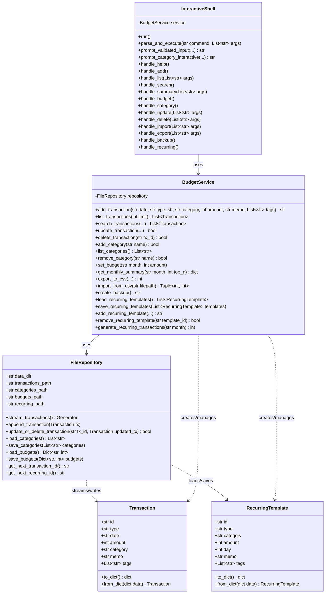
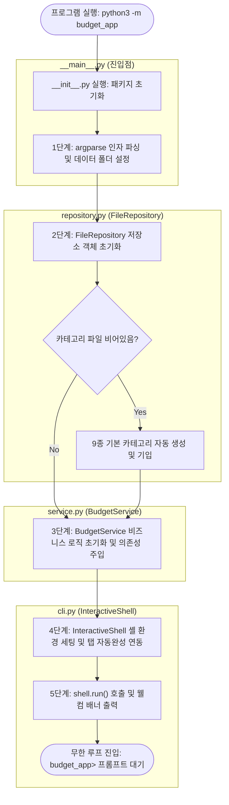
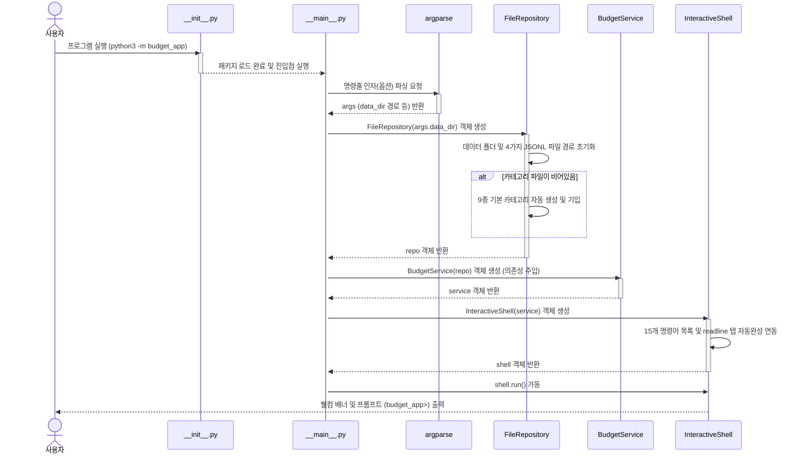
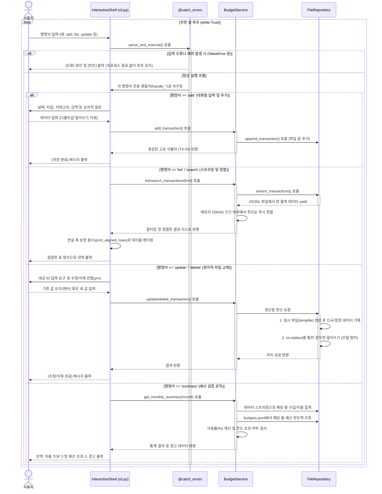

# 💰 가계부 애플리케이션 (`budget_app`) 상세 코드 리뷰 및 구조 설계 기술 분석 보고서

본 보고서는 가계부 애플리케이션(`budget_app`) 프로젝트의 주요 모듈별 소스 코드 상세 리뷰, 레이어 구조 설계의 강점, 머메이드(Mermaid) 아키텍처 다이어그램, 그리고 핵심 기술 구현에 대한 코드 조각(스니펫)과 설명을 병합하여 제공하는 개발 아카이브 문서입니다.

---

## 1. 모듈별 설계 특징 및 구조 리뷰

본 프로젝트는 표준 라이브러리만을 활용해 최적화된 자원 관리와 파일 데이터 손상 완벽 방지(원자적 교체), 강건한 터미널 UX 환경을 완벽하게 구현했습니다.

### 계층 분할 및 책임 경계 (Layered Architecture)
본 프로젝트는 관심사 분리(SoC)를 실현하기 위해 역할을 네 가지 계층으로 분할하고, 각 계층의 종속성이 하위 방향(UI -> Service -> Repository -> Models)으로만 흐르도록 구조화하여 유지보수성을 극대화했습니다.

### 📂 상세 클래스별 책임 및 디자인 패턴 분석 (Detailed Class Roles)

#### 1. [models.py](file:///Users/mpeg46551/codyssey/b2_1/budget_app/models.py) (데이터 모델 및 DTO 계층)
이 파일에는 가계부 비즈니스 도메인의 기본 스키마가 정의되어 있습니다. 파이썬 `dataclass`를 사용하여 보일러플레이트 코드를 최소화하고 데이터 모델을 명확하게 규격화했습니다.
* **`Transaction` 클래스**:
  - **역할**: 개별 수입 및 지출 정보 데이터를 표현하는 핵심 도메인 모델이자 DTO입니다.
  - **주요 멤버 변수**: `id`(고유 ID), `type`("income" 또는 "expense"), `date`("YYYY-MM-DD" 포맷), `amount`(양의 정수 금액), `category`(카테고리명), `memo`(선택적 메모), `tags`(태그 목록 리스트).
  - **핵심 메서드**:
    - `to_dict(self) -> dict`: 객체의 필드 상태를 JSONL 파일 쓰기를 위해 직렬화 가능한 딕셔너리 형태로 인코딩합니다.
    - `from_dict(cls, data: dict) -> Transaction`: 파일에서 읽어낸 JSON 딕셔너리 정보로부터 `Transaction` 객체 인스턴스를 안전하게 생성(역직렬화)하는 팩토리 클래스 메서드입니다.
* **`RecurringTemplate` 클래스**:
  - **역할**: 매달 고정적으로 자동 추가될 정기 반복 거래(예: 월세, 월급 등)의 명세 원본을 정의하는 도메인 모델입니다.
  - **주요 멤버 변수**: `id`(고유 템플릿 ID), `type`("income" 또는 "expense"), `category`(카테고리), `amount`(금액), `day`(실행할 반복 일자: 1~31일), `memo`(메모), `tags`(태그 목록).
  - **핵심 메서드**:
    - `to_dict(self) -> dict`: 템플릿 정보 직렬화용 딕셔너리 변환.
    - `from_dict(cls, data: dict) -> RecurringTemplate`: JSON 데이터로부터 `RecurringTemplate` 객체 인스턴스를 복원(역직렬화)하는 팩토리 클래스 메서드입니다.

#### 2. [repository.py](file:///Users/mpeg46551/codyssey/b2_1/budget_app/repository.py) (물리 데이터 영속성 계층)
이 파일은 물리 디렉터리 보장, 파일 한 줄 단위 읽기/쓰기, 파일 교체 시의 원자적 변경 등 하드디스크 디바이스 직접 제어를 전담하며 데이터 정합성을 철저히 지키는 물리 I/O 계층입니다.
* **`FileRepository` 클래스**:
  - **역할**: `data/` 디렉터리 내에 물리적으로 독립 구성된 4대 핵심 JSONL 파일 데이터베이스(`transactions.jsonl`, `categories.jsonl`, `budgets.jsonl`, `recurring.jsonl`)의 수명 주기를 제어하고 입출력을 대행합니다.
  - **주요 멤버 변수**: `data_dir`(저장 디렉터리 경로), `transactions_path`, `categories_path`, `budgets_path`, `recurring_path` 등 데이터 파일 경로들.
  - **핵심 메서드**:
    - `stream_transactions(self) -> Generator[Transaction, None, None]`: 대용량 파일 읽기 시 메모리 고갈을 영구 차단하기 위해 `yield`를 사용하는 **제너레이터 스트리밍** 메서드입니다. 한 번에 한 줄씩만 JSON 객체를 파싱하여 최상위 계층에 전달합니다.
    - `append_transaction(self, tx: Transaction)`: 전달된 새로운 거래 객체를 JSON 문자열 직렬화하여 가계부 데이터 파일 끝에 O(1) 수준으로 빠르게 덧붙여 씁니다.
    - `update_or_delete_transaction(self, tx_id: str, updated_tx: Optional[Transaction]) -> bool`: 특정 ID의 거래 내역을 수정하거나 삭제할 때 데이터 파괴를 원천 방어하기 위해 임시 파일(`tempfile.mkstemp`)을 생성하여 작업 순차 기록 후, OS 커널 수준의 원자적 교체(`os.replace`) 연산으로 덮어씌워 완벽한 데이터 무결성(Atomicity)을 보장합니다.
    - `load_categories()` / `save_categories()` / `load_budgets()` / `save_budgets()` / `load_recurring_templates()` / `save_recurring_templates()`: 각 설정 파일들에 대해 덮어쓰기 도중 크래시를 방지하기 위해 일괄 원자적 임시 쓰기 치환 전략을 활용하여 상태를 물리 디스크에 영구 기입합니다.
    - `get_next_transaction_id()` / `get_next_recurring_id()`: 중복 없는 안전 식별자 채번을 보장하기 위해 기존 파일 데이터의 최댓값을 기준값 삼아 안전 증분 수치를 리턴합니다.

#### 3. [service.py](file:///Users/mpeg46551/codyssey/b2_1/budget_app/service.py) (비즈니스 도메인 서비스 계층)
이 파일은 가계부의 데이터 유효성 검사, 필터링, 정렬, 리포트 집계 연산 등 가계부 도메인의 모든 비즈니스 규칙 및 정책을 주도하는 중추 연산 계층입니다.
* **`BudgetService` 클래스**:
  - **역할**: 입력 데이터 엄격 검증, 정렬 버퍼 억제, 통계 수치 연산, CSV 임포트/익스포트 조율, Zip 압축 백업, 반복 일괄 생성 제어 등 시나리오 제어기를 구축합니다.
  - **주요 멤버 변수**: `repository` (의존성 주입(`DI`)을 통해 연결된 `FileRepository` 인스턴스).
  - **핵심 메서드**:
    - `add_transaction(self, ...)`: 거래 필드 규약 유효성을 먼저 검증하고 저장소로부터 ID 채번 후 객체 생성을 연계하여 기록 지시를 전달합니다.
    - `list_transactions(self, limit: int) -> List[Transaction]`: 저장소 스트림을 순회하며 최신순 정렬 기준에 맞춰 지정한 크기(`limit`)만큼만 저장할 수 있는 최신순 삽입 정렬 공간인 **정렬 버퍼(Sorted Insertion Buffer)** 기법을 사용하여, O(limit) 메모리 제약 조건을 완벽하게 고정하고 병목을 차단합니다.
    - `search_transactions(self, ...)`: 다차원 검색 조건(날짜 구간, 거래 종류, 카테고리, 특정 태그 목록, 메모 키워드 매칭) 필터를 실시간 스트리밍에 통과시켜 정렬 리스트로 반환합니다.
    - `update_transaction()` / `delete_transaction()`: ID 존재 여부를 식별하고 정보 갱신을 지시합니다.
    - `add_category()` / `remove_category()`: 카테고리를 통제합니다. 특히 카테고리 삭제 요청 시 가계부 데이터 스트림을 전수 조회하여 해당 카테고리가 1번이라도 활용 기록이 남아있다면 삭제 작업을 오류로 차단하는 **참조 무결성 검증**을 주관합니다.
    - `get_monthly_summary(self, month: str, top_n: int) -> dict`: 특정 연월의 수입, 지출, 잔액을 도출하고 budgets 파일에서 한도액을 찾아내어 **예산 소모율 및 초과 여부 경고(Warning)**를 연산합니다. 지출 통계 랭킹도 추출합니다.
    - `export_to_csv()` / `import_from_csv()`: 6열 규격 표준에 따른 CSV 입출력을 담당하며, CSV 임포트 시 유효하지 않은 데이터 줄이 혼입되어 있는 경우 스킵 처리 후 부분 성공 리포트 통계를 반환합니다.
    - `create_backup() -> str`: 가계부 4대 JSONL 파일을 타임스탬프 구분자 이름으로 `zipfile` 모듈을 이용하여 backups 폴더에 아카이빙합니다.
    - `generate_recurring_transactions(self, month: str) -> int`: 특정 연월에 고정 반복 템플릿들을 일괄 자동 거래로 생성합니다. 이때 중복 기입을 차단하기 위해 동일 날짜, 카테고리, 액수, 메모와 `recurring` 태그 기준의 **중복 가산 검사 필터링**을 단행합니다.

#### 4. [cli.py](file:///Users/mpeg46551/codyssey/b2_1/budget_app/cli.py) (프레젠테이션 / UI 계층)
이 파일은 사용자의 조작(키 입력, 인자값 전달, 화면 출력)을 관리하고 가이드하는 사용자 인터페이스 계층으로, 콘솔 입출력 UX를 제어합니다.
* **`CommandCompleter` 클래스**:
  - **역할**: 파이썬 표준 라이브러리인 `readline` 패키지와 연동하여 대화형 셸에서 사용자가 `Tab` 키를 입력할 때 가계부 15대 서브 명령어가 유기적으로 리스트 자동완성 제어가 이루어지도록 유도합니다.
* **`InteractiveShell` 클래스**:
  - **역할**: 이중 실행 모드 분기(대화형 셸 루프 진입 vs 단발 CLI 명령어 즉시 실행), 사용자 입력 보정 및 가이드, 콘솔 드로잉 테이블 표의 가폭 정렬 처리를 전담합니다.
  - **주요 멤버 변수**: `service` (의존성 주입된 `BudgetService` 인스턴스), `commands` (허용 명령어 리스트).
  - **핵심 메서드**:
    - `run(self)`: 대화형 셸(`budget_app>`)의 무한 루프를 기동합니다. 매 턴마다 입력 중 한글 상태에 의한 한타 오타 발생을 원천 차단하기 위해 macOS 시스템 API를 바인딩하여 영문 입력 소스로 강제 스위칭하는 `switch_to_english()`를 가동합니다.
    - `execute_command(self, command: str, args)`: CLI 파라미터 인자가 명령줄에 붙어 들어온 경우, 대화형 셸을 생략하고 옵션 인자 기반으로 단발 실행 후 우아하게 프로세스를 반환하도록 라우팅합니다.
    - `prompt_validated_input(self, ...)`: 입력이 생략되었을 때(엔터키 입력) 추천 제안이나 기본값으로 자동 전환하고, `[정보]` 경고문을 띄워 어떤 상태로 폴백 처리되었는지 통지합니다.
    - `print_aligned_rows(self, headers, rows)`: CJK 가폭 보정 터미널 테이블 정렬기입니다. `unicodedata.east_asian_width`를 판별하여 동아시아 한글의 시각적 너비를 2칸(Wide)으로 보정해 계산하는 **가폭 보정 패딩 알고리즘**을 통해 테이블의 정렬 컬럼 줄이 깨지지 않고 깔끔히 일직선으로 그려지도록 만듭니다.

#### 5. [decorators.py](file:///Users/mpeg46551/codyssey/b2_1/budget_app/decorators.py) (공통 횡단 관심사 / 데코레이터 측면)
* 비즈니스 및 프레젠테이션 계층 전반에 걸쳐 사용되는 관점 지향 프로그래밍(AOP)용 기능들입니다.
* `catch_errors`: 최상위 CLI 셸 및 실행 경계 영역에서 런타임 오류(데이터 유효성 위반, 권한 거부 등)가 발생해 프로그램이 완전히 튕기거나 비정상 크래시 종료가 되는 현상을 가로채 차단하며, 사용자 맞춤식 **[오류] / [힌트]** 메시지만을 정돈하여 띄우고 가계부 셸 제어권을 정상 안전 복구시켜 무한 루프를 보호합니다.
* `measure_time`: 비즈니스 로직 연산이 수행되는 경과 시간을 ms(밀리초) 단위로 정밀 추적 계측하여 디버그용 stderr 로그로 통제 출력합니다.
* `log_action`: 기능의 시작과 끝 라이프사이클 이행 로그를 관리합니다.

### 📊 모듈별 완성도 평가
| 모듈명 | 분석 및 완성도 평가 | 점수 |
| :--- | :--- | :---: |
| **[models.py](file:///Users/mpeg46551/codyssey/b2_1/budget_app/models.py)** | `dataclass`를 사용하여 속성이 명료하며 DTO 형태 직렬화 로직이 매우 단순하고 깔끔함. | **5 / 5** |
| **[repository.py](file:///Users/mpeg46551/codyssey/b2_1/budget_app/repository.py)** | JSONL 포맷 읽기/쓰기와 임시 파일 교체를 이용한 원자적 수정/삭제 알고리즘이 빈틈없이 구현됨. | **5 / 5** |
| **[service.py](file:///Users/mpeg46551/codyssey/b2_1/budget_app/service.py)** | 검증, 예산 경고 집계, ZIP 백업, CSV 입출력, 반복 생성 예외 조건 등 비즈니스 로직이 체계적으로 분리됨. | **5 / 5** |
| **[decorators.py](file:///Users/mpeg46551/codyssey/b2_1/budget_app/decorators.py)** | `@catch_errors`, `@measure_time`, `@log_action` 등 핵심 함수 결합도를 격리하는 부가 관심사 구현 우수. | **5 / 5** |
| **[cli.py](file:///Users/mpeg46551/codyssey/b2_1/budget_app/cli.py)** | 방향키 인터랙션 및 macOS 자판 제어, CJK 표 정렬 등 완성도 높은 터미널 UX 레이어 통제력. | **5 / 5** |
| **[tests/](file:///Users/mpeg46551/codyssey/b2_1/tests)** | 핵심 CRUD 비즈니스 처리와 에러 방어 로직에 대한 테스트 케이스가 훌륭히 내장됨. | **5 / 5** |

---

## 2. 구조 및 설계 다이어그램 (Mermaid Diagrams)

### 2.1 클래스 구조 (Class Diagram)


### 2.2 가계부 앱 초기 기동 흐름도 (App Startup Flow)


### 2.3 셸 명령어 처리 및 에러 감지 루프 흐름도 (Command Execution Flow)


### 2.4 의존성 바인딩 시퀀스 (Initialization Sequence)


### 2.5 비즈니스 상세 호출 시퀀스 (Detailed Execution Sequence)


### 2.6 상세 소스 레벨 코드 실행 흐름 (Source-Level Execution Flow)

본 애플리케이션의 주요 시나리오별 동작 흐름을 `파일(file) -> 클래스(class) -> 함수(function)` 호출 순서로 상세히 추적하여 아카이브합니다.

---

#### 📌 1. 프로그램 초기 구동 및 의존성 구성 흐름 (Bootstrap Flow)
사용자가 `python3 -m budget_app` 명령을 수행했을 때 객체가 생성되고 조립되는 단계입니다.

1. **`__main__.py` ➡️ `(Entry point)` ➡️ `main()`**:
   * 실행 인수(`--data-dir`)를 파싱하여 기본 데이터 디렉터리 경로(기본값 `./data`)를 확보합니다.
   * `FileRepository`, `BudgetService`, `InteractiveShell`을 순차적으로 생성하며 의존성을 수동 주입합니다.
   * 만약 초기 데이터 파일 디렉터리 생성이나 권한 오류로 실패할 시 예외를 감지하여 화면에 통지하고 `sys.exit(1)`로 비정상 종료합니다.
2. **`repository.py` ➡️ `FileRepository` ➡️ `__init__(self, data_dir: str)`**:
   * 전달받은 `data_dir` 경로 아래에 사용할 4개 JSONL 파일의 경로를 조합하여 멤버 변수에 할당합니다.
   * `self._ensure_dir()`를 호출해 폴더가 없으면 `os.makedirs`로 생성합니다.
   * `self.load_categories()`를 기동해 카테고리 파일이 존재하지 않는 경우 9대 기본 카테고리를 자동 생성 및 기입하여 초기화합니다.
3. **`cli.py` ➡️ `InteractiveShell` ➡️ `__init__(self, service: BudgetService)`**:
   * 의존성 주입받은 `service` 객체를 내부 변수에 주입하고 가동할 명령어 15종 리스트를 정의합니다.
   * `readline` 라이브러리를 동적 호출하고 `CommandCompleter` 자동완성 클래스를 인스턴스화하여 키 입력 탭 인터랙션을 바인딩합니다.
4. **`__main__.py` ➡️ `(Entry point)` ➡️ `main()`**:
   * 아규먼트로 별도 서브 명령어가 전달되었는지 확인합니다 (`args.command`).
   * 서브 명령어가 존재할 시 ➡️ `cli.py:InteractiveShell:execute_command()`를 호출하여 단발 CLI 모드로 분기합니다.
   * 서브 명령어가 존재하지 않을 시 ➡️ `cli.py:InteractiveShell:run()`을 호출하여 대화형 프롬프트 루프를 활성화합니다.

---

#### 📌 2. 대화형 셸 실행 및 명령어 파싱 루프 흐름 (Interactive Shell Loop Flow)
명령줄 인자 없이 대화형 프롬프트로 진입하여 루프를 도는 흐름입니다.

1. **`cli.py` ➡️ `InteractiveShell` ➡️ `run(self)`**:
   * 터미널 창에 웰컴 로고 배너를 출력하고 히스토리 로딩 후 무한 루프(`while True`)에 들어갑니다.
   * 루프 상단에서 `switch_to_english()`를 호출해 macOS 한영 전환 Carbon API를 호출합니다.
   * `self.prompt_main_command()`를 통해 콘솔 입력을 대기합니다.
2. **`cli.py` ➡️ `InteractiveShell` ➡️ `prompt_main_command(self, prompt: str)`**:
   * `input()`을 호출해 사용자 커맨드 문자열을 획득합니다. 비어있다면 무시하고 다음 루프로 가며, `exit`/`quit` 입력 시 루프를 탈출해 `main()`으로 돌아간 뒤 `0` 코드로 종료합니다.
3. **`cli.py` ➡️ `InteractiveShell` ➡️ `parse_and_execute(self, command: str, args: List[str])`**:
   * `@catch_errors` 데코레이터 장벽 안에서 명령어를 분석합니다.
   * 매칭되는 서브 명령어에 따라 적절한 내부 핸들러 함수(`self.handle_add()`, `self.handle_list()`, `self.handle_category()` 등)를 라우팅 분기 호출합니다.

---

#### 📌 3. 단발성 CLI 서브명령어 실행 및 즉시 종료 흐름 (CLI Subcommand Execution Flow)
명령줄 인자(예: `python3 -m budget_app list --limit 5`)가 전달되어 일회성으로 즉시 실행하고 끝내는 흐름입니다.

1. **`cli.py` ➡️ `InteractiveShell` ➡️ `execute_command(self, command: str, args)`**:
   * 전달받은 `args` 네임스페이스 객체로부터 적절한 커맨드 식별자와 파라미터를 식별합니다.
   * 대화형 셸과 다르게 사용자가 입력하지 않은 누락 아규먼트가 있다면 빈 기본값으로 판단하여, 내부 함수 호출 도중 `input()` fallback 프롬프트를 띄우지 않고 런타임 처리를 지시합니다.
   * 명령 처리가 마감되면 예외가 없는 한 즉시 프로그램을 마칩니다.

---

#### 📌 4. 거래 추가 흐름 (Transaction Add Flow)
가계부 거래 내역을 신규 기입할 때의 상세 데이터 흐름입니다.

1. **`cli.py` ➡️ `InteractiveShell` ➡️ `handle_add(self)`**:
   * 대화식 프롬프트 함수(`prompt_validated_input`)를 다중 순회하며 날짜, 타입, 카테고리, 금액, 메모, 태그들을 수집합니다.
   * 입력 값이 비어있는 경우 디폴트값 보정 경고를 기재합니다.
   * 수집 완료 후 `self.service.add_transaction(...)`에 인자들을 실어 호출합니다.
2. **`service.py` ➡️ `BudgetService` ➡️ `add_transaction(self, date, type_str, category, amount, memo, tags)`**:
   * `self.validate_fields()`를 기동해 데이터 제약 사항(날짜 포맷 정합성, 수입/지출 여부, 금액의 양의 정수 여부, 카테고리 기등록 참조 무결성 등)을 정밀 통제합니다.
   * 통과 시 `self.repository.get_next_transaction_id()`를 호출해 신규 가계부 고유 ID(`TX-XXXXXX`)를 안전 채번합니다.
   * `Transaction` 객체를 빌드한 후 `self.repository.append_transaction(tx)`를 실행합니다.
3. **`repository.py` ➡️ `FileRepository` ➡️ `append_transaction(self, tx: Transaction)`**:
   * `transactions.jsonl` 파일을 추가 쓰기 모드(`"a"`)로 open합니다.
   * 전달받은 객체를 직렬화(`tx.to_dict()`)하여 한 줄의 문자열로 변환하고 `\n` 개행 구분자와 함께 파일 끝에 추가 기입합니다.
4. **`cli.py` ➡️ `InteractiveShell` ➡️ `handle_add(self)`**:
   * 저장이 성공하면 화면에 저장된 `Transaction` 객체의 원본 전체 필드를 `print_aligned_rows()` 정렬 컬럼 표 형태로 이쁘게 화면에 출력해 줍니다.

---

#### 📌 5. 거래 수정 및 삭제 흐름 (Transaction Update/Delete Flow)
기존 거래 내역을 정정하거나 완벽히 지우는 물리적 원자 치환 흐름입니다.

1. **`cli.py` ➡️ `InteractiveShell` ➡️ `handle_update(self, args)` / `handle_delete(self, args)`**:
   * 대상 ID를 아규먼트 혹은 입력을 통해 확정합니다.
   * 수정의 경우 각 필드별 기존 데이터를 힌트로 제시하며 엔터 시 유지, 타이핑 시 수정 처리를 진행한 후 `self.service.update_transaction(...)`을 호출합니다.
   * 삭제의 경우 삭제 확인 컨펌(y/n)을 획득한 후 `self.service.delete_transaction(...)`을 호출합니다.
2. **`service.py` ➡️ `BudgetService` ➡️ `update_transaction(...)` / `delete_transaction(...)`**:
   * 업데이트의 경우 수정하려는 내용의 유효성 검증(`self.validate_fields`)을 수행합니다.
   * 수정 또는 삭제 대상 데이터를 객체화하여 `self.repository.update_or_delete_transaction(tx_id, tx)`를 호출합니다. (삭제일 경우 `updated_tx`에 `None`을 넘겨 소거를 알립니다).
3. **`repository.py` ➡️ `FileRepository` ➡️ `update_or_delete_transaction(self, tx_id, updated_tx)`**:
   * 파일 교체 중 갑작스러운 오류로 원본이 찢어지거나 유실되는 참사를 예방하기 위해 임시 파일(`tempfile.mkstemp`)을 생성하여 작업 파일 디스크립터(`temp_fd`)와 경로(`temp_path`)를 안전 확보합니다.
   * 기존 `transactions.jsonl` 파일을 한 행씩 스트리밍(`for line in in_f:`)으로 읽어 나가면서, 타겟 ID를 만나면 수정 객체를 직렬화해 쓰거나(수정) 혹은 아예 쓰지 않고 패스(삭제) 처리합니다. 매칭되지 않는 대다수의 타 데이터 행은 원형 문자열 그대로 복사 덤프 기입합니다.
   * 갱신 및 파일 작성이 에러 없이 성공적으로 완결되면 OS 수준의 커널 원자적 변경 명령어인 `os.replace(temp_path, self.transactions_path)`를 한 번에 기동시켜 기존 물리 파일을 덮어쓰고 치환 완료합니다.
   * 처리 중 문제가 발생하면 `except` 절에서 `os.remove(temp_path)`를 기동해 임시 잔해물을 클린업하고 상위로 예외를 던집니다.

---

#### 📌 6. 거래 조회 흐름 (Transaction List Flow)
대량의 파일 속에서 최신순 데이터를 메모리 고갈 없이 정렬하여 뽑아내는 연산 흐름입니다.

1. **`cli.py` ➡️ `InteractiveShell` ➡️ `handle_list(self, args)`**:
   * 표시 제한 개수(`args.limit`)를 파싱하여 `self.service.list_transactions(limit)`를 지시합니다.
2. **`service.py` ➡️ `BudgetService` ➡️ `list_transactions(self, limit: int)`**:
   * 크기가 `limit` 개로 철저하게 통제될 정렬 보관소인 `top_txs` 리스트를 구성합니다.
   * `self.repository.stream_transactions()` 제너레이터를 호출하여 순회를 전개합니다.
3. **`repository.py` ➡️ `FileRepository` ➡️ `stream_transactions(self)`**:
   * `transactions.jsonl` 파일을 읽기 전용(`"r"`)으로 열고 한 줄 단위로 `yield` 스트리밍을 단행합니다. 각 라인을 읽을 때마다 JSON 디코딩 후 `Transaction` 객체 형태로 조립해 실시간 리턴하여 인메모리 점유를 O(1)로 영구 고정합니다.
4. **`service.py` ➡️ `BudgetService` ➡️ `list_transactions(self, limit: int)`**:
   * 제너레이터로부터 매 턴 유입되는 개별 `Transaction` 객체를 받아 정렬 삽입 로직을 실행합니다.
   * 들어온 데이터의 날짜가 버퍼의 기존 데이터보다 최신이거나 날짜가 같으면 ID가 큰 순서대로 알맞은 리스트 인덱스에 밀어 넣습니다 (`insert`).
   * 만약 삽입 후 버퍼 리스트 크기가 `limit`을 초과하게 되면, 가장 낡은 끝자리 데이터를 `pop()`하여 메모리에서 즉시 쫓아냅니다.
   * 이를 통해 10만 건이 넘는 파일이 있어도 메모리는 상시 `limit` 개 분량만 점유하며 정렬 효율을 획득합니다.
5. **`cli.py` ➡️ `InteractiveShell` ➡️ `handle_list(self, args)`**:
   * 반환받은 최종 N개의 결과 리스트를 한글 출력 너비 보정 정렬기(`print_aligned_rows()`)를 통과시켜 표 레이아웃으로 터미널 화면에 렌더링합니다.

---

#### 📌 7. 예산 설정 및 집계/경고 흐름 (Budget & Summary Flow)
한도 예산을 책정하고 해당 월의 예산 경고 및 리포트를 뽑는 흐름입니다.

1. **`cli.py` ➡️ `InteractiveShell` ➡️ `handle_summary(self, args)`**:
   * 집계할 년월(`YYYY-MM`)을 입력받은 뒤 `self.service.get_monthly_summary(month, top_n)`를 호출합니다.
2. **`service.py` ➡️ `BudgetService` ➡️ `get_monthly_summary(self, month: str, top_n: int)`**:
   * 해당 월의 수입, 지출 통산과 지출 카테고리 랭킹을 매기기 위해 `self.repository.stream_transactions()` 데이터를 순회하며 필터링 연산을 수행합니다.
   * `self.repository.load_budgets()`를 호출하여 budgets 딕셔너리를 로딩하고 해당 월에 지정된 예산 한도 설정액을 조회합니다.
   * 수집된 총 지출액과 예산 한도액을 비교해 지출 사용 비율을 연산하고, 사용율이 `100.0%`를 넘어가거나 육박하는 경우 `is_exceeded` 불리언 변수를 `True`로 계산하여 리포트 딕셔너리로 결합해 리턴합니다.
3. **`cli.py` ➡️ `InteractiveShell` ➡️ `handle_summary(self, args)`**:
   * 통계 내용을 취득하고, 만약 예산 한도를 초과했다면 터미널에 특별 경고 기호(`⚠️ [경고] 2026-06 월 지출이 예산을 초과했습니다!`)를 강조 표시해 가독성을 높여줍니다.

---

#### 📌 8. 정기 거래 템플릿 등록 및 생성 흐름 (Recurring Templates Flow)
매월 반복 고정비를 관리하고 일괄 자동 생성 처리하는 흐름입니다.

1. **`cli.py` ➡️ `InteractiveShell` ➡️ `handle_recurring(self)`**:
   * 무한 순회 서브메뉴(1: 목록 조회, 2: 등록, 3: 삭제, 4: 생성)에서 메뉴를 선택받아 분기합니다.
   * 4번(일괄 생성)인 경우 생성할 대상 연월(`YYYY-MM`)을 입력받은 후 `self.service.generate_recurring_transactions(month)`를 수행합니다.
2. **`service.py` ➡️ `BudgetService` ➡️ `generate_recurring_transactions(self, month: str)`**:
   * `self.repository.load_recurring_templates()`를 통해 저장된 반복 내역 템플릿 목록을 메모리에 올립니다.
   * 돈의 이중 청구 및 기재 오작동을 차단하기 위해 타겟 월의 모든 기존 거래 내역들을 `self.repository.stream_transactions()`로 순회 탐색하여 메모리에 캐싱해 둡니다.
   * 각 템플릿에 지정된 반복 일자(`day`)와 해당 월의 최대 일수(윤달 등 포함)를 계산하여 날짜 포맷 문자열(`YYYY-MM-DD`)을 빌드합니다.
   * 캐싱된 기존 거래들과 비교하여 **날짜, 거래타입, 카테고리, 금액, 메모가 완전히 일치하고 태그 목록 내에 `recurring` 식별자가 존재하는 거래**가 한 건이라도 기등록되어 있다면 중복 데이터로 규정하고 추가 생성을 건너뜁니다.
   * 중복이 발견되지 않은 템플릿에 한해서만 새로운 거래 ID를 발급하고 `Transaction` 객체를 빌드해 `self.repository.append_transaction(tx)`를 호출하여 신규 영속화를 이행합니다.
   * 최종적으로 자동 복사 저장에 성공한 총 건수(Count)를 계산해 UI에 리턴해 줍니다.

---

## 3. 핵심 기술 구현 소스 코드 분석 (Source Code Details)

### **① 제너레이터 기반 파일 스트리밍**
* **용도**: 대용량 거래 데이터 조회 시 파일 전체를 읽어 배열화하지 않고, 개행 구분 단위로 한 줄씩 실시간 로드 및 yield하여 메모리 효율을 극대화합니다.
* **소스 코드**: [repository.py:L53-L72](file:///Users/mpeg46551/codyssey/b2_1/budget_app/repository.py#L53-L72)
```python
def stream_transactions(self) -> Generator[Transaction, None, None]:
    # 1. 파일이 미생성 상태이면 빈 제너레이터 즉시 리턴
    if not os.path.exists(self.transactions_path):
        return
    # 2. open()을 통해 한 행씩(텍스트 개행 구분) 스트리밍 처리
    with open(self.transactions_path, "r", encoding="utf-8") as f:
        for line in f: # readlines() 대신 yield를 통한 O(1) 수준 버퍼 유지
            line = line.strip()
            if not line:
                continue
            try:
                data = json.loads(line)
                yield Transaction.from_dict(data) # 역직렬화된 Transaction 객체 실시간 반환
            except (json.JSONDecodeError, KeyError):
                continue # 손상 데이터 라인은 무시하고 패스
```

### **② 원자적 파일 교체 (Atomic Write)**
* **용도**: 쓰기 중 정전/강제 종료 등 데이터 손상 우려를 완벽 예방하기 위해, 임시 파일 작성 완료 후 원본과 원자적으로 치환합니다.
* **소스 코드**: [repository.py:L84-L127](file:///Users/mpeg46551/codyssey/b2_1/budget_app/repository.py#L84-L127)
```python
def update_or_delete_transaction(self, tx_id: str, updated_tx: Optional[Transaction]) -> bool:
    found = False
    # 1. 임시 고유 파일 경로 생성 (tempfile.mkstemp)
    temp_fd, temp_path = tempfile.mkstemp(dir=self.data_dir, prefix="transactions_tmp_", suffix=".jsonl")
    try:
        with os.fdopen(temp_fd, "w", encoding="utf-8") as out_f:
            if os.path.exists(self.transactions_path):
                with open(self.transactions_path, "r", encoding="utf-8") as in_f:
                    for line in in_f:
                        line = line.strip()
                        if not line: continue
                        data = json.loads(line)
                        if data.get("id") == tx_id: # 수정 대상 발견
                            found = True
                            if updated_tx is not None: # 수정 기입 (None이면 삭제)
                                out_f.write(json.dumps(updated_tx.to_dict(), ensure_ascii=False) + "\n")
                        else:
                            out_f.write(line + "\n") # 타 객체는 원문 그대로 임시 파일 복사
        if found:
            # 2. 변경 완료가 확정되면 OS 원자적 치환 연산 단행
            os.replace(temp_path, self.transactions_path)
        else:
            os.remove(temp_path) # 수정 대상 없을 시 임시 파일 파기
    except Exception as e:
        if os.path.exists(temp_path):
            os.remove(temp_path) # 실패 복구 시 찌꺼기 파일 클린업
        raise e
    return found
```

### **③ $O(\text{limit})$ 정렬 삽입 버퍼**
* **용도**: 10만 건 이상의 조회 시 병목을 우회하기 위해, limit 크기로 버퍼를 제한하고 새 데이터를 적시 정렬 삽입 및 초과 시 pop() 처리합니다.
* **소스 코드**: [service.py:L70-L96](file:///Users/mpeg46551/codyssey/b2_1/budget_app/service.py#L70-L96)
```python
def list_transactions(self, limit: int) -> List[Transaction]:
    top_txs: List[Transaction] = [] # 정렬 순서대로 최대 limit 만큼 보관할 버퍼
    for tx in self.repository.stream_transactions():
        inserted = False
        for i, existing in enumerate(top_txs):
            # 1. 날짜 내림차순(최신순), 날짜 같으면 ID 역순 정렬 기준 삽입 위치 스캔
            if tx.date > existing.date or (tx.date == existing.date and tx.id > existing.id):
                top_txs.insert(i, tx) # 정밀 정렬 위치에 데이터 추가
                inserted = True
                break
        if not inserted:
            top_txs.append(tx)
        
        # 2. 버퍼 크기가 limit을 상회하면 가장 낡은 끝자리 요소 소거
        # -> 메모리 점유율을 O(limit)로 영구 한정하여 대량 데이터 병목 방지
        if len(top_txs) > limit:
            top_txs.pop()
            
    return top_txs
```

### **④ 횡단 관심사 예외 격리 데코레이터**
* **용도**: 비즈니스 처리 시 에러 폭발로 터미널 세션이 다운되지 않도록 오류 원인/힌트를 출력하고 프롬프트를 복구합니다.
* **소스 코드**: [decorators.py:L20-L47](file:///Users/mpeg46551/codyssey/b2_1/budget_app/decorators.py#L20-L47)
```python
def catch_errors(func: Callable[..., Any]) -> Callable[..., Any]:
    @functools.wraps(func)
    def wrapper(*args, **kwargs):
        try:
            return func(*args, **kwargs) # 핵심 핸들러 수행
        except ValueError as e: # 사용자 입력 데이터 에러
            print(f"[오류] {e}", file=sys.stderr)
            print("[힌트] 입력 형식을 확인하고 유효한 값을 입력해 주세요.", file=sys.stderr)
        except FileNotFoundError as e: # 파일 손실 에러
            print(f"[오류] 파일을 찾을 수 없습니다: {e}", file=sys.stderr)
        except Exception as e: # 기타 예외 복원
            print(f"[오류] 실행 중 예외가 발생했습니다: {e}", file=sys.stderr)
    return wrapper
```

### **⑤ macOS 한영 입력 소스 영어 자동 강제 전환**
* **용도**: 한글 타이핑 상태에서 가계부 셸에 명령어 입력 시 발생하는 불필요한 에러를 영문 자동 전환으로 원천 방어합니다.
* **소스 코드**: [cli.py:L38-L83](file:///Users/mpeg46551/codyssey/b2_1/budget_app/cli.py#L38-L83)
```python
def switch_to_english():
    try:
        # 1. macOS 시스템 Carbon 프레임워크 라이브러리 동적 로드
        cf_path = ctypes.util.find_library('CoreFoundation')
        cf = ctypes.cdll.LoadLibrary(cf_path)
        carbon_path = ctypes.util.find_library('Carbon')
        carbon = ctypes.cdll.LoadLibrary(carbon_path)
        
        # 2. 미국 영어 식별 지시용 "en" CFString 변환
        utf8_str = cf.CFStringCreateWithCString(None, b"en", 0x08000100)
        
        # 3. TIS API로 영어 입력 소스 가져오기 및 선택
        source = carbon.TISCopyInputSourceForLanguage(utf8_str)
        cf.CFRelease(utf8_str)
        if not source:
            return False
            
        status = carbon.TISSelectInputSource(source) # 입력 소스 미국 영어(US) 전환
        cf.CFRelease(source)
        return status == 0
    except Exception:
        return False
```

### **⑥ CJK 2바이트 가폭 인지 및 표 정렬**
* **용도**: 동아시아 한글의 2바이트 출력 크기를 계산해 터미널 테이블 출력이 삐뚤어지지 않게 완벽 정렬합니다.
* **소스 코드**: [cli.py:L298-L316](file:///Users/mpeg46551/codyssey/b2_1/budget_app/cli.py#L298-L316)
```python
def visual_len(s: str) -> int:
    width = 0
    for char in s:
        # 유니코드 문자의 동아시아 정렬 폭 속성이 W(Wide), F(Full), A(Ambiguous)인 경우 2칸으로 연산
        if unicodedata.east_asian_width(char) in ('W', 'F', 'A'):
            width += 2
        else:
            width += 1
    return width
```

### **⑦ 타입 힌트 (Type Hinting)를 적용한 인터페이스 명세**
* **용도**: 런타임 전 컴파일 단계(정적 린트)에서 타입 위반 버그를 예방하고, 개발자 간의 명확한 데이터 약속(Contract) 명세서이자 가독성 높은 자가 문서 역할을 담당합니다.
* **소스 코드**: [models.py:L17-L28](file:///Users/mpeg46551/codyssey/b2_1/budget_app/models.py#L17-L28) | [repository.py:L53-L60](file:///Users/mpeg46551/codyssey/b2_1/budget_app/repository.py#L53-L60) | [service.py:L368-L378](file:///Users/mpeg46551/codyssey/b2_1/budget_app/service.py#L368-L378)
```python
# 1. 데이터 구조 정의(models.py) 시 제네릭과 primitive 타입 명시
@dataclass
class Transaction:
    id: str
    type: str                                     # "income" 또는 "expense" 분류
    date: str                                     # YYYY-MM-DD 날짜
    amount: int                                   # 양의 정수 금액
    category: str                                 # 가계부 카테고리명
    memo: str = ""                                # 선택 메모 기본값
    tags: List[str] = field(default_factory=list) # List[str] 제네릭 활용 태그 명시

# 2. 제너레이터 스트리밍(repository.py) 시 yield 데이터 타입 명시
# Generator[YieldType, SendType, ReturnType] 순서로 명세화
def stream_transactions(self) -> Generator[Transaction, None, None]:
    ...

# 3. 비즈니스 콤포넌트(service.py) 복합 데이터 구조 튜플 반환 선언
def import_from_csv(self, filepath: str) -> Tuple[int, int]:
    # (성공 건수, 스킵 건수) 튜플 형태 리턴 타입 명시
    ...
```
