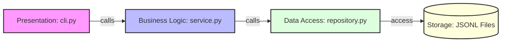

# 💰 가계부 애플리케이션 (b2_1) 핵심 개념 스터디 가이드

본 문서는 가계부 애플리케이션(`budget_app`) 프로젝트의 주요 기술적 특징인 **제너레이터 스트리밍, 데코레이터 패턴, 원자적 파일 교체, 계층형 설계**의 이론적 배경과 구현 내용, 그리고 평가/면접에서 나올 수 있는 예상 질문과 모범 답안을 종합 정리한 학습 자료입니다.

---

## 1. 제너레이터(Generator)와 메모리 최적화

### 💡 핵심 개념
* **제너레이터(Generator)**: 모든 데이터를 메모리에 한 번에 적재하지 않고, 데이터가 필요한 시점에 `yield` 키워드를 통해 값을 하나씩 반환하는 특수한 반복자(Iterator)입니다.
* **메모리 복잡도 $O(1)$**: 제너레이터는 다음 데이터 읽기를 위한 상태(포인터)만 기억하므로, 가계부의 데이터가 수백만 건으로 늘어나도 상시 일정한 최소한의 메모리만 점유합니다.
* **$O(\text{limit})$ 정렬 버퍼**: 전체 데이터를 로딩해서 정렬(`sorted()`)하는 대신, 제너레이터 스트리밍 도중 **지정한 한계치 크기(limit)를 넘지 않는 삽입 정렬 버퍼(Sorted Insertion Buffer)**를 유지함으로써 실시간 검색/목록 보기 시의 메모리 낭비를 방지합니다.

### 🛠️ 코드 내 구현 현황
* [repository.py](file:///Users/mpeg46551/codyssey/b2_1/budget_app/repository.py)의 `stream_transactions()` 메서드는 파일을 한 행씩 읽으면서 파싱한 객체를 `yield`로 전달합니다.
* [service.py](file:///Users/mpeg46551/codyssey/b2_1/budget_app/service.py)의 `list_transactions(limit)` 및 `search_transactions(...)` 메서드는 이 제너레이터를 받아 순회하면서 `top_txs` 리스트의 크기를 최대 `limit`로 유지하여 버퍼가 무한정 커지지 않도록 억제합니다.

### ❓ 평가 예상 질문 & 모범 답안
> **Q. JSONL 포맷을 채택하고 제너레이터를 사용한 이유는 무엇인가요?**
> **A.** 일반적인 JSON 포맷은 전체 데이터를 하나의 대괄호(`[]`) 리스트로 묶기 때문에 파일 전체를 읽어 파싱하는 `json.load()`를 써야 하므로 메모리 낭비가 큽니다. 반면 **JSONL(JSON Lines)은 행 단위로 온전한 JSON이 기록**되므로 파이썬의 파일 스트림 줄 단위 읽기(`for line in f`)와 궁합이 맞습니다. 이를 **제너레이터(`yield`)와 결합하면 대용량 파일도 필요한 만큼만 실시간 로드**할 수 있어 메모리를 획기적으로 아낄 수 있습니다.

> **Q. 최신순으로 정렬할 때 전체 데이터를 다 정렬하면 메모리가 부족할 텐데 어떻게 해결했나요?**
> **A.** 전체 데이터를 메모리에 다 받아 정렬을 수행하지 않고, 저장소로부터 실시간으로 한 줄씩 스트리밍받아 **사용자가 요청한 출력 개수(`limit`) 크기의 정렬 리스트만 유지**하는 방식을 썼습니다. 새 데이터를 버퍼의 적절한 날짜/ID 위치에 삽입한 후 리스트 길이가 `limit`을 초과하면 가장 오래된 요소를 즉시 버려(`pop()`) 메모리 내 정렬 데이터 개수를 항상 `limit` 이하로 억제시켰습니다.

---

## 2. 데코레이터(Decorator)와 관심사 분리 (AOP)

### 💡 핵심 개념
* **데코레이터(Decorator)**: 기존 코드를 수정하지 않고 함수의 앞뒤에 부가적인 기능(로깅, 실행 시간 측정, 공통 에러 핸들링 등)을 동적으로 추가할 수 있게 돕는 디자인 패턴입니다.
* **`functools.wraps`**: 데코레이터를 적용할 때 데코레이팅된 원본 함수의 이름(`__name__`)이나 문서 설명(`__doc__`) 등 메타데이터가 사라지고 래퍼 함수 이름으로 대체되는 문제를 막아주는 유틸리티입니다.
* **에러 경계(Error Boundary) 설계**: 셸의 상호작용 경계에서 오류를 잡아줌으로써 사용자가 값을 잘못 입력하더라도 프로그램이 비정상 종료(`sys.exit()`)되지 않고 다시 프롬프트 대기 상태로 우아하게 복귀하도록 구성합니다.

### 🛠️ 코드 내 구현 현황
* [decorators.py](file:///Users/mpeg46551/codyssey/b2_1/budget_app/decorators.py) 파일에 `@catch_errors`, `@measure_time`, `@log_action` 데코레이터가 정의되어 있습니다.
* [cli.py](file:///Users/mpeg46551/codyssey/b2_1/budget_app/cli.py)의 명령어 핸들러들(`handle_add`, `handle_list` 등)에 `@catch_errors`가 적용되어 실행 중 발생하는 값 오류 등을 화면에 힌트와 함께 포착해 줍니다.

### ❓ 평가 예상 질문 & 모범 답안
> **Q. 데코레이터를 사용할 때 `@functools.wraps`를 쓰는 이유는 무엇인가요?**
> **A.** 데코레이터 내부에서 래퍼(wrapper) 함수를 작성해 반환하게 되면, 원본 함수의 함수명이나 독스트링 같은 메타데이터가 래퍼 함수의 정보로 덮어씌워져 유실됩니다. 이는 디버깅이나 테스트 도구 활용 시 혼란을 주는데, `@functools.wraps(func)`를 사용하면 **원본 함수의 속성 정보들을 래퍼 함수로 복사하여 원본의 메타데이터를 안전하게 보존**해 줍니다.

> **Q. 예외 처리 데코레이터인 `@catch_errors`는 프로세스를 강제 종료시키나요?**
> **A.** 아닙니다. 비즈니스 영역에서 발생한 예외(ValueError 등)를 포착하면 사용자에게 **가시적인 오류 사유와 문제 해결 힌트(Hint)만 깔끔하게 출력한 뒤 예외 전파를 차단**합니다. `sys.exit()`를 부르지 않으므로 메인 셸의 `while True` 무한 루프가 그대로 유지되어 프로그램이 중단 없이 대기 상태로 유지되도록 돕습니다.

---

## 3. 원자적 파일 교체 (Atomic Write)와 데이터 신뢰성

### 💡 핵심 개념
* **원자성(Atomicity)**: "전부 실행되거나 혹은 전혀 실행되지 않아야 한다(All-or-Nothing)"는 성질입니다. 
* **직접 쓰기의 위험성**: 파일을 읽으면서 동시에 원본 파일에 바로 수정 내용을 덮어쓰거나(`open(..., 'w')`), 스트림 쓰기 도중 정전/강제종료가 일어나면 중간에 끊긴 파일이 깨지거나 통째로 유실됩니다.
* **임시 파일 + 치환 기법**: 
  1. 원본 파일 저장 경로와 동일한 안전 영역에 유니크한 임시 파일(`tempfile.mkstemp`)을 생성합니다.
  2. 임시 파일에 쓰기 작업을 100% 안전하게 모두 기입 완료합니다.
  3. 완료되면 OS 커널 수준에서 보장하는 원자적 파일 이동 함수인 `os.replace`를 사용하여 임시 파일명을 원래 파일명 위로 덮어씌워 교체합니다.

### 🛠️ 코드 내 구현 현황
* [repository.py](file:///Users/mpeg46551/codyssey/b2_1/budget_app/repository.py)의 `update_or_delete_transaction`, `save_categories`, `save_budgets`, `save_recurring_templates` 등 물리 디스크 쓰기가 수반되는 모든 로직에 철저하게 적용되어 있습니다.

### ❓ 평가 예상 질문 & 모범 답안
> **Q. 파일 쓰기 중 정전이 되거나 앱이 비정상 종료되어도 파일이 안 깨지게 설계한 원리는 무엇인가요?**
> **A.** **임시 파일 작성 및 원자적 파일 교체(Atomic Swap) 전략**을 사용했습니다. 원본 파일 대신 임시 파일에 쓰기를 온전히 마친 후, OS 커널 수준에서 원자성을 보장하는 `os.replace` 연산으로 파일명 덮어쓰기를 완료합니다. 따라서 파일 쓰기 도중에 앱이 강제 종료되거나 정전이 발생하더라도, 쓰기가 덜 끝난 파일은 찌꺼기 임시 파일로만 남고 원본 파일은 손상 없이 완벽히 보존됩니다.

---

## 4. 계층형 설계 (Layered Architecture)와 의존성 주입 (DI)

### 💡 핵심 개념
* **계층 구조 설계 (Layered Architecture)**: 시스템을 논리적이고 독립적인 계층으로 분할하여 상위 계층이 하위 계층을 이용하되 역방향 의존이 생기지 않도록 하는 설계 패턴입니다.
* **의존성 주입 (Dependency Injection)**: 객체가 스스로 의존할 대상을 직접 생성(`new` / `init`)하지 않고, 외부의 조립기(주입기)로부터 매개변수 등을 통해 전달받는 패턴입니다. 결합도를 완화하고, Mock 객체를 활용한 독립적 테스트 작성을 가능하게 합니다.

### 🛠️ 계층 구조 구성도 및 책임 분할

* **[models.py](file:///Users/mpeg46551/codyssey/b2_1/budget_app/models.py)**: 도메인 데이터 구조 규격 및 Dict/객체 직렬화 캡슐화.
* **[repository.py](file:///Users/mpeg46551/codyssey/b2_1/budget_app/repository.py)**: 파일 I/O 및 데이터 CRUD 제어, 원자적 쓰기 등 기계적 파일 영속성 처리 담당.
* **[service.py](file:///Users/mpeg46551/codyssey/b2_1/budget_app/service.py)**: 데이터 제약 검증 규칙, 집계, 통계, 중복 차단 등 비즈니스 논리 구현.
* **[cli.py](file:///Users/mpeg46551/codyssey/b2_1/budget_app/cli.py)** & **[__main__.py](file:///Users/mpeg46551/codyssey/b2_1/budget_app/__main__.py)**: 아규먼트 파싱, 화면 프롬프트 렌더링, 입력 보정 등의 사용자 인터페이스 전담.

### ❓ 평가 예상 질문 & 모범 답안
> **Q. 계층형 아키텍처를 적용했을 때 얻는 소프트웨어 엔지니어링적 장점은 무엇인가요?**
> **A.** 각 모듈의 역할과 책임이 명확히 격리(Separation of Concerns)됩니다. 예를 들어 가계부 저장 장치가 JSONL 파일에서 데이터베이스(DB)로 변경되더라도 비즈니스 로직을 가진 `service.py`나 CLI 코드는 전혀 수정할 필요 없이 오직 `repository.py`만 수정하면 되므로 변경의 전파를 막고 유지보수성과 확장성이 대폭 향상됩니다.

---

## 5. 파이썬 패키지 실행 메커니즘 (`__init__.py` & `__main__.py`)

### 💡 핵심 개념
* **`python3 -m budget_app`**: `-m` 옵션은 지정한 모듈 또는 패키지를 파이썬의 모듈 탐색 경로(`sys.path`)에서 검색하여 메인 스크립트처럼 직접 가동시키는 옵션입니다.
* **실행 타이밍 흐름**:
  1. 파이썬 인터프리터가 `budget_app` 디렉터리가 패키지임을 파악하고 임포트하는 과정에서 **`__init__.py` 파일이 가장 먼저 실행**되어 패키지 전역 초기화를 수행합니다.
  2. 패키지 탐색 및 임포트가 완료되면 메인 스크립트 실행 타겟인 **`__main__.py` 파일로 진입**해 프로그램 본체가 실행됩니다.

### ❓ 평가 예상 질문 & 모범 답안
> **Q. `__init__.py`와 `__main__.py` 파일의 실행 순서와 역할의 차이는 무엇인가요?**
> **A.** `-m` 옵션으로 패키지를 구동할 때, 패키지 초기화 파일인 **`__init__.py`가 패키지 로딩 단계에서 가장 먼저 선행 호출**되어 패키지 네임스페이스 등을 빌드합니다. 이후 패키지 내부 실행 스크립트 진입점인 **`__main__.py`가 가동**되어 아규먼트 파싱 및 객체 결합 등 실제 프로그램 구동의 Entry Point 역할을 수행합니다.

---

## 6. 고급 CLI 편의 기능 및 다국어 렌더링

### 💡 CJK(한글) 폰트 가폭 깨짐 정렬 보정
* **문제점**: 영문/숫자는 1바이트 크기(폭 1)를 가지나, 한글은 2바이트 크기(폭 2)를 가집니다. 일반적인 `len()`이나 서식자(`%-10s`)를 쓰면 한글 1글자를 영문 1글자와 동일 너비로 취급해 테이블 출력 시 열 줄이 비뚤비뚤하게 깨집니다.
* **해결책**: `unicodedata.east_asian_width()` 함수를 이용해 문자별로 너비가 2글자 너비인 와이드 문자(W, F, A 타입)인지 판별하여 시각적 폭 너비(`visual_len`)를 정밀하게 계산하고, 공백을 차액 폭만큼 수동으로 패딩(`pad_string`)하여 테이블 열을 바르게 정렬합니다.

### 💡 macOS Input Method (IME) Auto Switcher
* **문제점**: 대화형 셸에서 한글 입력 소스 상태로 명령어를 입력하면 `ㅁㅇㅇ` 처럼 오타가 나 오동작합니다.
* **해결책**: CLI 입력 프롬프트가 실행되기 전에 macOS 시스템 CoreFoundation 및 Carbon 프레임워크의 TIS(Text Input Source) C-API를 `ctypes` 모듈로 직접 연결 가동해, **입력 포커스를 자동으로 영문(en) 자판으로 자동 전환**시킵니다.
