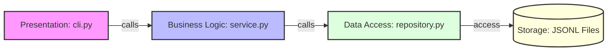

# 💰 가계부 애플리케이션 (b2_1) 핵심 개념 스터디 가이드

본 문서는 가계부 애플리케이션(`budget_app`) 프로젝트의 주요 기술적 특징인 **제너레이터 스트리밍, 데코레이터 패턴, 타입 힌트, 원자적 파일 교체, 계층형 설계**의 이론적 배경과 구현 내용, 그리고 평가/면접에서 나올 수 있는 예상 질문과 모범 답안을 종합 정리한 학습 자료입니다.

---

  @dataclass
    class Transaction:
        id: str
        type: str
        date: str
        amount: int
        category: str
        memo: str = ""
        tags: List[str] = field(default_factory=list)

  • 동작 방식:  @dataclass  데코레이터를 위에 적어두면, 파이썬이 생성자( __init__ ), 문자열 표현( __repr__ ), 동등성 비교( __eq__ ) 메서드를
  백그라운드에서 자동으로 구현해 줍니다.
  • 코드가 놀라울 정도로 깔끔해지고, 직관적으로 데이터의 형태를 파악할 수 있습니다.
  ──────
  ### 💡 dataclass의 4대 핵심 장점

  1. 생성자 자동 완성 ( __init__ ):
      •  tx = Transaction("TX-000001", "expense", "2026-06-28", 10000, "food")  형태로 입력값만 넣어주면 바로 필드에 매핑되어 주입됩니다.
  2. 보기 좋은 디버깅 출력 ( __repr__ ):
      • 일반 클래스 객체를  print(tx)  하면  <__main__.Transaction object at 0x1034c...>  같이 알아보기 힘든 메모리 주소가 나오지만, dataclass는
      Transaction(id='TX-000001', type='expense', ...) 처럼 안에 담긴 값들을 눈으로 볼 수 있게 예쁘게 출력해 줍니다.
  3. 쉬운 동등성 비교 ( __eq__ ):
      •  tx1 == tx2 를 수행하면, 파이썬이 내부 필드 값들을 하나하나 대조하여 모두 같을 때만  True 를 리턴해 줍니다.
  4. 타입 안정성 (Type Hint):
      • 필드 뒤에  : str ,  : int 와 같은 타입 힌트를 반드시 적어주어야 하므로, 개발자가 협업하거나 코드를 검토할 때 어떤 데이터가 오가는지 명확하게
      규격화됩니다.

  우리 가계부 애플리케이션( budget_app )의 models.py에서는 이  dataclass 를 사용하여 **개별 거래 내역( Transaction )**과 **정기 반복 템플릿(
  RecurringTemplate )**의 데이터 형태를 엄격하게 정의하고 안전하게 사용하고 있습니다!

## 1. 제너레이터(Generator)와 메모리 최적화

### 💡 핵심 개념
* **제너레이터(Generator)**: 모든 데이터를 메모리에 한 번에 적재하지 않고, 데이터가 필요한 시점에 `yield` 키워드를 통해 값을 하나씩 반환하는 특수한 반복자(Iterator)입니다.
* **메모리 복잡도 $O(1)$**: 제너레이터는 다음 데이터 읽기를 위한 상태(포인터)만 기억하므로, 가계부의 데이터가 수백만 건으로 늘어나도 상시 일정한 최소한의 메모리만 점유합니다.
* **$O(\text{limit})$ 정렬 버퍼**: 전체 데이터를 로딩해서 정렬(`sorted()`)하는 대신, 제너레이터 스트리밍 도중 **지정한 한계치 크기(limit)를 넘지 않는 삽입 정렬 버퍼(Sorted Insertion Buffer)**를 유지함으로써 실시간 검색/목록 보기 시의 메모리 낭비를 방지합니다.

### 🛠️ 코드 내 구현 현황
* [repository.py](file:///Users/mpeg46551/codyssey/b2_1/budget_app/repository.py)의 `stream_transactions()` 메서드는 파일을 한 행씩 읽으면서 파싱한 객체를 `yield`로 전달합니다.
* [service.py](file:///Users/mpeg46551/codyssey/b2_1/budget_app/service.py)의 `list_transactions(limit)` 및 `search_transactions(...)` 메서드는 이 제너레이터를 받아 순회하면서 `top_txs` 리스트의 크기를 최대 `limit`로 유지하여 버퍼가 무한정 커지지 않도록 억제합니다.

### ❓ 평가 예상 질문 & 모범 답안
> **Q. JSONL 포맷을 채택하고 제너레이터를 사용한 이유는 무엇인가요?**
> **A.** 일반적인 JSON 포맷은 전체 데이터를 하나의 대괄호(`[]`) 리스트로 묶기 때문에 파일 전체를 읽어 파싱하는 `json.load()`를 써야 하므로 메모리 낭비가 큽니다. 반면 **JSONL(JSON Lines)은 행 단위로 온전한 JSON이 기록**되므로 파이썬의 파일 스트림 줄 단위 읽기(`for line in f`)와 궁합이 맞습니다. 이를 **제너레이터(`yield`)와 결합하면 대용량 파일도 필요한 만큼만 실시간 로드**할 수 있어 메모리를 획기적으로 아낄 수 있습니다.

> **Q. 최신순으로 정렬할 때 전체 데이터를 다 정렬하면 메모리가 부족할 텐데 어떻게 해결했나요?**
> **A.** 전체 데이터를 메모리에 다 받아 정렬을 수행하지 않고, 저장소로부터 실시간으로 한 줄씩 스트리밍받아 **사용자가 요청한 출력 개수(`limit`) 크기의 정렬 리스트만 유지**하는 방식을 썼습니다. 새 데이터를 버퍼의 적절한 날짜/ID 위치에 삽입한 후 리스트 길이가 `limit`을 초과하면 가장 오래된 요소를 즉시 버려(`pop()`) 메모리 내 정렬 데이터 개수를 항상 `limit` 이하로 억제시켰습니다.

---

## 2. 데코레이터(Decorator)와 관심사 분리 (AOP)

### 💡 핵심 개념
* **데코레이터(Decorator)**: 기존 코드를 수정하지 않고 함수의 앞뒤에 부가적인 기능(로깅, 실행 시간 측정, 공통 에러 핸들링 등)을 동적으로 추가할 수 있게 돕는 디자인 패턴입니다.
* **`functools.wraps`**: 데코레이터를 적용할 때 데코레이팅된 원본 함수의 이름(`__name__`)이나 문서 설명(`__doc__`) 등 메타데이터가 사라지고 래퍼 함수 이름으로 대체되는 문제를 막아주는 유틸리티입니다.
* **에러 경계(Error Boundary) 설계**: 셸의 상호작용 경계에서 오류를 잡아줌으로써 사용자가 값을 잘못 입력하더라도 프로그램이 비정상 종료(`sys.exit()`)되지 않고 다시 프롬프트 대기 상태로 우아하게 복귀하도록 구성합니다.

### 🛠️ 코드 내 구현 현황
* [decorators.py](file:///Users/mpeg46551/codyssey/b2_1/budget_app/decorators.py) 파일에 `@catch_errors`, `@measure_time`, `@log_action` 데코레이터가 정의되어 있습니다.
* [cli.py](file:///Users/mpeg46551/codyssey/b2_1/budget_app/cli.py)의 명령어 핸들러들(`handle_add`, `handle_list` 등)에 `@catch_errors`가 적용되어 실행 중 발생하는 값 오류 등을 화면에 힌트와 함께 포착해 줍니다.

### ❓ 평가 예상 질문 & 모범 답안
> **Q. 데코레이터를 사용할 때 `@functools.wraps`를 쓰는 이유는 무엇인가요?**
> **A.** 데코레이터 내부에서 래퍼(wrapper) 함수를 작성해 반환하게 되면, 원본 함수의 함수명이나 독스트링 같은 메타데이터가 래퍼 함수의 정보로 덮어씌워져 유실됩니다. 이는 디버깅이나 테스트 도구 활용 시 혼란을 주는데, `@functools.wraps(func)`를 사용하면 **원본 함수의 속성 정보들을 래퍼 함수로 복사하여 원본의 메타데이터를 안전하게 보존**해 줍니다.

> **Q. 예외 처리 데코레이터인 `@catch_errors`는 프로세스를 강제 종료시키나요?**
> **A.** 아닙니다. 비즈니스 영역에서 발생한 예외(ValueError 등)를 포착하면 사용자에게 **가시적인 오류 사유와 문제 해결 힌트(Hint)만 깔끔하게 출력한 뒤 예외 전파를 차단**합니다. `sys.exit()`를 부르지 않으므로 메인 셸의 `while True` 무한 루프가 그대로 유지되어 프로그램이 중단 없이 대기 상태로 유지되도록 돕습니다.

---

## 3. 타입 힌트(Type Hinting)와 프로그램 안전성

### 💡 핵심 개념
* **정적 타입 바인딩 시뮬레이션**: 파이썬은 실행 시점에 타입을 결정하는 대표적인 동적 타입 언어이지만, `typing` 라이브러리를 통해 변수, 인자, 리턴값의 기대 타입을 Annotation 형태로 명시할 수 있습니다.
* **정적 검증 도구와의 시너지**: 작성된 타입 힌트는 배포 전 린터나 `mypy` 같은 정적 타입 검사기를 가동해 런타임에 발생할 치명적인 `TypeError`를 컴파일 단계(정적 린트)에서 100% 잡아낼 수 있게 돕습니다.
* **자가 문서화(Self-Documenting)**: 함수의 시그니처만 보고도 어떤 구조의 인자를 전달해 어떤 유형의 데이터를 응답받는지 즉시 알 수 있어 주석의 필요성을 줄이고 협업 생산성을 높입니다.

### 🛠️ 코드 내 구현 현황
* [models.py](file:///Users/mpeg46551/codyssey/b2_1/budget_app/models.py): `Transaction` 데이터 클래스의 `tags: List[str]` 속성 선언 및 `from_dict` 메서드의 반환 타입 `-> 'Transaction'` 지정.
* [repository.py](file:///Users/mpeg46551/codyssey/b2_1/budget_app/repository.py): 제너레이터 함수의 반환을 명확하게 규정하는 `stream_transactions(self) -> Generator[Transaction, None, None]` 선언.
* [service.py](file:///Users/mpeg46551/codyssey/b2_1/budget_app/service.py): 다중 범위 반환을 나타내는 `import_from_csv(self, filepath: str) -> Tuple[int, int]` 선언.

### ❓ 평가 예상 질문 & 모범 답안
> **Q. 파이썬은 동적 언어인데 타입 힌트(Type Hinting)를 적용해 얻는 이점은 무엇인가요?**
> **A.** 런타임에 유발될 수 있는 예기치 않은 데이터 타입 크래시(예: 정수가 들어올 자리에 문자열이 전달되어 발생하는 연산 오류)를 사전에 정적 분석 도구(`mypy`, `Pyright` 등)를 통해 차단할 수 있습니다. 또한 IDE의 자동완성(IntelliSense)과 매개변수 구조 정보 팝업이 완벽히 가동되어 개발 효율이 개선되고, 코드 자체가 API 명세서 역할을 하게 되어 가독성이 비약적으로 향상됩니다.

> **Q. 제너레이터 함수를 선언할 때 리턴 타입 힌트 `Generator[Transaction, None, None]`의 세 인자는 각각 무엇을 의미하나요?**
> **A.** `Generator[YieldType, SendType, ReturnType]` 순서로 제네릭 타입이 구성됩니다.
> 1. `YieldType (Transaction)`: 루프 순회 시 `yield` 키워드를 통해 실제로 호출자에게 반환하는 객체의 타입이 `Transaction`임을 정의합니다.
> 2. `SendType (None)`: 제너레이터 내부로 데이터가 유입(send)되는 흐름이 없음을 뜻합니다.
> 3. `ReturnType (None)`: 제너레이터 함수가 완전 종료(`return`)할 때 호출자에게 특별히 응답하는 값이 없음을 의미합니다.

---

## 4. 원자적 파일 교체 (Atomic Write)와 데이터 신뢰성

### 💡 핵심 개념
* **원자성(Atomicity)**: "전부 실행되거나 혹은 전혀 실행되지 않아야 한다(All-or-Nothing)"는 데이터베이스 무결성 원칙입니다. 
* **직접 쓰기의 위험성**: 파일을 열어 작업 중에 정전이나 앱 강제 종료가 일어나면 스트림 버퍼 쓰기가 멈추면서 데이터 파일이 깨지거나 공백화되어 통째로 유실되는 끔찍한 사고가 터집니다.
* **임시 파일 + 치환 기법**: 
  1. 원본 파일과 동일한 물리 디스크 경로에 고유 임시 파일(`tempfile.mkstemp`)을 개설합니다.
  2. 임시 파일에 데이터 쓰기를 진행해 100% 온전하게 쓰기를 마무리합니다.
  3. 기록이 끝나면 운영체제(OS)가 안전하게 보장하는 파일 치환 연산인 `os.replace`를 기동하여 임시 파일을 원본 파일명 위로 단숨에 Swap합니다.

### 🛠️ 코드 내 구현 현황
* [repository.py](file:///Users/mpeg46551/codyssey/b2_1/budget_app/repository.py)의 `update_or_delete_transaction`, `save_categories`, `save_budgets`, `save_recurring_templates` 등 물리 디스크 쓰기가 수반되는 모든 로직에 철저하게 적용되어 있습니다.

### ❓ 평가 예상 질문 & 모범 답안
> **Q. 파일 쓰기 중 정전이 되거나 앱이 비정상 종료되어도 파일이 안 깨지게 설계한 원리는 무엇인가요?**
> **A.** **임시 파일 작성 및 원자적 파일 교체(Atomic Swap) 전략**을 사용했습니다. 원본 파일 대신 임시 파일에 쓰기를 온전히 마친 후, OS 커널 수준에서 원자성을 보장하는 `os.replace` 연산으로 파일명 덮어쓰기를 완료합니다. 따라서 파일 쓰기 도중에 앱이 강제 종료되거나 정전이 발생하더라도, 쓰기가 덜 끝난 파일은 찌꺼기 임시 파일로만 남고 원본 파일은 손상 없이 완벽히 보존됩니다.

---

## 5. 계층형 설계 (Layered Architecture)와 의존성 주입 (DI)

### 💡 핵심 개념
* **계층 구조 설계 (Layered Architecture)**: 시스템을 논리적이고 독립적인 계층으로 분할하여 상위 계층이 하위 계층을 이용하되 역방향 의존이 생기지 않도록 하는 설계 패턴입니다.
* **의존성 주입 (Dependency Injection)**: 객체가 스스로 의존할 대상을 직접 생성(`new` / `init`)하지 않고, 외부의 조립기(주입기)로부터 매개변수 등을 통해 전달받는 패턴입니다. 결합도를 완화하고, Mock 객체를 활용한 독립적 테스트 작성을 가능하게 합니다.
**의존성 주입(Dependency Injection, DI)**은 객체 지향 프로그래밍과 계층형 설계에서 매우 중요한 개념입니다. 쉽게 말해 **"내가 사용할 도구(객체)를 내가 직접 만들지 않고, 외부에서 완성된 도구를 넘겨(주입) 받는 방식"**을 뜻합니다.

제공된 문서와 이전 대화에서 다뤘던 시퀀스 다이어그램을 바탕으로, 이 가계부 앱에서 의존성 주입이 정확히 어떻게 쓰였고 왜 유용한지 자세히 설명해 드리겠습니다.

### 1. 가계부 앱에서의 의존성 주입 적용 사례
이 프로젝트에서는 `__main__.py` 파일이 바로 **'외부의 조립기(주입기)'** 역할을 담당합니다. 

클래스들이 자기 내부에서 직접 하위 객체를 생성(`new` 또는 `__init__` 내부에서 직접 호출)하지 않고, 다음과 같이 `__main__.py`가 부품을 순서대로 만들어 매개변수로 밀어 넣어줍니다.

1. **저장소 생성:** `__main__.py`가 먼저 하드디스크와 소통하는 `FileRepository` 객체를 만듭니다.
2. **서비스에 주입:** 핵심 두뇌인 `BudgetService`를 만들 때, 방금 만든 `FileRepository` 객체를 괄호 안에 넣어(**주입**) 줍니다.
3. **셸에 주입:** 화면을 담당하는 `InteractiveShell`을 만들 때, 이번에는 앞서 완성된 `BudgetService` 객체를 넣어(**주입**) 줍니다.

즉, `A -> B -> C` 순서로 부품을 외부에서 조립해 주는 것이 바로 의존성 주입입니다.

### 2. 의존성 주입을 통해 얻는 2가지 핵심 이점

문서에 적힌 "결합도 완화"와 "Mock 객체를 활용한 테스트"는 소프트웨어 공학적으로 엄청난 장점입니다.

#### ① 결합도 완화 (Loose Coupling)
* **의미:** 각 계층(클래스)이 서로의 내부 사정을 너무 깊이 알지 못하게 느슨하게 연결하는 것입니다.
* **효과:** 현재 가계부는 JSONL 파일에 데이터를 저장(`FileRepository`)하고 있습니다. 만약 나중에 데이터베이스(DB) 시스템으로 저장 방식을 완전히 바꾸고 싶다면, 비즈니스 로직인 `BudgetService` 코드는 **단 한 줄도 수정할 필요가 없습니다**. 외부 조립기인 `__main__.py`에서 `FileRepository` 대신 새로 만든 `DatabaseRepository`를 주입해 주기만 하면 완벽하게 호환되어 작동하기 때문입니다. 변경의 파급력을 최소화하는 강력한 설계입니다.

#### ② Mock(가짜) 객체를 활용한 독립적 테스트 작성
* **의미:** 진짜 객체 대신, 껍데기만 있는 '가짜(Mock) 부품'을 끼워 넣어 테스트하는 기능입니다.
* **효과:** `BudgetService`의 비즈니스 로직(예: 예산 초과 경고 계산이 맞는지 등)만 테스트하고 싶은데, 매번 진짜 `FileRepository`를 연결하면 하드디스크에 실제로 파일이 써지고 지워지며 속도도 느려집니다. 의존성 주입 구조로 설계되어 있다면, 테스트 코드를 작성할 때 파일 I/O를 하지 않는 **가짜 저장소(Mock Repository)를 서비스 객체에 주입**하여 아주 빠르고 독립적인 단위 테스트를 수행할 수 있습니다. 

**💡 요약하자면:**
의존성 주입은 부품(객체)을 내부에서 직접 조립하지 않고 **외부(`__main__.py`)에서 끼워 맞춰주는 설계 기법**입니다. 이를 통해 각 모듈이 독립적으로 일할 수 있게 만들어 **유지보수를 아주 쉽게 만들고(결합도 완화), 테스트를 원활하게 수행(Mock 활용)**할 수 있는 튼튼한 구조를 만들어줍니다.

### 🛠️ 계층 구조 구성도 및 책임 분할

* **[models.py](file:///Users/mpeg46551/codyssey/b2_1/budget_app/models.py)**: 도메인 데이터 구조 규격 및 Dict/객체 직렬화 DTO 역할 전담.
* **[repository.py](file:///Users/mpeg46551/codyssey/b2_1/budget_app/repository.py)**: 파일 I/O 및 데이터 CRUD 제어, 원자적 쓰기 등 물리 파일 영속성 처리 담당.
* **[service.py](file:///Users/mpeg46551/codyssey/b2_1/budget_app/service.py)**: 데이터 제약 검증 규칙, 집계, 통계, 중복 차단 등 비즈니스 논리 구현.
* **[cli.py](file:///Users/mpeg46551/codyssey/b2_1/budget_app/cli.py)** & **[__main__.py](file:///Users/mpeg46551/codyssey/b2_1/budget_app/__main__.py)**: 아규먼트 파싱, 화면 프롬프트 렌더링, 입력 보정 등의 사용자 인터페이스 전담.

질문해주신 **'CRUD 제어'**와 **'원자적 쓰기(Atomic Write)'**는 이번 가계부 애플리케이션의 핵심 계층인 **데이터 영속성 계층(`repository.py`)이 담당하는 가장 중요한 두 가지 역할이자 기술**입니다.

이 두 개념이 가계부 앱에서 어떤 의미를 가지고 어떻게 동작하는지 알기 쉽게 설명해 드립니다.

---

### 1. CRUD 제어 (CRUD Control)
**CRUD**는 소프트웨어가 가지는 기본적인 데이터 처리 기능인 **C**reate(생성), **R**ead(읽기/조회), **U**pdate(수정), **D**elete(삭제)의 앞 글자를 딴 약자입니다.

*   **의미:** 가계부 프로그램에서 거래 내역, 카테고리, 예산 등의 데이터를 하드디스크(파일)에 쓰고, 읽고, 고치고, 지우는 모든 **'직접적인 파일 입출력 작업'**을 뜻합니다.
*   **가계부 앱에서의 적용:** 철저한 계층형 설계에 따라, 이 CRUD 제어는 오직 `FileRepository` 클래스(창고 관리자)만이 전담하도록 설계되었습니다. 
    *   **C (생성):** 새로운 거래 내역을 파일 끝에 추가(`append_transaction`)
    *   **R (조회):** 파일에서 데이터를 한 줄씩 스트리밍하여 읽어오기(`stream_transactions`)
    *   **U/D (수정 및 삭제):** 기존 데이터를 찾아 내용을 바꾸거나 지우기(`update_or_delete_transaction`)
*   비즈니스 로직(서비스 계층)은 파일이 어디 있는지, 어떻게 읽는지 신경 쓰지 않고 오직 이 창고 관리자에게 "데이터를 가져와라", "저장해라"라고 **CRUD 제어를 위임**하게 됩니다.

### 2. 원자적 쓰기 (Atomic Write / Atomic Swap)
**원자성(Atomicity)**은 "작업이 전부 완벽하게 실행되거나, 아예 1%도 실행되지 않아야 한다(All-or-Nothing)"는 데이터베이스의 핵심 무결성 원칙입니다.

*   **해결하려는 문제 (직접 쓰기의 위험성):** 수정(Update)이나 삭제(Delete) 작업을 할 때 원본 파일에 직접 새로운 내용을 덮어쓰고 있다고 가정해 보겠습니다. 만약 쓰기 작업이 50%쯤 진행되었을 때 갑자기 정전이 되거나 프로그램이 강제 종료되면 어떻게 될까요? 파일이 반쪽만 기록되어 전체 데이터가 꼬이거나 아예 백지화되어 날아가는 치명적인 사고가 발생합니다.
*   **가계부 앱에서의 적용 (임시 파일 + 치환 기법):** 이 문제를 완벽히 방어하기 위해 다음과 같은 3단계 **원자적 파일 교체(Atomic File Replacement)** 전략을 사용합니다.
    1.  원본 파일을 직접 건드리지 않고, 안전한 **임시 파일(`tempfile.mkstemp`)**을 몰래 하나 생성합니다.
    2.  이 임시 파일에 수정/삭제가 반영된 새로운 데이터를 **100% 안전하게 끝까지 다 기록**합니다.
    3.  기록이 완벽하게 끝났을 때만, 운영체제(OS)가 커널 수준에서 보장하는 **`os.replace` 연산을 호출하여 임시 파일을 원본 파일명 위로 단숨에 덮어쓰기(치환) 합**니다.
*   **효과:** 이렇게 설계하면 파일을 쓰는 도중에 컴퓨터가 꺼지더라도, 쓰다 만 찌꺼기는 임시 파일로만 남게 되므로 **원본 가계부 데이터 파일은 단 1%의 손상도 없이 완벽하게 보존**됩니다. 

**💡 요약하자면:**
`FileRepository` 모듈은 데이터를 쓰고 지우는 **CRUD 제어**를 전담하며, 이 과정에서 예기치 않은 사고로 데이터가 파괴되지 않도록 임시 파일과 `os.replace`를 활용한 **원자적 쓰기** 기술을 적용해 사용자의 데이터를 철통같이 보호하는 역할을 합니다.

### ❓ 평가 예상 질문 & 모범 답안
> **Q. 계층형 아키텍처를 적용했을 때 얻는 소프트웨어 엔지니어링적 장점은 무엇인가요?**
> **A.** 각 모듈의 역할과 책임이 명확히 격리(Separation of Concerns)됩니다. 예를 들어 가계부 저장 장치가 JSONL 파일에서 데이터베이스(DB)로 변경되더라도 비즈니스 로직을 가진 `service.py`나 CLI 코드는 전혀 수정할 필요 없이 오직 `repository.py`만 수정하면 되므로 변경의 전파를 막고 유지보수성과 확장성이 대폭 향상됩니다.

---

## 6. 파이썬 패키지 실행 메커니즘 (`__init__.py` & `__main__.py`)

### 💡 핵심 개념
* **`python3 -m budget_app`**: `-m` 옵션은 지정한 모듈 또는 패키지를 파이썬의 모듈 탐색 경로(`sys.path`)에서 검색하여 메인 스크립트처럼 직접 가동시키는 옵션입니다.
* **실행 타이밍 흐름**:
  1. 파이썬 인터프리터가 `budget_app` 디렉터리가 패키지임을 파악하고 임포트하는 과정에서 **`__init__.py` 파일이 가장 먼저 실행**되어 패키지 전역 초기화를 수행합니다.
  2. 패키지 탐색 및 임포트가 완료되면 메인 스크립트 실행 타겟인 **`__main__.py` 파일로 진입**해 프로그램 본체가 실행됩니다.

### ❓ 평가 예상 질문 & 모범 답안
> **Q. `__init__.py`와 `__main__.py` 파일의 실행 순서와 역할의 차이는 무엇인가요?**
> **A.** `-m` 옵션으로 패키지를 구동할 때, 패키지 초기화 파일인 **`__init__.py`가 패키지 로딩 단계에서 가장 먼저 선행 호출**되어 패키지 네임스페이스 등을 빌드합니다. 이후 패키지 내부 실행 스크립트 진입점인 **`__main__.py`가 가동**되어 아규먼트 파싱 및 객체 결합 등 실제 프로그램 구동의 Entry Point 역할을 수행합니다.

---

## 7. 고급 CLI 편의 기능 및 다국어 렌더링

### 💡 CJK(한글) 폰트 가폭 깨짐 정렬 보정
* **문제점**: 영문/숫자는 1바이트 크기(폭 1)를 가지나, 한글은 2바이트 크기(폭 2)를 가집니다. 일반적인 `len()`이나 서식자(`%-10s`)를 쓰면 한글 1글자를 영문 1글자와 동일 너비로 취급해 테이블 출력 시 열 줄이 비뚤비뚤하게 깨집니다.
* **해결책**: `unicodedata.east_asian_width()` 함수를 이용해 문자별로 너비가 2글자 너비인 와이드 문자(W, F, A 타입)인지 판별하여 시각적 폭 너비(`visual_len`)를 정밀하게 계산하고, 공백을 차액 폭만큼 수동으로 패딩(`pad_string`)하여 테이블 열을 바르게 정렬합니다.

### 💡 macOS Input Method (IME) Auto Switcher
* **문제점**: 대화형 셸에서 한글 입력 소스 상태로 명령어를 입력하면 `ㅁㅇㅇ` 처럼 오타가 나 오동작합니다.
* **해결책**: CLI 입력 프롬프트가 실행되기 전에 macOS 시스템 CoreFoundation 및 Carbon 프레임워크의 TIS(Text Input Source) C-API를 `ctypes` 모듈로 직접 연결 가동해, **입력 포커스를 자동으로 영문(en) 자판으로 자동 전환**시킵니다.
