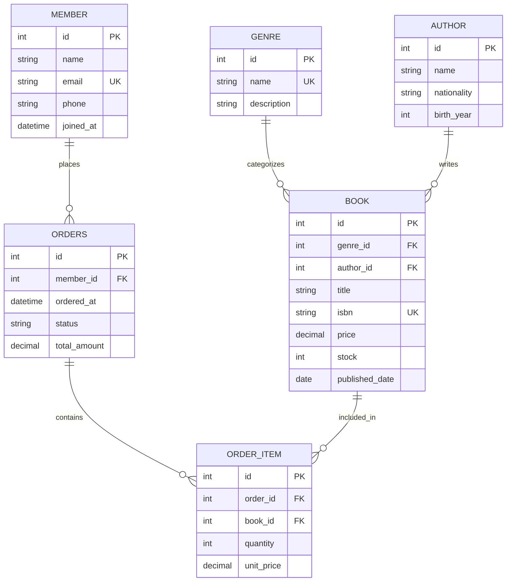

# 온라인 서점 DB (bookstore)

SQLite 기반으로 설계한 온라인 서점 데이터베이스 실습 결과물.  
테이블 설계(PK/FK/제약조건) → 샘플 데이터 입력 → 핵심 쿼리 15개 실행까지 전 과정을 포함한다.

## 1. 개발 환경

| 항목 | 내용 |
|---|---|
| DB | SQLite 3.50.4 |
| 실행 도구 | Python 3.13 (`sqlite3` 표준 라이브러리) |
| OS | Windows 11 |

SQLite를 선택한 이유: 설치 없이 파일 하나로 동작하며, Python 표준 라이브러리에 포함되어 있어 추가 의존성 없이 재현 가능하다.

## 2. 실행 방법

```bash
# 전체 실행 (DB 생성 + 데이터 입력 + 쿼리 15개 실행 + 결과 저장)
python run_all.py

# 결과 파일 위치
results/Q01_result.txt ~ Q15_result.txt
results/bonus/
```

> `run_all.py`는 실행마다 `bookstore.db`를 새로 생성한다.  
> 결과는 `results/` 디렉토리에 텍스트 파일로 저장된다.

## 3. 도메인 및 테이블 구조

**주제: 온라인 서점** — 도서, 저자, 장르, 회원, 주문, 주문상세를 관리한다.

### 테이블 목록 (6개)

| 테이블 | 설명 | 행 수 |
|---|---|---|
| `genre` | 도서 장르 | 10 |
| `author` | 저자 정보 | 10 |
| `book` | 도서 목록 | 15 |
| `member` | 회원 정보 | 12 |
| `orders` | 주문 | 20 |
| `order_item` | 주문 상세 (도서별 수량) | 29 |

### 1:N 관계 (5개)

```
genre   ──< book         장르 1 : 도서 N
author  ──< book         저자 1 : 도서 N
member  ──< orders       회원 1 : 주문 N
orders  ──< order_item   주문 1 : 주문상세 N
book    ──< order_item   도서 1 : 주문상세 N
```

### ERD



### 제약조건 요약

| 제약 | 적용 컬럼 |
|---|---|
| `NOT NULL` | `book.isbn`, `member.email`, `orders.status` 등 핵심 컬럼 전체 |
| `UNIQUE` | `genre.name`, `book.isbn`, `member.email` |
| `CHECK` | `book.price > 0`, `book.stock >= 0`, `order_item.quantity > 0`, `orders.status IN (...)` |
| `FK` | `book→genre`, `book→author`, `orders→member`, `order_item→orders`, `order_item→book` |

## 4. 제출 파일 구성

```
codyssey-b5-1/
├── schema.sql          # CREATE TABLE (스키마 정의)
├── data.sql            # INSERT (샘플 데이터)
├── queries.sql         # 핵심 쿼리 15개
├── run_all.py          # 전체 실행 및 결과 저장 스크립트
├── bonus/
│   ├── comparison.sql  # 보너스1: JOIN vs 서브쿼리 비교
│   ├── fk_error.sql    # 보너스2: FK 제약 위반 시도
│   └── report.sql      # 보너스3: 미니 리포트 3개
└── results/
    ├── Q01_result.txt ~ Q15_result.txt  # 쿼리별 실행 결과
    └── bonus/                            # 보너스 실행 결과
```

## 5. 핵심 쿼리 15개 목록

### 기본 조회 (Q01~Q04)

| 번호 | 설명 | 주요 절 |
|---|---|---|
| Q01 | 전체 도서를 가격 높은 순으로 조회 | `ORDER BY price DESC` |
| Q02 | 재고 30권 미만인 도서 조회 (재입고 필요) | `WHERE stock < 30` |
| Q03 | 최근 주문 5건 조회 | `ORDER BY ordered_at DESC LIMIT 5` |
| Q04 | 완료 주문 중 20,000원 이상인 주문 | `WHERE status = 'completed' AND ...` |

### 조인 (Q05~Q08)

| 번호 | 설명 | 조인 방식 |
|---|---|---|
| Q05 | 도서 + 저자 + 장르 함께 조회 | `INNER JOIN` × 2 |
| Q06 | 주문 내역 + 회원 이름 조회 | `INNER JOIN` |
| Q07 | 한 번도 주문하지 않은 회원 목록 | `LEFT JOIN + WHERE IS NULL` |
| Q08 | 주문상세 + 도서 제목 + 회원 이름 | `INNER JOIN` × 3 |

### 집계 (Q09~Q11)

| 번호 | 설명 | 집계 함수 |
|---|---|---|
| Q09 | 회원별 완료 주문 건수 및 총 결제금액 | `COUNT + SUM + GROUP BY` |
| Q10 | 저자별 도서 수와 평균 가격 | `COUNT + AVG + GROUP BY` |
| Q11 | 장르별 도서 수와 총 재고 현황 | `COUNT + SUM + GROUP BY` |

### 서브쿼리 (Q12)

| 번호 | 설명 |
|---|---|
| Q12 | 평균 도서 가격보다 비싼 도서 목록 (`WHERE price > (SELECT AVG(price) FROM book)`) |

### 수정 및 삭제 (Q13~Q14)

| 번호 | 설명 |
|---|---|
| Q13 | 재고 30권 미만 도서 가격 5% 인하 (`UPDATE`) |
| Q14 | 취소된 주문의 주문상세 삭제 (`DELETE`) |

### 인덱스 (Q15)

| 번호 | 설명 |
|---|---|
| Q15 | `orders.ordered_at`에 인덱스 생성 — 날짜 범위 검색이 가장 빈번하므로 풀스캔 없이 범위 조회 성능을 개선 |

## 6. 보너스 과제

### 보너스1: JOIN vs 서브쿼리 비교

요구: "가장 많이 팔린 도서를 구매한 회원 목록"

두 방식 모두 동일한 결과 (`박지호`, `이서연`)를 반환.

```sql
-- JOIN 방식
SELECT DISTINCT m.id, m.name, m.email
FROM member m
INNER JOIN orders o ON m.id = o.member_id
INNER JOIN order_item oi ON o.id = oi.order_id
WHERE oi.book_id = (SELECT book_id FROM order_item GROUP BY book_id ORDER BY SUM(quantity) DESC LIMIT 1);

-- 서브쿼리 방식
SELECT id, name, email FROM member
WHERE id IN (
    SELECT DISTINCT o.member_id FROM orders o
    INNER JOIN order_item oi ON o.id = oi.order_id
    WHERE oi.book_id = (SELECT book_id FROM order_item GROUP BY book_id ORDER BY SUM(quantity) DESC LIMIT 1)
);
```

비교 분석:
- JOIN 방식: 옵티마이저가 실행 계획을 유연하게 최적화하기 쉽다. 대용량에서 Hash Join을 활용 가능.
- 서브쿼리 방식: 논리 흐름이 "조건 → 회원"으로 직관적이라 가독성이 좋다.
- SQLite 3.x에서는 두 방식의 `EXPLAIN QUERY PLAN` 결과가 동일하게 최적화된다.

### 보너스2: FK 제약 위반 시도

```sql
PRAGMA foreign_keys = ON;

-- 시도: 존재하지 않는 book_id(999) 참조
INSERT INTO order_item (order_id, book_id, quantity, unit_price) VALUES (1, 999, 1, 10000);
-- 결과: FOREIGN KEY constraint failed
```

`PRAGMA foreign_keys = ON` 설정 시 SQLite가 참조 무결성을 강제한다. 수정 방법: 부모 테이블에 먼저 행을 추가하거나 존재하는 PK를 사용한다.

### 보너스3: 미니 리포트 3개 지표

| 지표 | 설명 |
|---|---|
| 월별 매출 추이 | 2024-03이 103,500원으로 최고 매출 |
| 인기 도서 TOP 5 | 연금술사(파울로 코엘료) 4권으로 1위 |
| VIP 회원 TOP 3 | 이서연 67,500원 → 정도윤 57,000원 → 박지호 55,500원 |

## 7. 주요 설계 결정

### 왜 테이블로 나눠 저장하는가?

엑셀에서 "도서명 / 저자명 / 주문 회원 / 주문 수량"을 한 시트에 담으면 같은 저자명이 수백 번 중복된다. 테이블로 나누면 저자 정보는 `author` 테이블에 1번만 저장하고 `book`은 `author_id`로 참조한다. 중복 제거 + 수정 시 한 곳만 변경하면 됨.

### PK / FK 선택

모든 테이블에 `INTEGER PRIMARY KEY AUTOINCREMENT`를 사용했다. SQLite에서 이 패턴은 내부적으로 rowid와 동일하게 처리되어 삽입 성능이 좋다. FK는 자식 테이블에만 선언하고, 부모 테이블의 PK를 참조한다.

### 인덱스 적용 기준

`ordered_at` 컬럼은 "최근 주문 조회(ORDER BY)", "기간별 집계(WHERE ordered_at BETWEEN ...)" 두 패턴에서 모두 사용된다. 인덱스 없이는 orders 테이블 풀스캔이 발생하므로 `idx_orders_ordered_at`을 생성했다.
