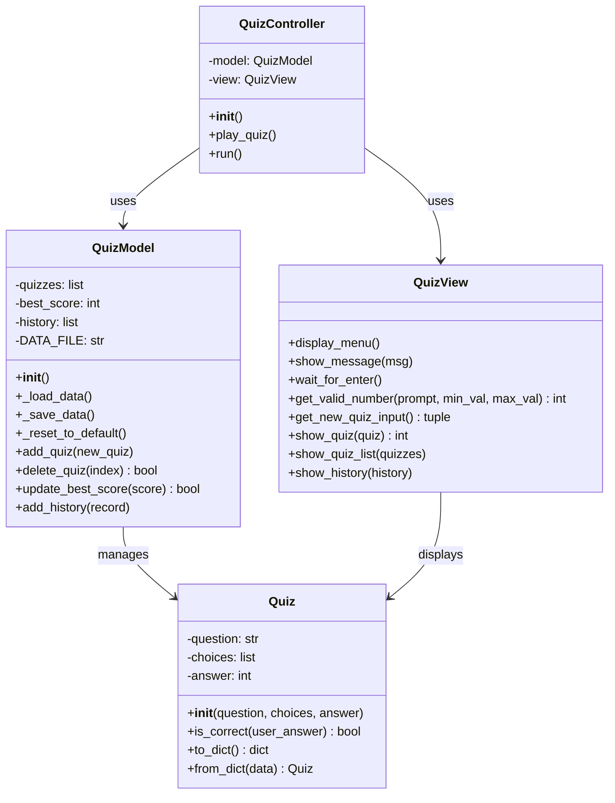
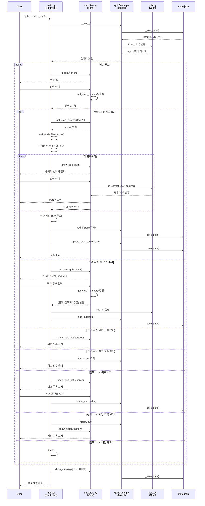

# Git과 함께하는 Python 첫 발자국
## 프로젝트 개요
- 터미널에서 동작하는 인터랙티브한 퀴즈 게임을 Python으로 구현한 프로젝트입니다.
### 기술 스택
| 항목 | 내용 |
|------|------|
| **언어** | Python 3.10+ |
| **패턴** | MVC (Model-View-Controller) |
| **데이터 저장** | JSON (UTF-8 인코딩) |
| **외부 라이브러리** | 없음 (표준 라이브러리만 사용) |
| **주요 모듈** | `json`, `os`, `random`, `datetime` |
## 퀴즈 주제와 선정 이유
- Python, 현재 python학습중이라 친숙해지기 위해
## 실행 방법
- 터미널이나 CMD 창에서 **python main.py**를 입력하여 실행
# 기능 목록
- 퀴즈 풀기: 저장된 문제를 풀고 정답 여부를 확인하며, 최종 점수를 계산합니다.
- 퀴즈 추가: 새로운 문제와 4개의 선택지, 정답 번호를 입력받아 시스템에 등록합니다.
- 퀴즈 목록 조회: 현재 등록된 모든 퀴즈의 질문 리스트를 확인합니다.
- 최고 점수 관리: 역대 최고 점수를 기록하고, 퀴즈를 풀 때마다 갱신 여부를 확인합니다.
- 데이터 영속성 유지: 모든 데이터는 state.json에 저장되어 프로그램 재시작 후에도 유지됩니다.
# 파일 구조
## 프로젝트 구조
```
E1_2/
├── src/
│   ├── main.py           # 메인 컨트롤러 (게임 흐름 관리)
│   ├── quiz.py           # Quiz 데이터 모델
│   ├── quizGame.py       # QuizModel (데이터 저장/불러오기)
│   └── quizView.py       # QuizView (UI 및 입력 처리)
├── doc/
│   ├── mission.md        # 미션 요구사항
│   ├── project_intro.md  # 프로젝트 개요 (본 파일)
│   └── plan.md           # 개발 계획
├── README.md             # 프로젝트 설명서
└── state.json            # 데이터 저장 파일 (자동 생성)
```
## 프로젝트에 사용한 4개 클래스의 이름과 역할

| 클래스 이름 | 위치 (파일명) | 주요 역할 및 기능 |
| :--- | :--- | :--- |
| **Quiz** | `quiz.py` | 개별 퀴즈 데이터 모델 (문제, 선택지, 정답 관리 및 정답 확인) |
| **QuizModel** | `quizGame.py` | 데이터 관리 및 파일(state.json) 입출력, 점수 및 히스토리 관리 |
| **QuizView** | `quizView.py` | 사용자 인터페이스(UI) 담당, 메뉴 출력 및 사용자 입력 검증 |
| **QuizController** | `main.py` | 전체 게임 흐름 제어 및 모델과 뷰를 연결하는 컨트롤러 |


### Class Diagram


# 데이터 파일 설명(state.json 경로/역할/스키마)
경로: 프로젝트 루트 디렉토리 (./state.json)
역할: 프로그램 종료 후에도 추가된 퀴즈와 최고 점수가 유지되도록 데이터를 저장하는 데이터 영속성을 담당합니다
. 파일이 없거나 손상된 경우 기본 데이터로 자동 복구하는 기능도 포함합니다
```
state.json (데이터 구조)
├── 📂 quizzes (List: 퀴즈 목록)
│   └── 📄 Quiz Object
│       ├── ❓ question (String: 문제 내용)
│       ├── 📜 choices (List: 4개의 선택지)
│       └── ✅ answer (Integer: 정답 번호 1~4)
├── 🏆 best_score (Integer: 최고 점수)
└── 🕒 history (List: 게임 기록 히스토리)
``` 

# Git: README 작성 후 최종 푸시한다.

### ⚙️ Git 저장소 복제 실습

* 이 단계는 `clone`과 `pull` 명령어를 자연스럽게 경험하기 위한 실습이다. 퀴즈 게임 개발이 완료된 후 아래 절차를 순서대로 수행한다.
* 미션 수행 저장소를 `clone`하여 별도의 로컬 디렉터리에 복제한다.
* 복제된 저장소에서 간단한 변경(예: README에 한 줄 추가)을 하고 `commit` → `push`한다.
* 기존 로컬 작업 디렉터리에서 `pull`로 변경사항을 가져온다.
* `pull` 받은 내용이 정상적으로 반영되었는지 확인한다.

---

## 5. 보너스 과제 (선택)
* **랜덤 출제:** 퀴즈 풀기 시 문제 순서를 랜덤하게 섞는다. (`random` 모듈 사용법 스스로 학습)
* **문제 수 선택:** 퀴즈 풀기 시 몇 문제를 풀지 선택할 수 있다.
* **힌트 기능:** `Quiz` 클래스에 힌트 속성을 추가한다. 풀이 중 힌트를 볼 수 있으며, 사용 시 점수 차감 로직을 구현한다.
* **퀴즈 삭제 기능:** 등록된 퀴즈를 삭제할 수 있다. 삭제 후 파일에 반영한다.
* **점수 기록 히스토리:** 최고 점수뿐 아니라 모든 게임 기록을 저장한다. 날짜/시간, 푼 문제 수, 점수를 기록한다.

---

## 6. 개발 환경
* Python 3.10 이상을 사용해야 한다.
```bash
mpeg46551@c5r1s2 codyssey % python --version
Python 3.12.13
```
* 외부 라이브러리 없이 기본 문법만 사용해야 한다. (표준 라이브러리 사용 가능)

---

## 7. 제약 사항

### 📌 데이터 저장 규칙
* 데이터 파일은 프로젝트 루트의 `state.json`을 기본으로 한다.

* state.json 전체내용
```bash
mpeg46551@c5r1s2 e1_2 % cd src
mpeg46551@c5r1s2 src % ls
__pycache__     main.py         quiz.py         quizGame.py     quizView.py     state.json
mpeg46551@c5r1s2 src % cat state.json
{
  "quizzes": [
    {
      "question": "파이썬의 창시자는?",
      "choices": [
        "제임스 고슬링",
        "리누스 토르발스",
        "귀도 반 로섬",
        "브렌던 아이크"
      ],
      "answer": 3
    },
    {
      "question": "파이썬 내장 데이터 타입이 아닌 것은?",
      "choices": [
        "int",
        "str",
        "bool",
        "char"
      ],
      "answer": 4
    },
    {
      "question": "원격 저장소로 업로드하는 Git 명령어는?",
      "choices": [
        "git pull",
        "git commit",
        "git push",
        "git clone"
      ],
      "answer": 3
    },
    {
      "question": "JSON의 약자는?",
      "choices": [
        "Java Standard Object Notation",
        "JavaScript Object Notation",
        "Java Syntax Output Network",
        "JavaScript Online Node"
      ],
      "answer": 2
    },
    {
      "question": "파이썬 함수 정의 키워드는?",
      "choices": [
        "func",
        "define",
        "def",
        "function"
      ],
      "answer": 3
    }
  ],
  "best_score": 20,
  "history": [
    {
      "date": "2026-04-09 13:14",
      "score": 0,
      "correct": 0,
      "total": 1
    },
    {
      "date": "2026-04-09 15:24",
      "score": 0,
      "correct": 0,
      "total": 2
    },
    {
      "date": "2026-04-09 15:25",
      "score": 0,
      "correct": 0,
      "total": 1
    }
  ]
}%                
```
* 파일 인코딩은 UTF-8을 권장한다.
```bash
# state.json 파일 읽기 (UTF-8 인코딩)
            with open(self.DATA_FILE, "r", encoding="utf-8") as f:
```

### 📌 코드 구조
* 모든 코드를 한 함수에 작성하지 않고, 기능별로 함수를 분리해야 한다.
* 최소 2개 이상의 클래스로 역할을 분리해야 한다.

### Menu Sequence Diagram


### 📌 Git 워크플로우
* 최소 10개 이상의 의미 있는 커밋이 있어야 한다.

* 기능 단위 커밋(메뉴/Quiz/플레이/추가/저장/README 등) + 커밋 메시지에 변경 요약 포함
* 형식적인 커밋 메시지를 피하고, 아래처럼 작업 내용을 드러내는 형식을 권장한다.
    * `Feat: 퀴즈 출제 기능 구현`
    * `Fix: 점수 계산 오류 수정`
    * `Docs: README 실행 방법 추가`
    * `Refactor: QuizGame 책임 분리`
* Git 기초 명령어 7종(`init`, `add`, `commit`, `push`, `pull`, `checkout`, `clone`)을 각각 한 번 이상 사용해야 한다.

### 📌 제출물
* GitHub 저장소 URL
* 개발 환경 설정 스크린샷(예: VSCode, Python 버전, Git 설정)
* 프로그램 실행 결과 스크린샷(퀴즈 추가, 목록, 플레이, 점수)
* `git log --oneline --graph` 결과 스크린샷

---

## 8. 결과 예시
### ✅ 동작하는 퀴즈 게임
* 프로그램 실행 시 메뉴에서 번호를 선택하면, 선택 결과에 따라 퀴즈 출제/등록/목록/점수 확인/종료 화면이 출력된다.
```
mpeg46551@c5r1s2 e1_2 % python src/main.py
```p
mpeg46551@c5r1s2 codyssey % cd e1_2
mpeg46551@c5r1s2 e1_2 % python src/main.py

==============================
   파이썬 퀴즈 챌린지
==============================
1. 퀴즈 풀기 (랜덤/수량)
2. 새로운 퀴즈 추가
3. 퀴즈 목록 보기
4. 최고 점수 확인
5. 퀴즈 삭제하기 (보너스)
6. 전체 기록 보기 (보너스)
7. 게임 종료
==============================
선택: 
⚠ 입력이 비어있습니다.
선택: 0
⚠ 1~7 사이를 입력하세요.
선택: a
⚠ 숫자를 입력해주세요.
선택: 1
몇 문제를 푸시겠습니까? (1~6): 0
⚠ 1~6 사이를 입력하세요.
몇 문제를 푸시겠습니까? (1~6): 
=============================
   파이썬 퀴즈 챌린지
==============================
1. 퀴즈 풀기 (랜덤/수량)
2. 새로운 퀴즈 추가
3. 퀴즈 목록 보기
4. 최고 점수 확인
5. 퀴즈 삭제하기 (보너스)
6. 전체 기록 보기 (보너스)
7. 게임 종료
==============================
선택: 2

[새 퀴즈 추가]
문제: python의 변수 타입이 아닌것은?
보기1: ㅑint
보기2: float
보기3: str
보기4: print
정답(1-4): 4

==============================
   파이썬 퀴즈 챌린지
==============================
1. 퀴즈 풀기 (랜덤/수량)
2. 새로운 퀴즈 추가
3. 퀴즈 목록 보기
4. 최고 점수 확인
5. 퀴즈 삭제하기 (보너스)
6. 전체 기록 보기 (보너스)
7. 게임 종료
==============================
선택: 3
1. 파이썬에서 함수를 정의할 때 사용하는 키워드는 무엇인가요
2. 다음 중 파이썬의 기본 데이터 타입이 아닌 것은 무엇인가요
3. 화면에 값을 출력하기 위해 사용하는 함수는 무엇인가요
4. 리스트의 맨 끝에 새로운 요소를 추가하는 메서드는 무엇인가요
5. 조건에 따라 코드를 실행할지 결정하는 키워드는 무엇인가요
6. python의 변수 타입이 아닌것은?

==============================
   파이썬 퀴즈 챌린지
==============================
1. 퀴즈 풀기 (랜덤/수량)
2. 새로운 퀴즈 추가
3. 퀴즈 목록 보기
4. 최고 점수 확인
5. 퀴즈 삭제하기 (보너스)
6. 전체 기록 보기 (보너스)
7. 게임 종료
==============================
선택: 4

🔥 최고 점수: 0점
==============================
   파이썬 퀴즈 챌린지
==============================
1. 퀴즈 풀기 (랜덤/수량)
2. 새로운 퀴즈 추가
3. 퀴즈 목록 보기
4. 최고 점수 확인
5. 퀴즈 삭제하기 (보너스)
6. 전체 기록 보기 (보너스)
7. 게임 종료
==============================
선택: 5

1. 파이썬에서 함수를 정의할 때 사용하는 키워드는 무엇인가요
2. 다음 중 파이썬의 기본 데이터 타입이 아닌 것은 무엇인가요
3. 화면에 값을 출력하기 위해 사용하는 함수는 무엇인가요
4. 리스트의 맨 끝에 새로운 요소를 추가하는 메서드는 무엇인가요
5. 조건에 따라 코드를 실행할지 결정하는 키워드는 무엇인가요
6. python의 변수 타입이 아닌것은?
삭제할 번호: 

==============================
   파이썬 퀴즈 챌린지
==============================
1. 퀴즈 풀기 (랜덤/수량)
2. 새로운 퀴즈 추가
3. 퀴즈 목록 보기
4. 최고 점수 확인
5. 퀴즈 삭제하기 (보너스)
6. 전체 기록 보기 (보너스)
7. 게임 종료
==============================
선택: 6

[게임 기록 히스토리]
- 2026-04-10 21:08 | 점수: 0점 (0/1)

==============================
   파이썬 퀴즈 챌린지
==============================
1. 퀴즈 풀기 (랜덤/수량)
2. 새로운 퀴즈 추가
3. 퀴즈 목록 보기
4. 최고 점수 확인
5. 퀴즈 삭제하기 (보너스)
6. 전체 기록 보기 (보너스)
7. 게임 종료
==============================
선택: 7
```
* 퀴즈 풀기, 퀴즈 추가, 퀴즈 목록, 점수 확인 기능이 동작한다.

* 본인이 선택한 주제의 퀴즈가 5개 이상 포함되어 있다.
* 프로그램을 종료하고 다시 실행해도 추가한 퀴즈와 최고 점수가 유지된다. (파일 저장)
```p
==============================
   파이썬 퀴즈 챌린지
==============================
1. 퀴즈 풀기 (랜덤/수량)
2. 새로운 퀴즈 추가
3. 퀴즈 목록 보기
4. 최고 점수 확인
5. 퀴즈 삭제하기 (보너스)
6. 전체 기록 보기 (보너스)
7. 게임 종료
==============================
선택: 4
🔥 최고 점수: 100점

==============================
   파이썬 퀴즈 챌린지
==============================
1. 퀴즈 풀기 (랜덤/수량)
2. 새로운 퀴즈 추가
3. 퀴즈 목록 보기
4. 최고 점수 확인
5. 퀴즈 삭제하기 (보너스)
6. 전체 기록 보기 (보너스)
7. 게임 종료
==============================
선택: 7
mpeg46551@c5r1s2 e1_2 % python src/main.py

==============================
   파이썬 퀴즈 챌린지
==============================
1. 퀴즈 풀기 (랜덤/수량)
2. 새로운 퀴즈 추가
3. 퀴즈 목록 보기
4. 최고 점수 확인
5. 퀴즈 삭제하기 (보너스)
6. 전체 기록 보기 (보너스)
7. 게임 종료
==============================
선택: 4
🔥 최고 점수: 100점
stte.json
  "best_score": 100,
```

### state.json 예시 (데이터 형태 참고)
```json
{
    "quizzes": [
        {
            "question": "Python의 창시자는?",
            "choices": ["Guido", "Linus", "Bjarne", "James"],
            "answer": 1
        }
    ],
    "best_score": 3
}
```
### data유효검사및 로드,저장
```python
class QuizView
        def get_valid_number(self, prompt, min_val, max_val):
        # 사용자로부터 유효한 숫자를 입력받음 (미션 요구 예외 처리 포함)
class QuizController:

    """퀴즈 게임의 전체 플로우를 관리하는 컨트롤러 클래스
    
    QuizModel(데이터 관리)과 QuizView(UI)를 연결하여 게임 로직을 실행합니다.
    """
    def __init__(self):
        """QuizController 초기화. Model과 View 인스턴스 생성"""
        self.model = QuizModel()
  ```


### state.json
`state.json` 파일의 읽기, 사용, 저장 과정은 주로 **`QuizModel` 클래스(quizGame.py)**에서 관리하며, 상세 내용은 다음과 같습니다.

| 단계 | 관련 메서드 | 실행 시점 및 내용 |
| :--- | :--- | :--- |
| **읽기 (Load)** | `_load_data()` | 프로그램 시작 시 `QuizModel`이 초기화될 때 호출됩니다. 파일이 없으면 기본 데이터를 생성하고, 손상 시 복구 로직을 실행합니다. |
| **사용 (Use)** | (속성 참조) | 로드된 데이터는 `quizzes`, `best_score`, `history` 속성에 저장되어 게임 진행, 목록 출력, 최고 점수 확인 시 사용됩니다. |
| **저장 (Save)** | `_save_data()` | 퀴즈 추가, 퀴즈 삭제, 또는 퀴즈 풀기 완료 후 점수와 히스토리가 갱신될 때마다 즉시 호출되어 파일에 기록됩니다. |

모든 입출력은 **UTF-8 인코딩**을 사용하여 데이터의 영속성을 보장합니다.

UTF-8 인코딩은 한글과 같은 다국어 문자를 깨짐 없이 안전하게 저장하고 불러오기 위해 필수적입니다. 데이터 영속성의 핵심은 프로그램이 종료된 후에도 데이터가 변함없이 유지되는 것인데, UTF-8을 사용하면 다양한 운영체제나 환경에서도 저장된 퀴즈와 점수가 왜곡되지 않고 일관된 상태를 유지할 수 있습니다.
특히 state.json 저장 시 이 방식을 사용하면 한글로 작성된 퀴즈 질문이 올바르게 기록되어, 나중에 파일을 다시 읽어올 때 발생할 수 있는 인코딩 오류를 방지합니다.

### json특징
```plaintext
이번 미션에서 JSON을 사용하는 이유는 다음과 같은 실무적인 장점 때문입니다.
구조적 적합성: 파이썬의 dict나 list 자료구조를 그대로 파일에 옮기거나 불러오기에 가장 직관적이고 편리합니다.
표준 라이브러리: 별도의 외부 라이브러리 설치 없이 파이썬의 표준 기능만으로도 완벽하게 동작합니다.
가독성: 텍스트 기반 포맷이라 사람이 메모장으로 열어도 내용을 쉽게 확인하고 수정할 수 있습니다.
JSON 구조상 quizzes가 배열(List) 형태로 되어 있어, 데이터가 많아질수록 특정 문제를 찾기 위해 처음부터 끝까지 훑어야 하는 탐색 성능 문제가 발생합니다.
```

### json파일 손상 대책
```
state.json 파일 손상에 대비하려면 데이터 로드 로직에 try-except 구문을 활용한 자동 복구 시스템을 갖추어야 합니다.
구체적인 단계는 다음과 같습니다:
예외 포착: 파일을 읽거나 파싱할 때 json.JSONDecodeError 또는 ValueError가 발생하면 파일이 손상된 것으로 판단합니다.
안내 및 복구: 사용자에게 손상 안내 메시지를 출력한 뒤, 준비해 둔 기본 퀴즈 데이터(DEFAULT_QUIZZES)로 시스템을 초기화합니다.
상태 동기화: 초기화된 데이터를 다시 state.json에 저장하여 파일의 무결성을 회복합니다.
현재 QuizModel의 _load_data() 메서드에서 이 예외 처리를 구현해 두셨나요? 아니면 복구 시 사용자에게 보여줄 안내 메시지 내용을 함께 정해볼까요?

객체 지향 구조의 반영: quizzes 필드 내부에 각 퀴즈의 문제, 선택지, 정답을 중첩하여 저장하는 것은 Quiz 클래스의 속성(question, choices, answer)을 그대로 직렬화하기 위함입니다. 이를 통해 코드를 복잡하게 파싱할 필요 없이 객체로 바로 변환할 수 있습니다.
데이터의 연관성 유지: 하나의 문제에 종속된 4개의 선택지를 별도의 필드가 아닌 choices라는 리스트로 묶어 중첩한 것은 데이터 간의 관계를 명확히 하고 관리 효율을 높이기 위해서입니다.
확장성(리스트 구조): quizzes와 history를 리스트(배열) 형태로 설계한 이유는 사용자가 추가하는 만큼 무한히 데이터를 늘릴 수 있도록 하기 위함입니다. 이는 여러 문제를 관리해야 하는 퀴즈 게임의 본질에 부합합니다.
단일 상태 관리: 최고 점수(best_score)와 퀴즈 목록을 한 파일에 두는 것은 프로그램 재시작 시 게임의 전체 상태를 한 번의 읽기(_load_data) 작업으로 복구하기 위해서입니다
```