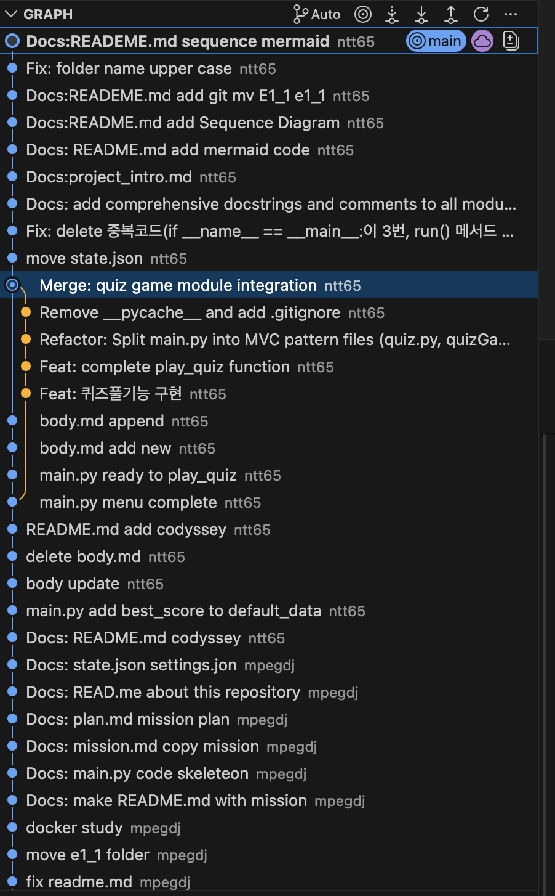
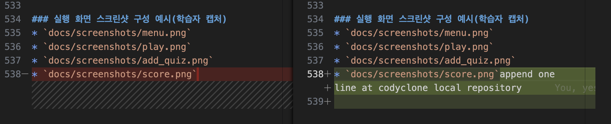
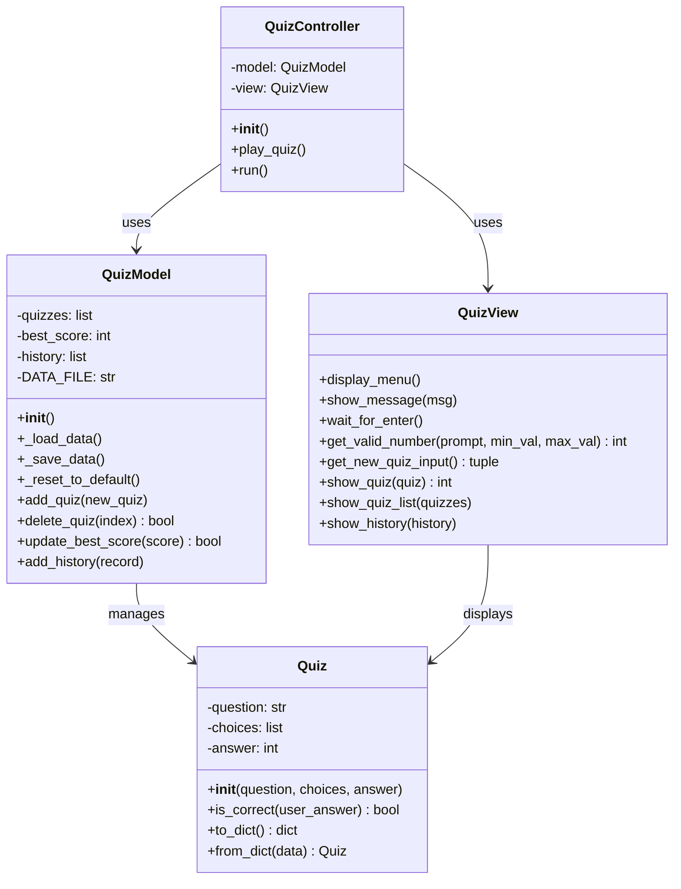
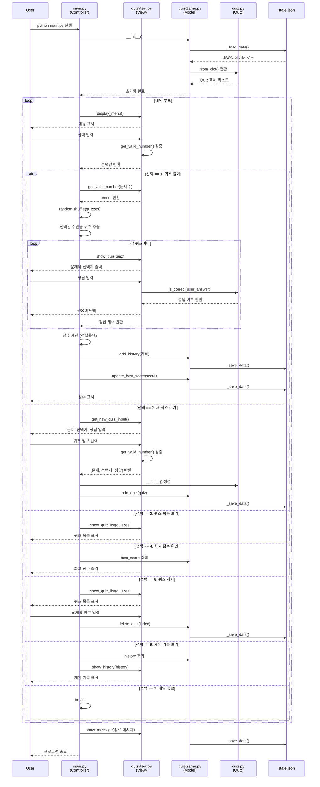

# 프로젝트의 개요
이 프로젝트는 **터미널에서 동작하는 인터랙티브한 퀴즈 게임**을 구현한 것으로, Python과 Git을 함께 학습하기 위한 첫 발자국입니다. 

주요 목표는 다음과 같습니다:
*   **Python 기초 및 실전 활용**: 클래스와 객체 지향 프로그래밍을 적용합니다.
*   **MVC 패턴 이해**: Model, View, Controller로 역할을 분리하여 구조화합니다.
*   **데이터 영속성**: JSON 파일을 사용하여 프로그램을 종료해도 데이터가 유지되도록 합니다.
*   **Git 버전 관리**: 커밋, 브랜치 병합 등 협업의 기초를 습득합니다.

사용자는 메뉴를 통해 퀴즈 풀기, 추가, 목록 조회, 최고 점수 확인 등의 기능을 이용할 수 있습니다. 

# 퀴즈선정이유
 **'파이썬 프로그래밍 입문자가 반드시 숙지해야 할 기초 문법과 핵심 개념을 복습하기 위해 선정했습니다'**

### 📝 기능 목록
*   **메뉴 시스템**: 퀴즈 풀기, 추가, 목록 보기 등 7가지 기능을 선택할 수 있는 메인 인터페이스를 제공합니다.
*   **퀴즈 풀기**: 저장된 퀴즈를 출제하고 정답 여부 확인 및 점수(정답률)를 계산합니다.
*   **퀴즈 관리**: 새로운 퀴즈를 등록하거나 전체 목록을 조회하고, 불필요한 퀴즈를 삭제할 수 있습니다.
*   **데이터 영속성**: `state.json`을 통해 프로그램 종료 후에도 데이터와 최고 점수를 유지하며, 파일 손상 시 기본값으로 자동 복구합니다.
*   **보너스 기능**: 문제 순서 랜덤 섞기, 풀이할 문제 수 선택, 전체 게임 기록 히스토리 조회 기능을 포함합니다.

### 📂 파일 구조
```text
project-root/
├── main.py         # Controller: 게임 흐름 제어 및 Model-View 연결
├── quizGame.py     # Model: 데이터 관리, JSON 파일 로드 및 저장 로직
├── quizView.py     # View: 화면 출력 및 사용자 입력 유효성 검증
├── quiz.py         # Quiz 객체: 문제, 선택지, 정답 데이터를 정의하는 클래스
├── state.json      # 데이터 파일: 퀴즈 목록, 최고 점수, 게임 기록 저장
└── README.md       # 프로젝트 개요 및 상세 설명 문서
```


# 평가기준 1 : 메뉴 표시 및 퀴즈 관련 모든 기능 동작 여부
* 프로그램 실행 시 메뉴에서 번호를 선택하면, 선택 결과에 따라 퀴즈 출제/등록/목록/점수 확인/종료 화면이 출력된다.
```
mpeg46551@c5r1s2 e1_2 % python src/main.py
```p
mpeg46551@c5r1s2 codyssey % cd e1_2
mpeg46551@c5r1s2 e1_2 % python src/main.py
```

```
==============================
   파이썬 퀴즈 챌린지
==============================
1. 퀴즈 풀기 (랜덤/수량)
2. 새로운 퀴즈 추가
3. 퀴즈 목록 보기
4. 최고 점수 확인
5. 퀴즈 삭제하기 (보너스)
6. 전체 기록 보기 (보너스)
7. 게임 종료
==============================

몇 문제를 푸시겠습니까? (1~6): 
=============================
   파이썬 퀴즈 챌린지
==============================
1. 퀴즈 풀기 (랜덤/수량)
2. 새로운 퀴즈 추가
3. 퀴즈 목록 보기
4. 최고 점수 확인
5. 퀴즈 삭제하기 (보너스)
6. 전체 기록 보기 (보너스)
7. 게임 종료
==============================
선택: 2
```p
[새 퀴즈 추가]
문제: python의 변수 타입이 아닌것은?
보기1: int
보기2: float
보기3: str
보기4: print
정답(1-4): 4
```
* 퀴즈목록보기
```p
==============================
   파이썬 퀴즈 챌린지
==============================
1. 퀴즈 풀기 (랜덤/수량)
2. 새로운 퀴즈 추가
3. 퀴즈 목록 보기
4. 최고 점수 확인
5. 퀴즈 삭제하기 (보너스)
6. 전체 기록 보기 (보너스)
7. 게임 종료
==============================
선택: 3
1. 파이썬에서 함수를 정의할 때 사용하는 키워드는 무엇인가요
2. 다음 중 파이썬의 기본 데이터 타입이 아닌 것은 무엇인가요
3. 화면에 값을 출력하기 위해 사용하는 함수는 무엇인가요
4. 리스트의 맨 끝에 새로운 요소를 추가하는 메서드는 무엇인가요
5. 조건에 따라 코드를 실행할지 결정하는 키워드는 무엇인가요
6. python의 변수 타입이 아닌것은?
```
* 최고점수확인
```p
==============================
   파이썬 퀴즈 챌린지
==============================
1. 퀴즈 풀기 (랜덤/수량)
2. 새로운 퀴즈 추가
3. 퀴즈 목록 보기
4. 최고 점수 확인
5. 퀴즈 삭제하기 (보너스)
6. 전체 기록 보기 (보너스)
7. 게임 종료
==============================
선택: 4

🔥 최고 점수: 0점
```
* 퀴즈삭제
```p
==============================
   파이썬 퀴즈 챌린지
==============================
1. 퀴즈 풀기 (랜덤/수량)
2. 새로운 퀴즈 추가
3. 퀴즈 목록 보기
4. 최고 점수 확인
5. 퀴즈 삭제하기 (보너스)
6. 전체 기록 보기 (보너스)
7. 게임 종료
==============================
선택: 5

1. 파이썬에서 함수를 정의할 때 사용하는 키워드는 무엇인가요
2. 다음 중 파이썬의 기본 데이터 타입이 아닌 것은 무엇인가요
3. 화면에 값을 출력하기 위해 사용하는 함수는 무엇인가요
4. 리스트의 맨 끝에 새로운 요소를 추가하는 메서드는 무엇인가요
5. 조건에 따라 코드를 실행할지 결정하는 키워드는 무엇인가요
6. python의 변수 타입이 아닌것은?
삭제할 번호: 6

==============================
   파이썬 퀴즈 챌린지
==============================
1. 퀴즈 풀기 (랜덤/수량)
2. 새로운 퀴즈 추가
3. 퀴즈 목록 보기
4. 최고 점수 확인
5. 퀴즈 삭제하기 (보너스)
6. 전체 기록 보기 (보너스)
7. 게임 종료
==============================
선택: 3
1. 파이썬에서 함수를 정의할 때 사용하는 키워드는 무엇인가요
2. 다음 중 파이썬의 기본 데이터 타입이 아닌 것은 무엇인가요
3. 화면에 값을 출력하기 위해 사용하는 함수는 무엇인가요
4. 리스트의 맨 끝에 새로운 요소를 추가하는 메서드는 무엇인가요
5. 조건에 따라 코드를 실행할지 결정하는 키워드는 무엇인가요
```
* 전체기록보기
```p

==============================
   파이썬 퀴즈 챌린지
==============================
1. 퀴즈 풀기 (랜덤/수량)
2. 새로운 퀴즈 추가
3. 퀴즈 목록 보기
4. 최고 점수 확인
5. 퀴즈 삭제하기 (보너스)
6. 전체 기록 보기 (보너스)
7. 게임 종료
==============================
선택: 6

[게임 기록 히스토리]
- 2026-04-10 21:08 | 점수: 0점 (0/1)
```
* 게임종료
```p
==============================
   파이썬 퀴즈 챌린지
==============================
1. 퀴즈 풀기 (랜덤/수량)
2. 새로운 퀴즈 추가
3. 퀴즈 목록 보기
4. 최고 점수 확인
5. 퀴즈 삭제하기 (보너스)
6. 전체 기록 보기 (보너스)
7. 게임 종료
==============================
선택: 7
```

# 평가기준 2 : 정답/오답 판정 
```p
문제: 리스트의 맨 끝에 새로운 요소를 추가하는 메서드는 무엇인가요
  1. add
  2. push
  3. append
  4. insert
정답: 3
✅ 정답!

문제: 조건에 따라 코드를 실행할지 결정하는 키워드는 무엇인가요
  1. if
  2. for
  3. while
  4. def
정답: 2
❌ 오답! 정답은 1

🏁 종료! 점수: 50점
```
# 입력오류처리
```
입력오류처리
```p
입력오류:
선택: 
⚠ 입력이 비어있습니다.
선택: 0
⚠ 1~7 사이를 입력하세요.
선택: a
⚠ 숫자를 입력해주세요.
선택: 1
몇 문제를 푸시겠습니까? (1~6): 0
⚠ 1~6 사이를 입력하세요.
```
# 평가기준 3 : 재실행 시 퀴즈 및 최고 점수 유지 여부
```p
==============================
   파이썬 퀴즈 챌린지
==============================
1. 퀴즈 풀기 (랜덤/수량)
2. 새로운 퀴즈 추가
3. 퀴즈 목록 보기
4. 최고 점수 확인
5. 퀴즈 삭제하기 (보너스)
6. 전체 기록 보기 (보너스)
7. 게임 종료
==============================
선택: 4
🔥 최고 점수: 100점

==============================
   파이썬 퀴즈 챌린지
==============================
1. 퀴즈 풀기 (랜덤/수량)
2. 새로운 퀴즈 추가
3. 퀴즈 목록 보기
4. 최고 점수 확인
5. 퀴즈 삭제하기 (보너스)
6. 전체 기록 보기 (보너스)
7. 게임 종료
==============================
선택: 7
mpeg46551@c5r1s2 e1_2 % python src/main.py

==============================
   파이썬 퀴즈 챌린지
==============================
1. 퀴즈 풀기 (랜덤/수량)
2. 새로운 퀴즈 추가
3. 퀴즈 목록 보기
4. 최고 점수 확인
5. 퀴즈 삭제하기 (보너스)
6. 전체 기록 보기 (보너스)
7. 게임 종료
==============================
선택: 4
🔥 최고 점수: 100점
```

# 평가기준 4 : 기본 퀴즈 5개 이상 포함 여부
```p
==============================
   파이썬 퀴즈 챌린지
==============================
1. 퀴즈 풀기 (랜덤/수량)
2. 새로운 퀴즈 추가
3. 퀴즈 목록 보기
4. 최고 점수 확인
5. 퀴즈 삭제하기 (보너스)
6. 전체 기록 보기 (보너스)
7. 게임 종료
==============================
선택: 4

1. 파이썬에서 함수를 정의할 때 사용하는 키워드는 무엇인가요
2. 다음 중 파이썬의 기본 데이터 타입이 아닌 것은 무엇인가요
3. 화면에 값을 출력하기 위해 사용하는 함수는 무엇인가요
4. 리스트의 맨 끝에 새로운 요소를 추가하는 메서드는 무엇인가요
5. 조건에 따라 코드를 실행할지 결정하는 키워드는 무엇인가요
6. python의 변수 타입이 아닌것은?
```

# 평가기준 5 : GitHub 코드 업로드 및 10개 이상 커밋 존재 여부

# 평가기준 6 : 브랜치 생성 및 병합 기록 확인


# 평가기준 7 : clone과 pull 실습 수행 흔적 확인
## clone
```bash 
mpeg46551@c5r1s2 /Users % cd ~
mpeg46551@c5r1s2 ~ % git clone https://github.com/ntt65/codyssey codyclone
  Cloning into 'codyclone'...
  remote: Enumerating objects: 372, done.
  remote: Counting objects: 100% (372/372), done.
  remote: Compressing objects: 100% (176/176), done.
  remote: Total 372 (delta 190), reused 351 (delta 169), pack-reused 0 (from 0)
  Receiving objects: 100% (372/372), 491.43 KiB | 4.13 MiB/s, done.
  Resolving deltas: 100% (190/190), done.
```
## 클론한 로컬리포지토리로 이동
```bash
mpeg46551@c5r1s2 ~ % cd codyclone
mpeg46551@c5r1s2 codyclone % ls
  body.md         e1_1            e1_2            README.md
  mpeg46551@c5r1s2 codyclone % cd e1_2
  mpeg46551@c5r1s2 e1_2 % ls
  doc             exam            pic             readme.md       src
  ```
  ## readme.md 변경
  ```bash
mpeg46551@c5r1s2 e1_2 % echo "append one line at codyclone local repository" >> readme.md
```
## add and commit
```bash
mpeg46551@c5r1s2 e1_2 % git add readme.md
mpeg46551@c5r1s2 e1_2 % git commit -m "Fix:readme.md oneline at cloned local repository"
  [main 92d7d85] Fix:readme.md oneline at cloned local repository
  1 file changed, 1 insertion(+), 1 deletion(-)
  mpeg46551@c5r1s2 codyclone % git config user.name "ntt65"
  mpeg46551@c5r1s2 codyclone % git config user.email "ntt6551@gmail.com"
  mpeg46551@c5r1s2 codyclone % git remote set-url origin https://ntt65@github.com/ntt65/codyssey.git
```
## push
```bash
mpeg46551@c5r1s2 codyclone % git push
  Enumerating objects: 7, done.
  Counting objects: 100% (7/7), done.
  Delta compression using up to 6 threads
  Compressing objects: 100% (4/4), done.
  Writing objects: 100% (4/4), 407 bytes | 407.00 KiB/s, done.
  Total 4 (delta 3), reused 0 (delta 0), pack-reused 0 (from 0)
  remote: Resolving deltas: 100% (3/3), completed with 3 local objects.
  To https://github.com/ntt65/codyssey.git
    bf5a565..92d7d85  main -> main
```
## 다시 원래 폴더로 이동후 git pull
```bash
mpeg46551@c5r1s2 ~ % cd codyssey 
mpeg46551@c5r1s2 codyssey % git pull
  remote: Enumerating objects: 7, done.
  remote: Counting objects: 100% (7/7), done.
  remote: Compressing objects: 100% (1/1), done.
  remote: Total 4 (delta 3), reused 4 (delta 3), pack-reused 0 (from 0)
  Unpacking objects: 100% (4/4), 387 bytes | 129.00 KiB/s, done.
  From https://github.com/ntt65/codyssey
    bf5a565..92d7d85  main       -> origin/main
  Updating bf5a565..92d7d85
  Fast-forward
  e1_2/readme.md | 2 +-
  1 file changed, 1 insertion(+), 1 deletion(-)
mpeg46551@c5r1s2 codyssey % 
```


# 평가기준 8 : 클래스들의 책임 분리 설명
## 프로젝트 구조
```
E1_2/
├── src/
│   ├── main.py           # 메인 컨트롤러 (게임 흐름 관리)
│   ├── quiz.py           # Quiz 데이터 모델
│   ├── quizGame.py       # QuizModel (데이터 저장/불러오기)
│   └── quizView.py       # QuizView (UI 및 입력 처리)
├── doc/
│   ├── mission.md        # 미션 요구사항
│   ├── project_intro.md  # 프로젝트 개요 (본 파일)
│   └── plan.md           # 개발 계획
├── README.md             # 프로젝트 설명서
└── state.json            # 데이터 저장 파일 (자동 생성)

## 프로젝트에 사용한 4개 클래스의 이름과 역할

| 클래스 이름 | 위치 (파일명) | 주요 역할 및 기능 |
| :--- | :--- | :--- |
| **Quiz** | `quiz.py` | 개별 퀴즈 데이터 모델 (문제, 선택지, 정답 관리 및 정답 확인) |
| **QuizModel** | `quizGame.py` | 데이터 관리 및 파일(state.json) 입출력, 점수 및 히스토리 관리 |
| **QuizView** | `quizView.py` | 사용자 인터페이스(UI) 담당, 메뉴 출력 및 사용자 입력 검증 |
| **QuizController** | `main.py` | 전체 게임 흐름 제어 및 모델과 뷰를 연결하는 컨트롤러 |
```
# 평가기준 9 : 로직 분리 기준 설명
로직 분리는 **MVC(Model-View-Controller) 패턴**을 기준으로 하며, 각 모듈이 하나의 명확한 역할만 수행하도록 나누는 것이 핵심입니다.

*   **Model (`quizGame.py`, `quiz.py`)**: 데이터의 구조와 영속성을 담당합니다. `state.json` 파일의 로드/저장, 퀴즈 객체의 속성 관리 등 **데이터 중심의 로직**을 처리합니다.
*   **View (`quizView.py`)**: 사용자 인터페이스를 담당합니다. 메뉴 출력, 메시지 표시, 그리고 입력값의 유효성 검증(공백 제거, 숫자 범위 체크 등)과 같은 **화면 관련 로직**만 포함합니다.
*   **Controller (`main.py`)**: 모델과 뷰를 연결하는 사령탑입니다. 사용자의 선택에 따라 어떤 데이터를 불러올지, 어떤 화면을 보여줄지 결정하는 **흐름 제어 로직**을 수행합니다.

이렇게 로직을 분리하면 UI를 웹으로 바꾸더라도 Model은 그대로 둘 수 있는 등 **유지보수와 확장성**이 비약적으로 좋아집니다. 

이 분리 기준을 README의 '아키텍처' 섹션에 다이어그램과 함께 배치해 볼까요?


### Class Diagram


# 평가기준 10 : state.json 읽기/쓰기 흐름 설명
### state.json
`state.json` 파일의 읽기, 사용, 저장 과정은 주로 **`QuizModel` 클래스(quizGame.py)**에서 관리하며, 상세 내용은 다음과 같습니다.

| 단계 | 관련 메서드 | 실행 시점 및 내용 |
| :--- | :--- | :--- |
| **읽기 (Load)** | `_load_data()` | 프로그램 시작 시 `QuizModel`이 초기화될 때 호출됩니다. 파일이 없으면 기본 데이터를 생성하고, 손상 시 복구 로직을 실행합니다. |
| **사용 (Use)** | (속성 참조) | 로드된 데이터는 `quizzes`, `best_score`, `history` 속성에 저장되어 게임 진행, 목록 출력, 최고 점수 확인 시 사용됩니다. |
| **저장 (Save)** | `_save_data()` | 퀴즈 추가, 퀴즈 삭제, 또는 퀴즈 풀기 완료 후 점수와 히스토리가 갱신될 때마다 즉시 호출되어 파일에 기록됩니다. |

모든 입출력은 **UTF-8 인코딩**을 사용하여 데이터의 영속성을 보장합니다.

UTF-8 인코딩은 한글과 같은 다국어 문자를 깨짐 없이 안전하게 저장하고 불러오기 위해 필수적입니다. 데이터 영속성의 핵심은 프로그램이 종료된 후에도 데이터가 변함없이 유지되는 것인데, UTF-8을 사용하면 다양한 운영체제나 환경에서도 저장된 퀴즈와 점수가 왜곡되지 않고 일관된 상태를 유지할 수 있습니다.
특히 state.json 저장 시 이 방식을 사용하면 한글로 작성된 퀴즈 질문이 올바르게 기록되어, 나중에 파일을 다시 읽어올 때 발생할 수 있는 인코딩 오류를 방지합니다.

### Menu Sequence Diagram



# 평가기준 11 : 안전 종료 처리 설명
### json파일 손상 대책
```
state.json 파일 손상에 대비하려면 데이터 로드 로직에 try-except 구문을 활용한 자동 복구 시스템을 갖추어야 합니다.
구체적인 단계는 다음과 같습니다:
예외 포착: 파일을 읽거나 파싱할 때 json.JSONDecodeError 또는 ValueError가 발생하면 파일이 손상된 것으로 판단합니다.
안내 및 복구: 사용자에게 손상 안내 메시지를 출력한 뒤, 준비해 둔 기본 퀴즈 데이터(DEFAULT_QUIZZES)로 시스템을 초기화합니다.
상태 동기화: 초기화된 데이터를 다시 state.json에 저장하여 파일의 무결성을 회복합니다.

```
# 평가기준 12 : 커밋 단위 및 메시지 규칙 설명

### 1. 커밋 단위 (Commit Granularity)
본 프로젝트에서는 **'함수생성과 같이 의미 있는 최소 기능 단위'**로 커밋을 세분화하여 관리하였습니다.

### 2. 커밋 메시지 규칙 (Commit Message Convention)
협업과 유지보수의 효율성을 위해 **[Type]: [Subject]** 형식을 기본으로 하는 규칙을 적용하였습니다.

| 타입(Type) | 설명 | 예시 |
| :--- | :--- | :--- |
| **Feat** | 새로운 기능 추가 | `feat: 퀴즈 플레이 기능(play_quiz) 구현` |
| **Fix** | 버그 수정 | `fix: 퀴즈 결과 출력 시 발생하는 오타 수정` |
| **Docs** | 문서 수정 (README, 이미지 등) | `docs: git log 그래프 이미지 추가 및 마크다운 수정` |
| **Refactor** | 코드 리팩토링 (기능 변경 없는 구조 개선) | `refactor: main.py 함수 구조 최적화` |
| **Chore** | 빌드 업무, 패키지 매니저 설정 등 | `chore: .gitignore 설정 업데이트` |

### 3. 메시지 작성 원칙
* **명확한 제목:** 제목만 보고도 어떤 파일이 왜 변경되었는지 짐작할 수 있도록 핵심 키워드를 포함했습니다.
* **일관성 유지:** `git merge -X theirs`를 사용할 때도 병합의 목적(예: 버그 수정 반영)을 명시하여 히스토리의 가독성을 높였습니다.


# 평가기준 13 : 클래스 사용 이유 및 함수 구현과의 차이 설명

### 1. 함수(Function) 구현의 특성
* **정의:** 특정 작업을 수행하는 코드의 집합으로, 입력을 받아 출력을 내보내는 **동작(Action)** 중심의 구조입니다.
* **한계:** 프로그램 규모가 커지면 관련 데이터와 함수들이 흩어져 관리하기 어려워집니다. 예를 들어, 퀴즈의 '점수' 변수와 '정답 확인' 함수가 따로 놀게 되어 데이터 오염의 위험이 생깁니다.

### 2. 클래스(Class) 사용 이유
* **데이터와 동작의 결합 (Encapsulation):** 퀴즈에 필요한 데이터(문제 목록, 현재 점수, 남은 시간)와 이를 처리하는 기능(문제 보여주기, 점수 계산하기)을 하나의 **'객체(Object)'**로 묶어 관리할 수 있습니다.
* **코드의 재사용성:** 클래스는 일종의 '붕어빵 틀'과 같습니다. 한 번 정의해두면 여러 개의 퀴즈 객체를 독립적으로 쉽게 생성할 수 있습니다.
* **유지보수의 용이성:** 특정 기능(예: 퀴즈 로직)을 수정해야 할 때 해당 클래스 내부만 확인하면 되므로 코드의 응집도가 높아집니다.

### 3. 클래스 vs 함수의 주요 차이점

| 비교 항목 | 함수 (Function) | 클래스 (Class) |
| :--- | :--- | :--- |
| **중심 사고** | 무엇을 **실행**할 것인가? (동작 중심) | 무엇을 **정의**할 것인가? (상태+동작 중심) |
| **데이터 관리** | 외부 변수나 전역 변수에 의존하기 쉬움 | 클래스 내부 변수(속성)에 데이터를 안전하게 저장 |
| **메모리** | 호출될 때 실행되고 종료 시 소멸 | 객체가 생성(인스턴스화)되어 메모리에 유지됨 |
| **구성 요소** | 로직(Logic) | 속성(Attribute) + 메서드(Method) |

### 4. 본 프로젝트에서의 적용 예시 (Codyssey)
* **함수 방식:** `play_quiz(questions, score)` 처럼 매번 점수와 문제 데이터를 인자로 넘겨줘야 합니다.
* **클래스 방식:** `QuizManager` 클래스를 만들어 `self.score`에 점수를 보관하고, `self.next_question()` 메서드로 다음 단계로 넘어갑니다. 이는 코드의 가독성을 높이고 **"퀴즈"라는 하나의 독립된 서비스 단위**를 명확하게 만들어 줍니다.

# 평가기준 14 : JSON 데이터 저장 이유 및 특징 설명
### json특징
```plaintext
이번 미션에서 JSON을 사용하는 이유는 다음과 같은 실무적인 장점 때문입니다.
구조적 적합성: 파이썬의 dict나 list 자료구조를 그대로 파일에 옮기거나 불러오기에 가장 직관적이고 편리합니다.
표준 라이브러리: 별도의 외부 라이브러리 설치 없이 파이썬의 표준 기능만으로도 완벽하게 동작합니다.
가독성: 텍스트 기반 포맷이라 사람이 메모장으로 열어도 내용을 쉽게 확인하고 수정할 수 있습니다.
JSON 구조상 quizzes가 배열(List) 형태로 되어 있어, 데이터가 많아질수록 특정 문제를 찾기 위해 처음부터 끝까지 훑어야 하는 탐색 성능 문제가 발생합니다.
```


# 평가기준 15 : 파일 입출력에서 try/except 필요성 설명
1. 파일 입출력의 불안정성
프로그램 내부 로직과 달리, **파일 입출력(I/O)**은 외부 자원(디스크, 파일 시스템)을 사용하기 때문에 프로그램의 의도와 상관없이 오류가 발생할 확률이 매우 높습니다.

파일 미존재: 불러오려는 설정 파일이나 퀴즈 데이터 파일이 삭제되었거나 경로가 잘못된 경우 (FileNotFoundError).

권한 문제: 파일은 존재하지만 읽기/쓰기 권한이 없는 경우 (PermissionError).

저장 공간 부족: 데이터를 기록하려는데 디스크 용량이 가득 찬 경우.

2. try/except 사용 이유
이러한 예외 상황에서 try/except가 없다면 프로그램은 **비정상 종료(Crash)**하게 됩니다.

프로그램 안정성 유지: 예외가 발생하더라도 사용자에게 친절한 안내 메시지를 보여주고, 프로그램이 멈추지 않고 다음 단계를 수행하도록 제어할 수 있습니다.

자원 보호: 파일 쓰기 도중 에러가 났을 때, finally 구문을 활용하여 열려 있는 파일 객체를 안전하게 닫음(Close)으로써 데이터 손상을 방지합니다.
# 평가기준 16 : 브랜치 분리 및 병합 의미 설명
1. 브랜치 분리 (Branching)의 의미
목적: 메인 코드(main)의 안정성을 유지하면서, 새로운 기능 개발이나 버그 수정을 독립된 공간에서 진행하기 위함입니다.

사례: 본 프로젝트에서는 퀴즈 실행 로직 개발 및 버그 수정을 위해 play_quiz 브랜치를 분리하였습니다. 이를 통해 개발 중 발생하는 불안정한 코드가 메인 서비스에 영향을 주지 않도록 격리했습니다.

2. 브랜치 병합 (Merging) 전략: git merge -X theirs
단순한 병합을 넘어 특정 전략을 선택한 이유는 다음과 같습니다.

선택한 전략: git merge play_quiz -X theirs

병합의 의미: * 코드의 무결성 확보: play_quiz 브랜치에서 검증된 버그 수정 사항과 최신 로직이 메인 코드보다 정확하다고 판단될 때, 충돌 발생 시 feature 브랜치의 코드를 우선 채택하여 병합했습니다.

히스토리 보존: reset --hard와 달리, 병합(Merge) 방식을 사용하여 play_quiz 브랜치에서 진행된 상세한 개발 이력과 커밋 로그를 프로젝트 전체 히스토리에 남겼습니다.

추적 가능성: 나중에 git log --graph를 통해 기능이 언제 시작되고 어떤 과정을 거쳐 메인 줄기에 합쳐졌는지 명확하게 시각화할 수 있습니다.

# 평가기준 17 : state.json 데이터 구조 설계 이유 설명

### 1. JSON 형식을 선택한 이유
* **가독성과 범용성:** JSON(JavaScript Object Notation)은 텍스트 기반이라 사람이 읽기 쉽고, 파이썬의 `dict` 구조와 직관적으로 매핑되어 처리가 매우 빠릅니다.
* **경량화:** 데이터의 구조를 유지하면서도 파일 크기가 작아, 로컬 환경에서 상태를 저장하고 불러오는 데 최적입니다.

### 2. state.json 데이터 구조 설계의 목적
`state.json`은 프로그램이 종료되어도 **사용자의 현재 진행 상태를 유지(Persistence)**하기 위해 설계되었습니다.

* **연속성 보장:** 사용자가 퀴즈를 풀다가 프로그램을 종료해도, 다시 실행했을 때 이전 점수나 진행 단계를 기억할 수 있게 합니다.
* **설정 관리:** 매번 프로그램을 실행할 때마다 초기화해야 하는 번거로움을 없애고, 사용자 개인화된 설정을 유지합니다.
### 📌 데이터 저장 규칙
* 데이터 파일은 프로젝트 루트의 `state.json`을 기본으로 한다.

* state.json 전체내용
```bash
mpeg46551@c5r1s2 e1_2 % cd src
mpeg46551@c5r1s2 src % ls
__pycache__     main.py         quiz.py         quizGame.py     quizView.py     state.json
mpeg46551@c5r1s2 src % cat state.json
{
  "quizzes": [
    {
      "question": "파이썬의 창시자는?",
      "choices": [
        "제임스 고슬링",
        "리누스 토르발스",
        "귀도 반 로섬",
        "브렌던 아이크"
      ],
      "answer": 3
    },
    {
      "question": "파이썬 내장 데이터 타입이 아닌 것은?",
      "choices": [
        "int",
        "str",
        "bool",
        "char"
      ],
      "answer": 4
    },
    {
      "question": "원격 저장소로 업로드하는 Git 명령어는?",
      "choices": [
        "git pull",
        "git commit",
        "git push",
        "git clone"
      ],
      "answer": 3
    },
    {
      "question": "JSON의 약자는?",
      "choices": [
        "Java Standard Object Notation",
        "JavaScript Object Notation",
        "Java Syntax Output Network",
        "JavaScript Online Node"
      ],
      "answer": 2
    },
    {
      "question": "파이썬 함수 정의 키워드는?",
      "choices": [
        "func",
        "define",
        "def",
        "function"
      ],
      "answer": 3
    }
  ],
  "best_score": 20,
  "history": [
    {
      "date": "2026-04-09 13:14",
      "score": 0,
      "correct": 0,
      "total": 1
    },
    {
      "date": "2026-04-09 15:24",
      "score": 0,
      "correct": 0,
      "total": 2
    },
    {
      "date": "2026-04-09 15:25",
      "score": 0,
      "correct": 0,
      "total": 1
    }
  ]
}%                
```


# 평가기준 18 : 데이터 증가 시 JSON 저장 방식의 한계 설명
데이터가 방대해질 때 JSON 저장 방식(`state.json`)은 다음과 같은 한계를 가집니다.

1.  **전체 로드/저장 방식의 비효율성**: 현재 `_load_data()`와 `_save_data()`는 파일 전체를 한꺼번에 읽고 씁니다. 데이터가 커질수록 단 하나의 항목만 수정하려 해도 파일 전체를 다시 써야 하므로 I/O 성능이 급격히 저하됩니다.
2.  **메모리 점유율 증가**: 모든 데이터(퀴즈 목록, 히스토리 등)를 메모리(리스트 객체)에 한꺼번에 올려야 하므로, 데이터 양이 수천 개 이상으로 늘어나면 메모리 부족 문제가 발생할 수 있습니다.
3.  **검색 및 필터링 속도 저하**: 특정 데이터를 찾으려면 전체 리스트를 순회해야 하므로, 데이터가 많아질수록 조회 속도가 느려집니다.
4.  **데이터 무결성 위험**: 쓰기 작업 중 프로그램이 강제 종료되면 파일 전체가 손상될 위험이 크며, 이를 방지하기 위한 트랜잭션 처리가 어렵습니다.


# 평가기준 19 : state.json 손상 시 대응 방법 설명
`state.json` 파일이 손상되었을 때 프로그램은 다음과 같은 단계로 안전하게 대응합니다.

1.  **에러 탐지**: 데이터를 불러오는 `_load_data()` 메서드에서 `try-except` 구문을 사용해 `json.JSONDecodeError`나 `ValueError` 등을 감지합니다.
2.  **사용자 알림**: 파일이 손상되었다는 안내 메시지를 출력하여 사용자에게 현재 상태를 알립니다.
3.  **기본 데이터 복구**: `_reset_to_default()`를 호출하여 `DEFAULT_QUIZZES`와 같은 기본 퀴즈 데이터로 시스템을 초기화합니다.
4.  **파일 재생성**: 초기화된 데이터를 바탕으로 `state.json` 파일을 다시 저장하여 프로그램이 중단 없이 실행될 수 있도록 보장합니다.


# 평가기준 20 : 요구사항 변경 시 수정 범위 설명
요구사항이 변경될 때의 수정 범위는 적용된 **MVC 패턴**에 따라 다음과 같이 역할별로 명확히 나뉩니다.

*   **사용자 인터페이스(UI)나 입력 방식 변경**: 화면에 보여지는 메시지, 메뉴 구성, 입력 검증 로직이 바뀌면 **`QuizView`(`quizView.py`)**만 수정하면 됩니다. 아까 정답 입력 위치를 루프 밖으로 옮겼던 작업이 대표적인 예시입니다.
*   **데이터 구조나 저장 로직 변경**: 퀴즈 객체에 새로운 속성(예: 힌트)을 추가하거나 `state.json` 저장 방식이 바뀌면 **`QuizModel`(`quizGame.py`)**이나 **`Quiz`(`quiz.py`)** 클래스를 수정합니다.
*   **전체 게임 흐름이나 메뉴 연동**: 새로운 기능을 메뉴에 연결하거나 프로그램의 전반적인 실행 순서를 바꿀 때는 컨트롤러인 **`QuizController`(`main.py`)**를 수정합니다.

이처럼 역할이 분리되어 있어 한 곳을 고쳐도 다른 코드에 미치는 영향을 최소화할 수 있습니다. 이제 이 설계 장점을 README의 '아키텍처' 섹션에 정리해 넣어볼까요?

# Git과 함께하는 Python 첫 발자국
## 프로젝트 개요
- 터미널에서 동작하는 인터랙티브한 퀴즈 게임을 Python으로 구현한 프로젝트입니다.
### 기술 스택
| 항목 | 내용 |
|------|------|
| **언어** | Python 3.10+ |
| **패턴** | MVC (Model-View-Controller) |
| **데이터 저장** | JSON (UTF-8 인코딩) |
| **외부 라이브러리** | 없음 (표준 라이브러리만 사용) |
| **주요 모듈** | `json`, `os`, `random`, `datetime` |
## 퀴즈 주제와 선정 이유
- Python, 현재 python학습중이라 친숙해지기 위해
## 실행 방법
- 터미널이나 CMD 창에서 **python main.py**를 입력하여 실행
# 기능 목록
- 퀴즈 풀기: 저장된 문제를 풀고 정답 여부를 확인하며, 최종 점수를 계산합니다.
- 퀴즈 추가: 새로운 문제와 4개의 선택지, 정답 번호를 입력받아 시스템에 등록합니다.
- 퀴즈 목록 조회: 현재 등록된 모든 퀴즈의 질문 리스트를 확인합니다.
- 최고 점수 관리: 역대 최고 점수를 기록하고, 퀴즈를 풀 때마다 갱신 여부를 확인합니다.
- 데이터 영속성 유지: 모든 데이터는 state.json에 저장되어 프로그램 재시작 후에도 유지됩니다.
# 파일 구조


# 데이터 파일 설명(state.json 경로/역할/스키마)
경로: 프로젝트 루트 디렉토리 (./state.json)
역할: 프로그램 종료 후에도 추가된 퀴즈와 최고 점수가 유지되도록 데이터를 저장하는 데이터 영속성을 담당합니다
. 파일이 없거나 손상된 경우 기본 데이터로 자동 복구하는 기능도 포함합니다
```
state.json (데이터 구조)
├── 📂 quizzes (List: 퀴즈 목록)
│   └── 📄 Quiz Object
│       ├── ❓ question (String: 문제 내용)
│       ├── 📜 choices (List: 4개의 선택지)
│       └── ✅ answer (Integer: 정답 번호 1~4)
├── 🏆 best_score (Integer: 최고 점수)
└── 🕒 history (List: 게임 기록 히스토리)
``` 


## 6. 개발 환경
* Python 3.10 이상을 사용해야 한다.
```bash
mpeg46551@c5r1s2 codyssey % python --version
Python 3.12.13
```
* 외부 라이브러리 없이 기본 문법만 사용해야 한다. (표준 라이브러리 사용 가능)

---

## 7. 제약 사항


* 파일 인코딩은 UTF-8을 권장한다.
```bash
# state.json 파일 읽기 (UTF-8 인코딩)
            with open(self.DATA_FILE, "r", encoding="utf-8") as f:
```

### 📌 코드 구조
* 모든 코드를 한 함수에 작성하지 않고, 기능별로 함수를 분리해야 한다.
* 최소 2개 이상의 클래스로 역할을 분리해야 한다.


### 📌 Git 워크플로우
* 최소 10개 이상의 의미 있는 커밋이 있어야 한다.

* 기능 단위 커밋(메뉴/Quiz/플레이/추가/저장/README 등) + 커밋 메시지에 변경 요약 포함
* 형식적인 커밋 메시지를 피하고, 아래처럼 작업 내용을 드러내는 형식을 권장한다.
    * `Feat: 퀴즈 출제 기능 구현`
    * `Fix: 점수 계산 오류 수정`
    * `Docs: README 실행 방법 추가`
    * `Refactor: QuizGame 책임 분리`
* Git 기초 명령어 7종(`init`, `add`, `commit`, `push`, `pull`, `checkout`, `clone`)을 각각 한 번 이상 사용해야 한다.


### state.json 예시 (데이터 형태 참고)
```json
{
    "quizzes": [
        {
            "question": "Python의 창시자는?",
            "choices": ["Guido", "Linus", "Bjarne", "James"],
            "answer": 1
        }
    ],
    "best_score": 3
}
```
### data유효검사및 로드,저장
```python
class QuizView
        def get_valid_number(self, prompt, min_val, max_val):
        # 사용자로부터 유효한 숫자를 입력받음 (미션 요구 예외 처리 포함)
class QuizController:

    """퀴즈 게임의 전체 플로우를 관리하는 컨트롤러 클래스
    
    QuizModel(데이터 관리)과 QuizView(UI)를 연결하여 게임 로직을 실행합니다.
    """
    def __init__(self):
        """QuizController 초기화. Model과 View 인스턴스 생성"""
        self.model = QuizModel()
  ```


