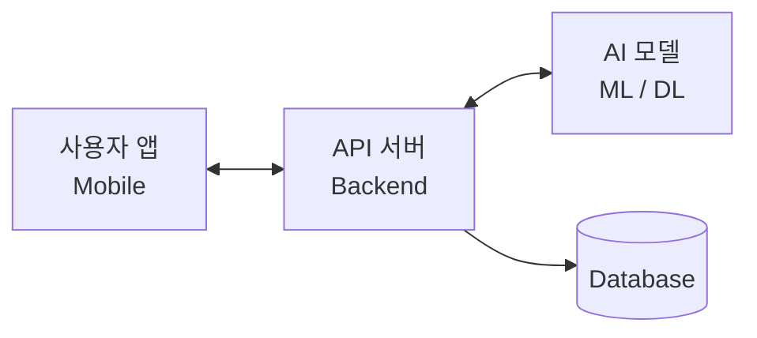

7개 도메인 아이디어톤
문제기술
기술적 설명
⁠⁠⁠⁠⁠⁠⁠

1. 미션 소개
코디세이 AI 올인원, 그 학습의 끝에서 마주할 '산업 문제를 해결하는 Final Project'.

이 거대한 여정을 완주하기 위해 반드시 통과해야 할 첫 관문이 바로 지금 시작됩니다.

우리는 단순히 '무엇을 만들까?'라는 막연한 고민에 머물러 있을 순 없습니다.

이번 텀 프로젝트는 학습자 여러분이 어떤 도메인에 깊은 관심을 가지고 있는지 발견하고, 그 가능성을 구체적으로 증명해 보는 시간입니다.

제시된 7개 도메인의 현황을 심도 있게 조사하고, 산업 현장의 문제를 발굴하여 우리 팀만의 AI 서비스 기획안을 도출합니다.

직접 개발에 착수하기 전, 아이디어톤과 PT를 통해 실현 가능성을 검증하며 AI 프로젝트 개발의 전 과정을 미리 경험하게 됩니다.

본 미션은 향후 진행될 학습의 밑거름이자, 팀 협업을 통해 아이디어를 실체화하는 역량을 기르는 본격적인 첫 번째 팀 프로젝트입니다.

2. 최종 결과물
제시된 도메인 내에서 팀 단위로 AI 서비스 기획서를 완성한다.

서비스 기획서
형식: Markdown, Word 등
내용: 문제 정의, 타겟 사용자, 서비스 개요, AI 기술 적용 방안, 기대 효과를 포함한 기획서 작성
발표 자료
형식: PPT 또는 PDF
내용: 기획서 핵심 내용을 발표용으로 구성
3. 과제 목표
이 과제를 마친 후, 학습자는 아래를 스스로 설명할 수 있어야 한다.

제시된 도메인의 산업 현황과 주요 이슈를 파악하고 설명할 수 있다.
해당 도메인에서 AI가 해결할 수 있는 문제를 정의하고 그 배경을 설명할 수 있다.
제안한 서비스의 타겟 사용자와 그들의 니즈를 구체적으로 설명할 수 있다.
서비스에 적용할 AI 기술의 종류와 선택 이유를 설명할 수 있다.
팀 프로젝트에서 본인의 역할과 기여, 협업 과정에서 배운 점을 설명할 수 있다.
제안한 서비스의 기대 효과와 향후 발전 방향을 설명할 수 있다.
4. 기능 요구 사항
다음 요구사항을 모두 만족해야 한다.

7대 도메인
그룹 별 도메인 내에서 AI 서비스 아이디어를 기획한다.
7대 도메인 리스트:
AI Mobility
AI Energy
AI Robotics
AI Smart Factory
AI Healthcare
AI Fintech
AI E-Commerce
팀 구성
팀 인원: 3~5인 (퍼실리테이터 및 예비 학습자 인원 현황에 따라 유동적 운영)
팀원 간 역할을 분담하고, 모든 팀원이 기획 과정에 실질적으로 기여해야 한다.
기획서 작성
제시된 도메인에서 해결하고자 하는 문제를 명확히 정의한다.
기획서에 다음 내용을 포함한다.

항목	설명
문제 정의	해결하고자 하는 문제와 그 배경, 주제 선택 이유
타겟 사용자	서비스의 주요 사용자 정의, 사용자 니즈 분석
서비스 개요	서비스 이름, 핵심 기능, 기존 서비스 대비 차별점
AI 기술 적용	적용할 AI/ML 기술, 기술 선택 이유
시스템 구성	간략한 아키텍처 (다이어그램 권장)
기대 효과	사용자 관점, 비즈니스 관점의 기대 효과
향후 발전 방향	서비스 확장 계획, 로드맵
팀 역할 분담	각 팀원의 담당 영역과 기여 내용
5. 보너스 과제
N/A

개발환경
6. 개발 환경
N/A

제약조건
7. 제약 사항
필수 요건
제시된 도메인과 관련된 AI 기술이 서비스의 핵심으로 포함되어야 한다.
팀 단위 협업으로 진행해야 한다.
모든 팀원이 기획 과정에 참여하고 발표 자료에 역할 분담을 명시해야 한다.
발표 자료
형식: PPT 또는 PDF
제출 기한: 4주차 목요일 11:00까지
Test Case
8. 결과 예시
아래는 정답이 아니라 참고 예시다. 실제 내용과 형식은 자유롭게 결정한다.

기획서 예시
# AI 기반 개인 맞춤형 당뇨 관리 서비스 기획서

## 1. 문제 정의
### 1.1 배경
- 국내 당뇨 환자 수 600만 명 돌파, 매년 증가 추세
- 기존 당뇨 관리 앱은 단순 기록 위주로 개인화된 관리 부재
- 환자 스스로 혈당 패턴을 분석하고 대응하기 어려움

### 1.2 해결하고자 하는 문제
- 개인별 혈당 변동 패턴을 학습하여 맞춤형 식단/운동 추천 제공
- 위험 혈당 수치 사전 예측을 통한 선제적 알림 서비스

## 2. 주제 선택 이유
- AI Healthcare 도메인 중 일상생활과 밀접한 만성질환 관리 분야 선택
- 개인화 추천과 시계열 예측이라는 AI 핵심 기술 적용 가능
- 실제 사용자 니즈가 명확하고 시장성 존재

## 3. 타겟 사용자
- 주 타겟: 2형 당뇨 진단을 받은 30~60대 환자
- 부 타겟: 당뇨 전단계 판정을 받은 고위험군
- 사용자 니즈: 복잡하지 않은 UI, 실질적인 생활 개선 가이드

## 4. 서비스 개요
### 4.1 핵심 기능
1. 혈당 기록 및 자동 패턴 분석
2. AI 기반 개인 맞춤형 식단 추천
3. 혈당 급등/급락 사전 예측 알림
4. 주간/월간 건강 리포트 자동 생성

### 4.2 차별점
- 단순 기록이 아닌 예측 기반 선제적 관리
- 개인 생활 패턴을 반영한 맞춤형 추천

## 5. AI 기술 적용 방안
| 기능 | 적용 기술 | 설명 |
|------|-----------|------|
| 혈당 예측 | LSTM/Transformer | 시계열 데이터 기반 혈당 변화 예측 |
| 식단 추천 | 협업 필터링 + 규칙 기반 | 유사 사용자 패턴과 영양학적 규칙 결합 |
| 패턴 분석 | 클러스터링 | 개인별 혈당 패턴 유형 분류 |

## 6. 예상 시스템 구성

## 7. 기대 효과
- 사용자: 혈당 관리 편의성 향상, 합병증 예방
- 의료 시스템: 당뇨 관련 의료비 절감 기여
- 비즈니스: 헬스케어 데이터 기반 부가 서비스 확장 가능

## 8. 향후 발전 방향
- 1단계: MVP 출시 및 사용자 피드백 수집
- 2단계: 연속혈당측정기(CGM) 연동
- 3단계: 의료진 연계 플랫폼 확장
